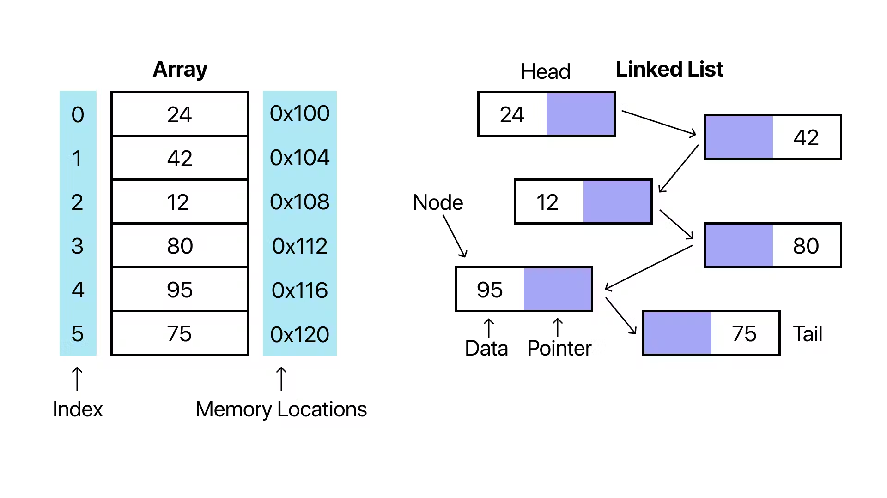
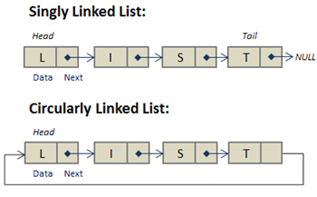

# Q11. Deletion of an element from an array 

[Click here](Lect1to10.md#q9-and-q10-explain-lect-9-and-10)

---

# Q12. Explain linear search and binary search with code

### Linear Search and Binary Search Explained

Linear Search and Binary Search are two fundamental search algorithms used to find an element in a dataset. Below is an explanation of each, along with C++ code.

---

### 1. Linear Search  
Linear Search works by checking each element in the array sequentially until the desired element is found or the array ends. 

**Steps**:  
1. Start from the first element.  
2. Compare the current element with the target.  
3. If found, return the index.  
4. If not, move to the next element.  
5. If the end of the array is reached, return "not found."  

**Time Complexity**:  
- Best Case: O(1) (Element found at the beginning)  
- Worst Case: O(n) (Element found at the end or not found)  

```cpp
#include <iostream>
using namespace std;

int linearSearch(int arr[], int n, int key) {
    for (int i = 0; i < n; i++) {
        if (arr[i] == key) // Compare each element with the key
            return i;      // Return index if found
    }
    return -1; // Return -1 if not found
}

int main() {
    int arr[] = {10, 20, 30, 40, 50};
    int n = sizeof(arr) / sizeof(arr[0]);
    int key = 30;

    int result = linearSearch(arr, n, key);
    if (result != -1)
        cout << "Element found at index " << result << endl;
    else
        cout << "Element not found." << endl;

    return 0;
}
```

**Output**:  
Element found at index 2  

---

### 2. Binary Search  
Binary Search works on sorted arrays by dividing the search space in half after each comparison.

**Steps**:  
1. Find the middle element of the array.  
2. If the middle element matches the target, return its index.  
3. If the target is smaller, search in the left half of the array.  
4. If the target is larger, search in the right half of the array.  
5. Repeat until the target is found or the search space is empty.  

- Example: Finding a page in a book. We start from the middle, then check if the target is on the left or right side, and repeat the process.

**Time Complexity**:  
- Best Case: O(1) (Target is the middle element)  
- Worst Case: O(log n) (Divide array in half repeatedly)  

```cpp
#include <iostream>
using namespace std;

int binarySearch(int arr[], int n, int key) {
    int left = 0, right = n - 1;

    while (left <= right) {
        int mid = left + (right - left) / 2; // Prevent overflow

        if (arr[mid] == key) // Check if middle element is the target
            return mid;
        else if (arr[mid] < key) // Search in the right half
            left = mid + 1;
        else // Search in the left half
            right = mid - 1;
    }
    return -1; // Return -1 if not found
}

int main() {
    int arr[] = {10, 20, 30, 40, 50};
    int n = sizeof(arr) / sizeof(arr[0]);
    int key = 30;

    int result = binarySearch(arr, n, key);
    if (result != -1)
        cout << "Element found at index " << result << endl;
    else
        cout << "Element not found." << endl;

    return 0;
}
```

**Output**:  
Element found at index 2  

---

### Key Differences Between Linear Search and Binary Search

| Criteria             | Linear Search                | Binary Search                     |
|-----------------------|-----------------------------|-----------------------------------|
| Precondition          | Works on unsorted arrays     | Works only on sorted arrays       |
| Approach              | Sequential search           | Divide and conquer                |
| Time Complexity       | O(n)                        | O(log n)                          |
| Best Case             | O(1)                        | O(1)                              |
| Worst Case            | O(n)                        | O(log n)                          |

Both algorithms have their use cases. Use Linear Search for small or unsorted datasets and Binary Search for large, sorted datasets to improve efficiency.

---

# Q13 and Q14. Explain
1. Explain What is linked list ? Why linked list.
2. Difference between linked list and Array

### 1. **What is a Linked List? Why Linked List?**

**Linked List**:  
A linked list is a linear data structure in which elements (called nodes) are stored in memory at non-contiguous locations. Each node contains two parts:
- **Data**: The value stored in the node.  
- **Pointer/Next**: A reference to the next node in the sequence.  

The first node is called the **head**, and the last node points to **NULL** (indicating the end of the list).

- Smjho ek hospital hai, bahut sare beds hai, phle kya tha ki doctor ata tha , sb logo ko ek sat sequentially contigious check krta tha, ab kya hai, ab jagah kam hai smjo 5 log aa gye, ab 5 hall me 5 diff jagah pr 5 head khali hai, so doctor ayega phle ko check krega ans usise hi puchega ki next patient ka bed kaha pr hai, yaha bed contigious nahi hai to har patient uske aage wala patient ki info sath me rkhta.

---

**Why Linked List?**  
1. **Dynamic Size**: Unlike arrays, the size of a linked list is not fixed. It can grow or shrink dynamically during runtime.  
2. **Efficient Insertion and Deletion**: Inserting or deleting elements in a linked list is easier and faster, especially in the middle or beginning, as it does not require shifting elements like in an array.  
3. **Memory Utilization**: Linked lists use memory efficiently by allocating space as needed, whereas arrays may waste memory if pre-allocated space is unused.  

---

**Structure of a Node in C++**:
```cpp
struct Node {
    int data; // Data part
    Node* next; // Pointer to the next node
};
```

### Drawbacks of Linked Lists:

1. **Sequential Access**: No direct access; must traverse the list (O(n)) to find an element.  
2. **Memory Overhead**: Each node requires extra memory for the pointer, leading to higher memory consumption.  
3. **Cache Unfriendliness**: Nodes are not stored contiguously, so they don't take full advantage of CPU caching.  
4. **Complexity**: More complex to implement and manage compared to arrays.  
5. **No Reverse Traversal (in Singly Linked List)**: Traversal is only possible in one direction.  

Linked lists are efficient for dynamic size adjustments but may not be ideal for applications requiring frequent random access or high memory efficiency.

---

### 2. **Difference Between Linked List and Array**

| Feature               | Linked List                          | Array                              |
|-----------------------|---------------------------------------|------------------------------------|
| **Structure**          | Consists of nodes connected via pointers. | Continuous memory allocation.      |
| **Size**               | Dynamic, grows or shrinks as needed. | Static or predefined size.         |
| **Insertion/Deletion** | Efficient at any position (O(1) for beginning). | Requires shifting elements (O(n)). |
| **Access Time**        | Sequential access (O(n)).            | Random access using an index (O(1)).|
| **Memory Usage**       | Uses extra memory for pointers.      | Memory-efficient without overhead. |
| **Example Usage**      | Useful for dynamic data or frequent insertions/deletions. | Best for fixed-size data or frequent accesses.|

---

**Linked List Example (C++)**:  
```cpp
#include <iostream>
using namespace std;

struct Node {
    int data;
    Node* next;
};

void printList(Node* head) {
    while (head != NULL) {
        cout << head->data << " -> ";
        head = head->next;
    }
    cout << "NULL" << endl;
}

int main() {
    // Create nodes
    Node* head = new Node();
    Node* second = new Node();
    Node* third = new Node();

    // Initialize data and link nodes
    head->data = 10;
    head->next = second;

    second->data = 20;
    second->next = third;

    third->data = 30;
    third->next = NULL;

    // Print linked list
    printList(head);

    return 0;
}
```

**Output**:  
`10 -> 20 -> 30 -> NULL`



Linked lists are preferable for dynamic data and scenarios where insertion or deletion occurs frequently, while arrays are better suited for situations requiring random access and fixed-size datasets.

---

# Q15 and Q16. Explain Insertion Linked List , Insertion - begin, between, end with time complexity

### **Insertion in a Linked List**  
Insertion in a linked list involves adding a new node at a specific position. It can be done at:  
1. The **beginning** of the list.  
2. A **specific position** (in-between nodes).  
3. The **end** of the list.  

---

### **Time Complexity**  
- **At the beginning**: O(1) (Directly modify the head pointer).  
- **In-between**: O(n) (Traversal required to reach the desired position).  
- **At the end**: O(n) (Traversal required to reach the last node).

---

### **Example Code in C++**

```cpp
#include <iostream>
using namespace std;

// Define the structure of a node
struct Node {
    int data;
    Node* next;
};

// Function to print the linked list
void printList(Node* head) {
    while (head != NULL) {
        cout << head->data << " -> ";
        head = head->next;
    } //yaha NULL tak gya to b problem nahi
    cout << "NULL" << endl;
}

// Insert at the beginning of the list
void insertAtBeginning(Node*& head, int value) {
    Node* newNode = new Node();
    newNode->data = value;
    newNode->next = head;
    head = newNode;
    cout << "Inserted " << value << " at the beginning.\n";
}

// Insert at the end of the list
void insertAtEnd(Node*& head, int value) {
    Node* newNode = new Node();
    newNode->data = value; // we crated LL without class that why manual insert value
    newNode->next = NULL;

    if (head == NULL) { // If the list is empty
        head = newNode;
        return;
    }

    Node* temp = head;
    while (temp->next != NULL) { // yaha NULL ke phle tak hi jana chahiye
        temp = temp->next;
    }
    temp->next = newNode;
    cout << "Inserted " << value << " at the end.\n";
}

// Insert at a specific position
void insertAtPosition(Node*& head, int value, int position) {
    Node* newNode = new Node();
    newNode->data = value;

    if (position == 1) { // If inserting at the beginning
        newNode->next = head;
        head = newNode;
        cout << "Inserted " << value << " at position " << position << ".\n";
        return;
    }

    Node* temp = head;
    for (int i = 1; i < position - 1 && temp != NULL; i++) {
        temp = temp->next;
    }

    if (temp == NULL) {
        cout << "Position out of bounds.\n";
        return;
    }

    newNode->next = temp->next;
    temp->next = newNode;
    cout << "Inserted " << value << " at position " << position << ".\n";
}

int main() {
    // Initial linked list: 10 -> 20 -> 30 -> NULL
    Node* head = new Node();
    head->data = 10;

    Node* second = new Node();
    second->data = 20;
    head->next = second;

    Node* third = new Node();
    third->data = 30;
    second->next = third;
    third->next = NULL;

    cout << "Initial Linked List:\n";
    printList(head);

    // Insert at the beginning
    insertAtBeginning(head, 5);
    printList(head);

    // Insert at the end
    insertAtEnd(head, 40);
    printList(head);

    // Insert at position 3
    insertAtPosition(head, 25, 3);
    printList(head);

    return 0;
}
```

---

### **Explanation**
1. **Initial List**:  
   `10 -> 20 -> 30 -> NULL`  

2. **Insert at Beginning**:  
   Insert `5` at the beginning.  
   `5 -> 10 -> 20 -> 30 -> NULL`  

3. **Insert at End**:  
   Insert `40` at the end.  
   `5 -> 10 -> 20 -> 30 -> 40 -> NULL`  

4. **Insert in Between (Position 3)**:  
   Insert `25` at position 3.  
   `5 -> 10 -> 25 -> 20 -> 30 -> 40 -> NULL`  

---

### **Time Complexity Recap**  
- **Beginning**: O(1)  
- **End**: O(n)  
- **Between (Position 3)**: O(n)

---

# Q17 and 18. Explain
1. Deletion Linked List , Deletion - begin, between, end with time complexity
2. Delete keyword and release memory


### **Deletion in a Linked List**  
Deletion in a linked list involves removing a node from a specific position. It can be done at:  
1. The **beginning** of the list.  
2. A **specific position** (in-between nodes).  
3. The **end** of the list.  

---

### **Time Complexity**  
- **At the beginning**: O(1) (Directly modify the head pointer).  
- **In-between**: O(n) (Traversal required to reach the desired position).  
- **At the end**: O(n) (Traversal required to reach the last node).

---

### **Example Code in C++**

```cpp
#include <iostream>
using namespace std;

// Define the structure of a node
struct Node {
    int data;
    Node* next;
};

// Function to print the linked list
void printList(Node* head) {
    while (head != NULL) {
        cout << head->data << " -> ";
        head = head->next;
    }
    cout << "NULL" << endl;
}

// Delete the first node
void deleteAtBeginning(Node*& head) {
    if (head == NULL) {
        cout << "List is empty. Cannot delete.\n";
        return;
    }
    Node* temp = head;
    head = head->next;
    delete temp;
    cout << "Deleted node at the beginning.\n";
}

// Delete the last node
void deleteAtEnd(Node*& head) {
    if (head == NULL) {
        cout << "List is empty. Cannot delete.\n";
        return;
    }
    if (head->next == NULL) { // Only one node in the list
        delete head;
        head = NULL;
        cout << "Deleted the last node.\n";
        return;
    }

    Node* temp = head;
    while (temp->next->next != NULL) { // Traverse to second last node
        temp = temp->next;
    }
    delete temp->next;
    temp->next = NULL;
    cout << "Deleted node at the end.\n";
}

// Delete a node at a specific position
void deleteAtPosition(Node*& head, int position) {
    if (head == NULL) {
        cout << "List is empty. Cannot delete.\n";
        return;
    }
    if (position == 1) { // Delete the first node
        Node* temp = head;
        head = head->next;
        delete temp;
        cout << "Deleted node at position " << position << ".\n";
        return;
    }

    Node* temp = head;
    for (int i = 1; i < position - 1 && temp->next != NULL; i++) {
        temp = temp->next;
    }

    if (temp->next == NULL) {
        cout << "Position out of bounds.\n";
        return;
    }

    Node* toDelete = temp->next;
    temp->next = temp->next->next;
    delete toDelete;
    cout << "Deleted node at position " << position << ".\n";
}


// extra  way

struct Node* deleteAtIndex(struct Node* head, int index) {
    struct Node* p = head;
    struct Node* q = head->next;

    // Traverse to the node before the target index
    for (int i = 0; i < index - 1; i++) {
        p = p->next;
        q = q->next;
    }

    // Adjust pointers and free memory
    p->next = q->next;
    free(q);
    return head;
}


struct Node* deleteByValue(struct Node* head, int value) {
    // If the list is empty
    if (head == nullptr) {
        return nullptr;
    }

    // If the head node holds the value
    if (head->data == value) {
        struct Node* temp = head;
        head = head->next;
        delete temp; // Release memory
        return head;
    }

    // Traverse the list to find the node with the given value
    struct Node* current = head;
    while (current->next != nullptr && current->next->data != value) {
        current = current->next;
    }

    // If the value was found
    if (current->next != nullptr) {
        struct Node* temp = current->next;
        current->next = current->next->next;
        delete temp; // Release memory
    } else {
        cout << "Value not found in the list.\n";
    }

    return head;
}

int main() {
    // Initial linked list: 10 -> 20 -> 30 -> 40 -> NULL
    Node* head = new Node();
    head->data = 10;

    Node* second = new Node();
    second->data = 20;
    head->next = second;

    Node* third = new Node();
    third->data = 30;
    second->next = third;

    Node* fourth = new Node();
    fourth->data = 40;
    third->next = fourth;
    fourth->next = NULL;

    cout << "Initial Linked List:\n";
    printList(head);

    // Delete at the beginning
    deleteAtBeginning(head);
    printList(head);

    // Delete at the end
    deleteAtEnd(head);
    printList(head);

    // Delete at position 2
    deleteAtPosition(head, 2);
    printList(head);

    return 0;
}
```

---

### **Explanation**

1. **Initial List**:  
   `10 -> 20 -> 30 -> 40 -> NULL`

2. **Delete at Beginning**:  
   Remove `10`.  
   `20 -> 30 -> 40 -> NULL`

3. **Delete at End**:  
   Remove `40`.  
   `20 -> 30 -> NULL`

4. **Delete in Between (Position 2)**:  
   Remove `30`.  
   `20 -> NULL`

---

### **Time Complexity Recap**  
- **Beginning**: O(1)  
- **End**: O(n)  
- **Between (Position 2)**: O(n)

---

### 2. **Delete Keyword in C++**

The `delete` keyword is used to **deallocate memory** that was dynamically allocated using the `new` keyword. It ensures that the memory is released and can be reused, avoiding memory leaks.

---

### **Syntax**
```cpp
delete pointer;      // For single object
delete[] pointer;    // For array of objects
```

---

### **Releasing Memory**
1. **Single Object**:  
   - Use `delete` to release memory allocated for a single object.  
   Example:  
   ```cpp
   int* ptr = new int;  // Allocate memory
   delete ptr;          // Release memory
   ```

2. **Array of Objects**:  
   - Use `delete[]` to release memory allocated for an array.  
   Example:  
   ```cpp
   int* arr = new int[5];  // Allocate memory for an array
   delete[] arr;           // Release memory
   ```

---

### **Why Release Memory?**
- Prevents **memory leaks** (unreleased memory that is no longer used).  
- Improves **performance** by freeing up system resources.  

---

### **Key Points**
- Always pair `new` with `delete` and `new[]` with `delete[]`.  
- Never use `delete` on memory not allocated by `new`.

--- 

# Q19 and Q20. Explain circular linked list with example.

### **Circular Linked List**
A **circular linked list** is a variation of a linked list where the last node of the list points back to the first node, forming a circle. There are two types:
1. **Singly Circular Linked List**: Each node has a single pointer to the next node, and the last node points back to the head.
2. **Doubly Circular Linked List**: Each node has pointers to both the next and previous nodes, and the last node points back to the head.

---

### **Why Circular Linked List?**
1. **Efficient Traversal**: You can traverse the entire list from any node without worrying about the end.
2. **Implementation of Queues and Buffers**: Ideal for circular queues, buffers, and token passing in networking.
3. **Continuous Navigation**: Useful in applications requiring a circular traversal, like music playlists.

---

### **Example Structure of Singly Circular Linked List**
```cpp
struct Node {
    int data;
    Node* next;
};
```

---

### **Operations on Circular Linked List**

#### 1. **Traversal**
In a circular linked list, you traverse until you return to the starting node.

```cpp
void traverse(Node* head) {
    if (head == nullptr) {
        cout << "List is empty.\n";
        return;
    }
    Node* temp = head;
    do {
        cout << temp->data << " ";
        temp = temp->next;
    } while (temp != head);
    cout << endl;
} //do whhile isliye temp!=head vali condition first run nhi hogi so phle ek iteration to run hona
```

---

#### 2. **Insertion**
- **At the Beginning**
```cpp
Node* insertAtBeginning(Node* head, int data) {
    Node* newNode = new Node{data, nullptr};
    if (head == nullptr) {
        newNode->next = newNode; // Point to itself
        return newNode;
    }
    Node* temp = head;
    while (temp->next != head) {
        temp = temp->next;
    }
    temp->next = newNode;
    newNode->next = head;
    return newNode;
}
```

- **At the End**
```cpp
Node* insertAtEnd(Node* head, int data) {
    Node* newNode = new Node{data, nullptr};
    if (head == nullptr) {
        newNode->next = newNode;
        return newNode;
    }
    Node* temp = head;
    while (temp->next != head) {
        temp = temp->next;
    }
    temp->next = newNode;
    newNode->next = head;
    return head;
}
```

- **At a Specific Position**
```cpp
Node* insertAtPosition(Node* head, int data, int position) {
    Node* newNode = new Node{data, nullptr};
    if (position == 0) {
        return insertAtBeginning(head, data);
    }
    Node* temp = head;
    for (int i = 0; i < position - 1 && temp->next != head; i++) {
        temp = temp->next;
    }
    newNode->next = temp->next;
    temp->next = newNode;
    return head;
}
```

---

#### 3. **Deletion**
- **From the Beginning**
```cpp
Node* deleteFromBeginning(Node* head) {
    if (head == nullptr) return nullptr;
    if (head->next == head) {
        delete head; // Single node case
        return nullptr;
    }
    Node* temp = head;
    while (temp->next != head) {
        temp = temp->next;
    }
    Node* toDelete = head;
    temp->next = head->next;
    head = head->next;
    delete toDelete;
    return head;
}
```

- **From the End**
```cpp
Node* deleteFromEnd(Node* head) {
    if (head == nullptr) return nullptr;
    if (head->next == head) {
        delete head; // Single node case
        return nullptr;
    }
    Node* temp = head;
    Node* prev = nullptr;
    while (temp->next != head) {
        prev = temp;
        temp = temp->next;
    }
    prev->next = head;
    delete temp;
    return head;
}
```

- **From a Specific Position**
```cpp
Node* deleteFromPosition(Node* head, int position) {
    if (head == nullptr) return nullptr;
    if (position == 0) {
        return deleteFromBeginning(head);
    }
    Node* temp = head;
    Node* prev = nullptr;
    for (int i = 0; i < position && temp->next != head; i++) {
        prev = temp;
        temp = temp->next;
    }
    if (temp->next == head) {
        cout << "Invalid position.\n";
        return head;
    }
    prev->next = temp->next;
    delete temp;
    return head;
}
```

---

### **Example Usage**
```cpp
int main() {
    Node* head = nullptr;

    // Insertions
    head = insertAtEnd(head, 10);
    head = insertAtEnd(head, 20);
    head = insertAtEnd(head, 30);
    head = insertAtBeginning(head, 5);

    cout << "After Insertions:\n";
    traverse(head);

    // Deletions
    head = deleteFromBeginning(head);
    cout << "After Deleting From Beginning:\n";
    traverse(head);

    head = deleteFromEnd(head);
    cout << "After Deleting From End:\n";
    traverse(head);

    return 0;
}
```

---

### **Time Complexities**
- **Traversal**: O(n)  
- **Insertion**:  
  - Beginning: O(n) (to adjust the last node's pointer)  
  - End: O(n)  
  - Position: O(n)  
- **Deletion**:  
  - Beginning: O(n)  
  - End: O(n)  
  - Position: O(n)  


---


