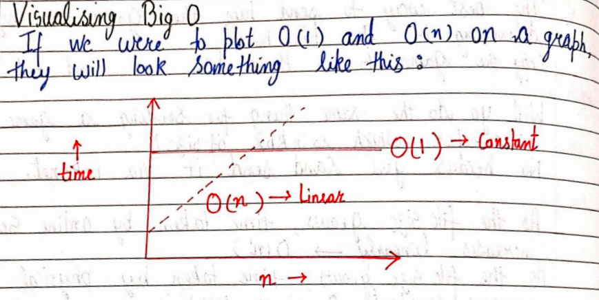

# Q1. Explain
1. What is Data Structure and algorithm? Its application?
2. What is Database, warehouse, Big data?
3. What is RAM , stack, heap?
4. Explain how program is executed? (like it comes to RAM, etc etc )

### 1. **What is Data Structure and Algorithm? Its Application?**

- **Data Structure**: A data structure is a way of organizing and storing data so that it can be accessed and modified efficiently. Examples include arrays, linked lists, stacks, queues, trees, and graphs. It uses RAM to store data.
  
- **Algorithm**: An algorithm is a step-by-step procedure or formula for solving a problem or performing a task, often using data structures. Examples include sorting algorithms (e.g., QuickSort, MergeSort) and search algorithms (e.g., Binary Search).

#### Applications:
- **Efficient Data Management**: Storing and managing data for applications like databases.
- **Optimized Problem Solving**: Algorithms help solve problems in the least amount of time and resources.
- **Real-World Applications**:
  - Graphs in networking (e.g., shortest path in GPS navigation).
  - Queues in CPU scheduling or print job management.
  - Trees for hierarchical data like file systems.

---

### 2. **What is Database, Data Warehouse, and Big Data?**

- **Database**: A structured collection of data stored electronically and managed using a Database Management System (DBMS). Examples: SQL databases like MySQL, PostgreSQL.
  - **Purpose**: Day-to-day operations like storing and retrieving user data in applications.
  - Is is HDD.

- **Data Warehouse**: A system used to store large amounts of historical data from multiple sources for analysis and reporting. It supports OLAP (Online Analytical Processing).
  - **Purpose**: Business intelligence and analytics for decision-making.

- **Big Data**: Extremely large and complex datasets that cannot be handled by traditional data processing tools. It uses frameworks like Hadoop or Spark for storage and processing.
  - **Purpose**: Handling high-volume, high-velocity, and high-variety data for insights, like in social media analytics or IoT data.

---

### 3. **What is RAM, Stack, and Heap?**

- **RAM (Random Access Memory)**: A volatile memory used by a computer to store data and instructions that are currently being used or processed. It is fast but loses data when power is off.

- **Stack**: A region of memory in RAM used for managing function calls, local variables, and control flow. Operates on a **LIFO** (Last In, First Out) principle.
  - **Usage**: Function calls, recursion.

- **Heap**: Another region of RAM used for dynamic memory allocation. Memory here must be managed explicitly by the programmer (e.g., using `malloc` in C or `new` in Java).
  - **Usage**: Objects, data structures like trees or graphs.

---

### 4. **How is a Program Executed?**

1. **Loading the Program**:
   - When you run a program, the CPU fetches the executable file from the disk (secondary storage).
   - The **Operating System (OS)** loads the program into **RAM** for faster access.

2. **Program Memory Allocation**:
   - **Text Segment**: Stores the compiled machine code (instructions).
   - **Data Segment**: Stores global and static variables.
   - **Heap**: Allocated for dynamic memory at runtime.
   - **Stack**: Allocated for function calls, local variables, and control flow.

3. **Execution by CPU**:
   - The **Program Counter (PC)** in the CPU fetches the next instruction from the text segment in RAM.
   - Instructions are decoded and executed.
   - If a function call is made, memory for local variables is pushed onto the stack.
   - Dynamic memory requested is allocated on the heap.

4. **I/O and External Interactions**:
   - Input/output operations (e.g., reading from a keyboard or displaying on a screen) are managed by the OS.

5. **Completion**:
   - When the program ends, the OS deallocates the memory from RAM and clears the stack and heap.

---

# Q2. Explain
1. What is Time Complexity?
2. What is Space Complexity?
3. What is Big O Notation?
4. What is Asymptotic Notation?

### 1. **What is Time Complexity?**  
Time complexity is a measure of how much **time** an algorithm takes to complete based on the size of the input (n). It helps analyze the efficiency of an algorithm by showing how execution time grows as input size increases.  

**Example**:  
- Linear Search: Time complexity is O(n), where time grows linearly with the size of input.  
- Binary Search: Time complexity is O(log n), where time grows logarithmically with input size.  

---

### 2. **What is Space Complexity?**  
Space complexity is the amount of **memory** an algorithm needs to execute, including:  
1. Fixed space for variables, constants, and instructions.  
2. Variable space for dynamic memory allocations and data structures.  

**Example**:  
- Sorting an array without extra memory: Space complexity is O(1).  
- Sorting using additional arrays: Space complexity is O(n).  

---

### 3. **What is Big O Notation?**  
Big O notation describes the **upper bound** of an algorithm’s time or space complexity. It represents the **worst-case scenario** of how the performance changes as input size grows.  

**Examples**:  
- O(1): Constant time (e.g., accessing an array element).  
- O(log n): Logarithmic time (e.g., Binary Search).  
- O(n): Linear time (e.g., iterating through an array).  
- O(n^2): Quadratic time (e.g., nested loops).  

---

### 4. **What is Asymptotic Notation?**  
Asymptotic notation describes the **growth** of an algorithm’s performance as the input size becomes very large. It ignores constants and lower-order terms to focus on the dominant behavior.  

**Types**:  
1. Big O (O): Represents the upper bound (worst-case).  
2. Omega (Ω): Represents the lower bound (best-case).  
3. Theta (Θ): Represents the exact growth (average-case).  

**Example**:  
For an algorithm that takes 3n^2 + 5n + 2 steps:  
- Big O: O(n^2) (focuses on the dominant term in the worst case).  
- Omega: Omega(n^2) (minimum growth rate).  
- Theta: Theta(n^2) (exact growth rate when upper and lower bounds match).  

###  5. How to decide which algorithm to use?
 - **Identify the problem**: Understand the problem statement and the constraints.
 - **Analyze the data**: Understand the data and its characteristics.
 - **Choose the algorithm**: Select an algorithm based on the problem and data characteristics.
 - **Implement the algorithm**: Write the code for the selected algorithm.
 - **Test the algorithm**: Test the algorithm with different inputs to ensure it works correctly.
 - **Evaluate the algorithm**: Evaluate the algorithm's performance and efficiency.
 - **Optimize the algorithm**: If necessary, optimize the algorithm to improve its performance.
 - **Document the algorithm**: Document the algorithm's design, implementation, and evaluation.
 - **Maintain the algorithm**: Regularly update and maintain the algorithm as needed.
The scenario you describe is an analogy for understanding how different algorithms or methods behave depending on the size of the data being processed. Let’s break it down:  

### **Explanation of Time complexity**  
1. **30 GB File (Constant Time)**  
   - For a large file like 30 GB, going to your friend's home and copying it via a hard disk is the most efficient approach.  
   - The time it takes depends on the **constant speed** of the hard disk and does not vary significantly with the file size.  
   - This resembles a **constant time algorithm** where the operation is completed in a fixed time regardless of input size (e.g., O(1)).

2. **250 KB File (Variable Time)**  
   - For a small file like 250 KB, receiving it online is more convenient and practical.  
   - The time taken depends on the file size and the speed of the internet connection.  
   - This resembles an algorithm where the time required varies proportionally with the size of the data being processed (e.g., O(n)).  

---

### **Comparison**  
- The first method (using a hard disk) works well for large data because the overhead of traveling and copying becomes negligible for such sizes.  
- The second method (receiving online) works better for smaller data sizes because the transfer time over the internet is minimal compared to physical travel.  

### **Graphical Representation**  


---


# Q3. Explain with equation and digram in simple term
1. Big oh notation
2. Big omega notation
3. Big theta notation


### 1. Big O Notation (O)  
Big O notation is said to represent the upper bound of an algorithm's time or space complexity. It defines the worst-case scenario, showing how the execution time or space grows as the input size increases.  

**Equation**:  
```text  
0 <= f(n) <= c * g(n) for all n >= n0  
```  
Here, `c` and `n0` are positive constants, and `g(n)` is the upper bound.  

**Example**:  
If an algorithm takes at most `3n + 2` operations, it is said to be Big O of `O(n)` because the growth is dominated by `n` as the input size increases.  

---

### 2. Big Omega Notation (Omega)  
Big Omega notation is said to represent the lower bound of an algorithm's time or space complexity. It defines the best-case scenario, showing the minimum growth of execution time or space as the input size increases.  

**Equation**:  
```text  
f(n) >= c * g(n) for all n >= n0  
```  
Here, `c` and `n0` are positive constants, and `g(n)` is the lower bound.  

**Example**:  
If an algorithm takes at least `n` operations in the best case, it is said to be Big Omega of `Omega(n)`.  

---

### 3. Big Theta Notation (Theta)  
Big Theta notation is said to represent the tight bound of an algorithm's time or space complexity. It defines the exact growth rate of execution time or space by combining both the upper and lower bounds.
- f(n) is said to be Big Theta of g(n) iff f(n) is both Big O of g(n) and Big Omega of g(n).
- Mathematically, `0 <= f(n) <= c1 * g(n)` and ` 0 <= c2 * g(n) <= f(n)` for all n >= n0.
- The equation simply meanss that there exist constants `c1` and `c2` such that the function `f(n)` is sandwiched between `c1 * g(n)` and `c2 * g(n)` for all `n` greater than or equal to `n0`.
- `c1 * g(n)` is the lower bound.
- `c2 * g(n)` is the upper bound.

**Equation**:  
```text  
c1 * g(n) <= f(n) <= c2 * g(n) for all n >= n0  
```  
Here, `c1`, `c2`, and `n0` are positive constants, and `g(n)` represents the tight bound.  

**Example**:  
If an algorithm takes `3n + 2` operations, it is said to be Big Theta of `Theta(n)` because `n` bounds the growth from both above and below.  


---

# Q4. Explain
1. What is best case, worst case and average case with example
2. Explain anaysis of a search algorithm
3. Explain space complexity with example ( factorial no)
4. Why cant we calculate complexity in seconnds instead of asymptotic analysis

### 1. What is best case, worst case and average case with example

### 1. Best Case  
The **best case** describes the scenario in which an algorithm performs the minimum number of operations. This is the most favorable input for the algorithm.  

#### Example:  
For linear search, where you search for an element in an array:  
- **Best case** occurs when the element to be found is the **first element** in the array.  
If the array is `[3, 5, 8, 10]` and you search for `3`, the algorithm checks only one element.  

---

### 2. Worst Case  
The **worst case** describes the scenario in which an algorithm performs the maximum number of operations. This happens with the least favorable input for the algorithm.  

#### Example:  
For linear search:  
- **Worst case** occurs when the element is the **last element** or is **not in the array**.  
If the array is `[3, 5, 8, 10]` and you search for `12`, the algorithm checks all four elements before concluding that the element is not present.  

---

### 3. Average Case  
The **average case** describes the scenario where the input is neither favorable nor unfavorable, and it represents the expected number of operations across all possible inputs.  

#### Example:  
For linear search:  
- **Average case** occurs when the element is somewhere **in the middle of the array**.  
If the array is `[3, 5, 8, 10]` and you search for `8`, the algorithm checks around half of the array on average, assuming the element exists.  

---

### Summary with Search Example  
| **Case**         | **Scenario**                  | **Linear Search Example**                |  
|-------------------|-------------------------------|------------------------------------------|  
| **Best Case**     | Minimum operations performed | Element is the first in the array        |  
| **Worst Case**    | Maximum operations performed | Element is the last or not in the array  |  
| **Average Case**  | Expected operations          | Element is in the middle of the array    |  

---

### Q2. Explain anaysis of a search algorithm

### **Analysis of Search Algorithms**

#### **Algorithm 1: Linear Search**  
This algorithm searches for an element by checking **each element sequentially** in the array until the target is found or the array is exhausted.  

- **Best Case (O(1))**:  
The element is found at the first position, requiring only **one comparison**.  
Example: Searching for `3` in `[3, 5, 7, 10]`.  

- **Worst Case (O(n))**:  
The element is either the **last element** or **not in the array**, requiring the algorithm to traverse the entire array of size `n`.  
Example: Searching for `10` or `12` in `[3, 5, 7, 10]`.  

- **Average Case (O(n))**:  
In this case, the element is assumed to be randomly placed in the array. The average runtime is calculated by summing up the runtime for all possible cases and dividing it by the total number of cases.  
If there are `n` elements in the array:  
```text
Average Runtime = (1 + 2 + 3 + ... + n) / n = (n(n + 1) / 2) / n = (n + 1) / 2
```
So, the time complexity remains proportional to `n`, making it **O(n)** for the average case.  

---

#### **Algorithm 2: Binary Search**  
This algorithm works by **dividing the array into two halves**. The search focuses on the half where the target might exist, discarding the other half. It repeats this process until the target is found or the array is exhausted.  

- **Best Case (O(1))**:  
The element is found **immediately** at the first comparison, usually when it's at the middle of the array.  
Example: Searching for `5` in `[1, 3, 5, 7, 9]`, where `5` is the middle element.  

- **Worst Case (O(log n))**:  
The element is not found until the array is reduced to a size of **1** or is **not present** at all. The array is divided repeatedly until it is exhausted.  

To understand **O(log n)**, note that the process of dividing the array stops when the size becomes `1`. This happens after `log2(n)` divisions (base 2 logarithm):  
- For an array of size `8`:  
```text
8 -> 4 -> 2 -> 1 (3 divisions, log2(8) = 3)
```
- For an array of size `4`:  
```text
4 -> 2 -> 1 (2 divisions, log2(4) = 2)
```  

```text
Log(n) -> no of times you need to half array before it get exhausted
log 8  = 3 => 8-> 4-> 2-> 1 -> no break
log 4 = 2 => 4->2->1->no break
```

- **Average Case (O(log n))**:  
In the average case, binary search still reduces the search space logarithmically, as each division halves the search space, making it logarithmic in complexity.  

---

### **Summary of Search Algorithms**

| **Algorithm**      | **Best Case** | **Worst Case** | **Average Case** | **Use Case**                        |  
|---------------------|---------------|----------------|------------------|--------------------------------------|  
| **Linear Search**   | O(1)          | O(n)           | O(n)            | Small or unsorted datasets           |  
| **Binary Search**   | O(1)          | O(log n)       | O(log n)        | Large, sorted datasets               |  

---

### 3. **Space Complexity**  
Space complexity refers to the amount of memory required by an algorithm to execute, including:  
- Memory for variables and constants.  
- Memory for input and output data.  
- Memory for auxiliary data structures (e.g., stacks, recursion calls).  

#### **Example: Space Complexity of Factorial Calculation**  
To calculate the factorial of a number `n` recursively, the algorithm uses additional memory for each recursive call.  

**Recursive Factorial Function**:  
```python
def factorial(n):
    if n == 1:
        return 1
    return n * factorial(n - 1)
```  

For `factorial(5)`, the recursion stack builds as:  
```text
factorial(5) -> factorial(4) -> factorial(3) -> factorial(2) -> factorial(1)
```  

Each call is stored in memory until the base case is reached. This uses **O(n)** memory for the recursion stack because there are `n` calls in the stack.  

**Space Complexity**:  
- **Auxiliary space** (recursion stack): O(n)  
- **Total space complexity**: O(n)  

---

### 4. **Why Can't We Calculate Complexity in Seconds?**  
Using seconds to measure algorithm performance is not reliable due to the following reasons:  

1. **Hardware Dependency**:  
2. Not everyone's computer is equally powerful.
3. Powerful computers can execute code faster, but this doesn't mean the algorithm is more efficient.
4. Asymptotic analysis is measure of how runtime grows with input size.

**Conclusion**:  
Instead of measuring performance in seconds, we use asymptotic notations (Big O, Omega, Theta) to analyze algorithms universally, considering their efficiency based on input size and ignoring hardware or software differences.  

---

# Q5. Explain
1. Explain how to calculate time complexity with some steps. Explain with example
2. Five examples of time complexity


### How to Calculate Time Complexity of an Algorithm  

Time complexity measures how the execution time of an algorithm changes with the input size, typically denoted as n. Below are the steps to calculate time complexity:  

---

### Steps to Calculate Time Complexity  

1. **Understand the Algorithm**:  
   Analyze the algorithm step-by-step to identify operations like loops, recursive calls, and function calls.  

2. **Identify Basic Operations**:  
   Count the most significant operations (e.g., assignments, comparisons) that dominate the algorithm's runtime.  

3. **Analyze Loops**:  
   - Single loop: The time complexity is proportional to the number of iterations (O(n)).  
   - Nested loops: Multiply the complexities of inner and outer loops (O(n^2) for two nested loops).  

4. **Account for Conditional Statements**:  
   Include branches with the longest runtime.  

5. **Analyze Recursion**:  
   Use recurrence relations or recursive tree methods to determine the time complexity.  

6. **Ignore Constants and Lower-Order Terms**:  
   Focus on the highest-order term as n grows large.  

---

### Example: Find Time Complexity of a Simple Algorithm

#### Algorithm: Calculate Sum of Elements in an Array  
```python
def calculate_sum(arr):
    n = len(arr)  # Step 1
    total = 0     # Step 2
    for i in range(n):  # Step 3
        total += arr[i]  # Step 4
    return total         # Step 5
```  

#### Step-by-Step Analysis  
1. Step 1: `len(arr)` takes O(1) (constant time).  
2. Step 2: `total = 0` is a single assignment, so O(1).  
3. Step 3: The loop runs n times (proportional to the size of the array), so O(n).  
4. Step 4: The operation inside the loop (`total += arr[i]`) is performed n times, so O(n).  
5. Step 5: `return total` takes O(1).  

**Total Time Complexity**:  
```text
O(1) + O(1) + O(n) + O(n) + O(1) = O(n)
```

The algorithm has O(n) time complexity.  

---

### Example: Nested Loops  

#### Algorithm: Print All Pairs in an Array  
```python
def print_pairs(arr):
    n = len(arr)  # Step 1
    for i in range(n):        # Outer loop
        for j in range(n):    # Inner loop
            print(arr[i], arr[j])  # Step 2
```  

#### Step-by-Step Analysis  
1. Outer Loop: Runs n times.  
2. Inner Loop: For each iteration of the outer loop, runs n times.  
3. Total Iterations: n * n = n^2.  

**Total Time Complexity**:  
```text
O(n^2)
```

The algorithm has O(n^2) time complexity.  

---

### Key Points  
- Look for loops, conditionals, and recursion.  
- Ignore constants and focus on dominant terms.  
- Use standard patterns to quickly estimate complexity (e.g., single loop = O(n), nested loops = O(n^2)).  

---

### Five Examples of Time Complexity

Here are five sample C++ codes with their corresponding time complexities, covering all major types:

---

### **1. Constant Time (O(1))**  
This algorithm executes a fixed number of operations regardless of the input size.

```cpp
#include <iostream>
using namespace std;

int getFirstElement(int arr[]) {
    return arr[0];  // Accessing the first element is O(1)
}

int main() {
    int arr[] = {10, 20, 30};
    cout << "First Element: " << getFirstElement(arr) << endl;
    return 0;
}
```

- **Time Complexity**: O(1)  
- **Reason**: The operation does not depend on the input size; it directly accesses the first element.

---

### **2. Linear Time (O(n))**  
This algorithm iterates through all elements of the input.

```cpp
#include <iostream>
using namespace std;

int calculateSum(int arr[], int n) {
    int sum = 0;
    for (int i = 0; i < n; i++) {  // Loop runs n times
        sum += arr[i];
    }
    return sum;
}

int main() {
    int arr[] = {1, 2, 3, 4, 5};
    int n = sizeof(arr) / sizeof(arr[0]);
    cout << "Sum: " << calculateSum(arr, n) << endl;
    return 0;
}
```

- **Time Complexity**: O(n)  
- **Reason**: The loop iterates through all `n` elements of the array.

---

### **3. Quadratic Time (O(n^2))**  
This algorithm involves nested loops, iterating through pairs of elements.

```cpp
#include <iostream>
using namespace std;

void printPairs(int arr[], int n) {
    for (int i = 0; i < n; i++) {          // Outer loop runs n times
        for (int j = 0; j < n; j++) {      // Inner loop runs n times
            cout << "(" << arr[i] << ", " << arr[j] << ")" << endl;
        }
    }
}

int main() {
    int arr[] = {1, 2, 3};
    int n = sizeof(arr) / sizeof(arr[0]);
    printPairs(arr, n);
    return 0;
}
```

- **Time Complexity**: O(n^2)  
- **Reason**: The nested loops result in n * n iterations.

---

### **4. Logarithmic Time (O(log n))**  
This algorithm halves the input size at each step (e.g., binary search).

```cpp
#include <iostream>
using namespace std;

int binarySearch(int arr[], int n, int target) {
    int left = 0, right = n - 1;
    while (left <= right) {
        int mid = left + (right - left) / 2;
        if (arr[mid] == target) {
            return mid;  // Found the target
        } else if (arr[mid] < target) {
            left = mid + 1;  // Search the right half
        } else {
            right = mid - 1;  // Search the left half
        }
    }
    return -1;  // Target not found
}

int main() {
    int arr[] = {1, 3, 5, 7, 9};
    int n = sizeof(arr) / sizeof(arr[0]);
    int target = 7;
    int result = binarySearch(arr, n, target);
    if (result != -1)
        cout << "Element found at index: " << result << endl;
    else
        cout << "Element not found." << endl;
    return 0;
}
```

- **Time Complexity**: O(log n)  
- **Reason**: The search space is halved at every iteration.

---

### **5. Factorial Time (O(n!))**  
This algorithm generates all permutations of an array.

```cpp
#include <iostream>
#include <algorithm>
using namespace std;

void printPermutations(int arr[], int n) {
    sort(arr, arr + n);
    do {
        for (int i = 0; i < n; i++) {
            cout << arr[i] << " ";
        }
        cout << endl;
    } while (next_permutation(arr, arr + n));  // Generates the next permutation
}

int main() {
    int arr[] = {1, 2, 3};
    int n = sizeof(arr) / sizeof(arr[0]);
    printPermutations(arr, n);
    return 0;
}
```

- **Time Complexity**: O(n!)  
- **Reason**: There are n! permutations of an array of size n.

---

### **6. Finding Prime Numbers (O(sqrt(n)))**  
This algorithm checks whether a number is prime by testing divisors up to its square root.

```cpp
#include <iostream>
using namespace std;

bool isPrime(int n) {
    if (n <= 1) return false;
    for (int i = 2; i * i <= n; i++) {  // Check divisors up to sqrt(n)
        if (n % i == 0) return false;
    }
    return true;
}

int main() {
    int num = 29;
    if (isPrime(num))
        cout << num << " is a prime number." << endl;
    else
        cout << num << " is not a prime number." << endl;
    return 0;
}
```

---

- **Time Complexity**: O(sqrt(n))  
- **Reason**: Instead of iterating up to `n`, we only check divisors up to `sqrt(n)`, reducing the total number of iterations significantly.  

---

### Complete List:
1. **O(1)**: Accessing the first element of an array.  
2. **O(n)**: Calculating the sum of an array.  
3. **O(n^2)**: Printing all pairs in an array (nested loops).  
4. **O(log n)**: Searching for an element using binary search.  
5. **O(n!)**: Generating all permutations of an array.  
6. **O(sqrt(n))**: Finding whether a number is prime.  

---

# Q6. Explain
1. Explain Arrays and Abstract Data Type in Data Structure

### **Arrays in Data Structures**

**Definition**:  
An **array** is a collection of elements of the same data type, stored in contiguous memory locations. Arrays are a fundamental data structure used to organize and store data for efficient access.

---

**Key Characteristics**:  
1. **Fixed Size**: The size of the array is defined at the time of its creation and cannot be changed.  
2. **Indexing**: Each element in the array is accessed using its index, which starts from 0.  
3. **Homogeneous Data**: All elements must be of the same type (e.g., integers, floats, characters).  
4. **Contiguous Memory**: Elements are stored in adjacent memory locations.  

---

**Advantages**:  
- **Fast Access**: Direct access to elements using indices (O(1)).  
- **Efficient Traversal**: Sequential traversal is straightforward.  

---

**Limitations**:  
- **Fixed Size**: Cannot dynamically grow or shrink after creation.  
- **Insertion/Deletion Cost**: Inserting or deleting elements can be time-consuming as it may require shifting other elements.

---

**Example (C++ Code)**:  

```cpp
#include <iostream>
using namespace std;

int main() {
    int arr[5] = {10, 20, 30, 40, 50}; // Array of size 5
    cout << "Element at index 2: " << arr[2] << endl; // Accessing an element
    return 0;
}
```

---

### **Abstract Data Type (ADT)**

**Definition**:  
An **Abstract Data Type (ADT)** is a theoretical concept that defines the **behavior** (operations) of a data structure without specifying its implementation. It provides a blueprint for what a data structure should do, focusing on **what** it does rather than **how** it does it.
bstract Data Types and Arrays:
ADTs or abstract data types are the ways of classifying data structures by providing a minimal expected interface and some set of methods. It is very similar to when we make a blueprint before actually getting into doing some job, be it constructing a computer or a building. The blueprint comprises all the minimum required logistics and the roadmap to pursuing the job.


**Key Features**:  
1. **Encapsulation**: Separates the interface (operations) from the implementation.  
2. **Mathematical Model**: Defines a data structure in terms of its operations and properties.  
3. **Implementation Independence**: The same ADT can be implemented in multiple ways (e.g., stacks using arrays or linked lists).

---

**Examples of ADTs**:  
1. **List**: A collection of elements where order matters.  
   - Operations: `insert`, `delete`, `traverse`.  
2. **Stack**: A collection following the Last In First Out (LIFO) principle.  
   - Operations: `push`, `pop`, `peek`.  
3. **Queue**: A collection following the First In First Out (FIFO) principle.  
   - Operations: `enqueue`, `dequeue`, `peek`.

### **Conclusion**:
- **Array**: A fundamental data structure with fixed size and efficient random access.  
- **ADT**: A high-level abstraction that defines data behavior, separating operations from implementation.

---

# Q7. Array and ADT (Not Needed Lect 7)
# Q8. Implementing array as ADT (Not Needed Lect 8)

# Q9 and Q10. Explain [Lect 9 and 10]
1. Explain Operations on an Array with cpp code: Traversal, Insertion, Deletion, Search

### **Operations on an Array with Time Complexity**

Below are the key array operations explained with C++ code and their respective time complexities:

---

### **1. Traversal**  
Visiting each element of the array sequentially.  

**Time Complexity**:  
- Best Case: O(n)  
- Worst Case: O(n)
 
 
```cpp
#include <iostream>
using namespace std;

int main() {
    int arr[5] = {10, 20, 30, 40, 50}; // Array declaration
    cout << "Array elements are: ";
    for (int i = 0; i < 5; i++) {      // Traverse the array
        cout << arr[i] << " ";
    }
    return 0;
}
```

**Output**:  
`Array elements are: 10 20 30 40 50`

---

### **2. Insertion**  
Adding an element at a specific position in the array.  

**Time Complexity**:  
- Best Case: O(1) (Insert at the end without shifting)  
- Worst Case: O(n) (Insert at the beginning with shifting)

When no position is specified, it’s best to insert the element at the end to avoid shifting, and this is when we achieve the best runtime O(1).

```cpp
#include <iostream>
using namespace std;

int main() {
    int arr[6] = {10, 20, 30, 40, 50}; // Array with extra space
    int n = 5; // Current size
    int pos = 3; // Position to insert (0-based index)
    int value = 25;

    // Shift elements to the right
    for (int i = n; i > pos; i--) {
        arr[i] = arr[i - 1];
    }
    arr[pos] = value; // Insert the new element
    n++; // Increase size

    // Print the updated array
    cout << "Array after insertion: ";
    for (int i = 0; i < n; i++) {
        cout << arr[i] << " ";
    }
    return 0;
}
```

**Output**:  
`Array after insertion: 10 20 30 25 40 50`

---

### **3. Deletion**  
Removing an element from a specific position in the array.  

**Time Complexity**:  
- Best Case: O(1) (Delete the last element without shifting)  
- Worst Case: O(n) (Delete from the beginning with shifting)

```cpp
#include <iostream>
using namespace std;

int main() {
    int arr[5] = {10, 20, 30, 40, 50}; // Array declaration
    int n = 5; // Current size
    int pos = 2; // Position to delete (0-based index)

    // Shift elements to the left
    for (int i = pos; i < n - 1; i++) {
        arr[i] = arr[i + 1];
    }
    n--; // Decrease size

    // Print the updated array
    cout << "Array after deletion: ";
    for (int i = 0; i < n; i++) {
        cout << arr[i] << " ";
    }
    return 0;
}
```

**Output**:  
`Array after deletion: 10 20 40 50`

---

### **4. Search**  
Finding the index of a specific element in the array.

#### **Linear Search**  
For unsorted arrays, check each element sequentially.

**Time Complexity**:  
- Best Case: O(1) (If the element is the first one)  
- Worst Case: O(n) (If the element is the last or not present)

```cpp
#include <iostream>
using namespace std;

int main() {
    int arr[5] = {10, 20, 30, 40, 50}; // Array declaration
    int n = 5;
    int key = 30;
    int found = -1; // To store index if found

    for (int i = 0; i < n; i++) {
        if (arr[i] == key) {
            found = i;
            break;
        }
    }

    if (found != -1)
        cout << "Element " << key << " found at index " << found << endl;
    else
        cout << "Element " << key << " not found." << endl;

    return 0;
}
```

**Output**:  
`Element 30 found at index 2`

---

### **Summary Table of Operations and Time Complexity**

| **Operation**   | **Time Complexity (Best Case)** | **Time Complexity (Worst Case)** | **Description**                                  |
|------------------|--------------------------------|----------------------------------|--------------------------------------------------|
| **Traversal**    | O(n)                     | O(n)                       | Visit each element of the array.                |
| **Insertion**    | O(1)                     | O(n)                       | Insert by shifting elements.                    |
| **Deletion**     | O(1)                     | O(n)                       | Delete by shifting elements.                    |
| **Search**       | O(1)                     | O(n)                       | Find an element sequentially.                   |

These examples demonstrate the array operations with their respective time complexities, allowing a better understanding of their efficiency in different scenarios.