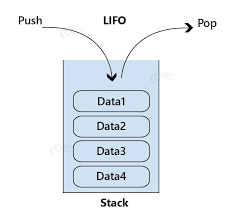

# Q21. Explain doubly linked list in detail with example


### **Doubly Linked List**

A **doubly linked list** is a type of linked list in which each node contains three parts:
1. **Data**: The actual value of the node.
2. **Pointer to the next node**: Points to the next node in the sequence.
3. **Pointer to the previous node**: Points to the previous node in the sequence.

---

### **Why Doubly Linked List?**
1. **Bi-directional Traversal**: You can traverse the list both forward and backward.
2. **Efficient Deletion and Insertion**: Allows for easier deletion and insertion compared to a singly linked list, as you have access to both previous and next nodes.
3. **Reversing the List**: Reversing the list is easier and more efficient.

---

### **Structure of a Doubly Linked List**
In C++, a node for a doubly linked list is represented as:
```cpp
struct Node {
    int data;
    Node* prev;
    Node* next;
};
```

---

### **Operations on a Doubly Linked List**

#### 1. **Traversal**
- **Forward Traversal**: Traverse from head to the end of the list.
- **Backward Traversal**: Traverse from the last node to the head.

```cpp
void traverseForward(Node* head) {
    Node* temp = head;
    while (temp != nullptr) {
        cout << temp->data << " ";
        temp = temp->next;
    }
    cout << endl;
}

void traverseBackward(Node* tail) {
    Node* temp = tail;
    while (temp != nullptr) {
        cout << temp->data << " ";
        temp = temp->prev;
    }
    cout << endl;
}
```

---

#### 2. **Insertion**
- **At the Beginning**
```cpp
Node* insertAtBeginning(Node* head, int data) {
    Node* newNode = new Node{data, nullptr, head};
    if (head != nullptr) {
        head->prev = newNode;
    }
    return newNode;
}
```

- **At the End**
```cpp
Node* insertAtEnd(Node* head, int data) {
    Node* newNode = new Node{data, nullptr, nullptr};
    if (head == nullptr) {
        return newNode;
    }
    Node* temp = head;
    while (temp->next != nullptr) {
        temp = temp->next;
    }
    temp->next = newNode;
    newNode->prev = temp;
    return head;
}
```

- **At a Specific Position**
```cpp
Node* insertAtPosition(Node* head, int data, int position) {
    if (position == 0) {
        return insertAtBeginning(head, data);
    }
    Node* newNode = new Node{data, nullptr, nullptr};
    Node* temp = head;
    for (int i = 0; i < position - 1 && temp != nullptr; i++) {
        temp = temp->next;
    }
    if (temp == nullptr) {
        cout << "Invalid position.\n";
        delete newNode;
        return head;
    }
    newNode->next = temp->next;
    if (temp->next != nullptr) {
        temp->next->prev = newNode;
    }
    newNode->prev = temp;
    temp->next = newNode;
    return head;
}
```

---

#### 3. **Deletion**
- **From the Beginning**
```cpp
Node* deleteFromBeginning(Node* head) {
    if (head == nullptr) return nullptr;
    Node* temp = head;
    head = head->next;
    if (head != nullptr) {
        head->prev = nullptr;
    }
    delete temp;
    return head;
}
```

- **From the End**
```cpp
Node* deleteFromEnd(Node* head) {
    if (head == nullptr) return nullptr;
    Node* temp = head;
    while (temp->next != nullptr) {
        temp = temp->next;
    }
    if (temp->prev != nullptr) {
        temp->prev->next = nullptr;
    } else {
        head = nullptr; // Single node case
    }
    delete temp;
    return head;
}
```

- **From a Specific Position**
```cpp
Node* deleteFromPosition(Node* head, int position) {
    if (head == nullptr) return nullptr;
    if (position == 0) {
        return deleteFromBeginning(head);
    }
    Node* temp = head;
    for (int i = 0; i < position && temp != nullptr; i++) {
        temp = temp->next;
    }
    if (temp == nullptr) {
        cout << "Invalid position.\n";
        return head;
    }
    if (temp->next != nullptr) {
        temp->next->prev = temp->prev;
    }
    if (temp->prev != nullptr) {
        temp->prev->next = temp->next;
    }
    delete temp;
    return head;
}
```

---

### **Example Usage**
```cpp
int main() {
    Node* head = nullptr;

    // Insertions
    head = insertAtEnd(head, 10);
    head = insertAtEnd(head, 20);
    head = insertAtEnd(head, 30);
    head = insertAtBeginning(head, 5);

    cout << "After Insertions (Forward Traversal):\n";
    traverseForward(head);

    // Deletion
    head = deleteFromBeginning(head);
    cout << "After Deleting From Beginning (Forward Traversal):\n";
    traverseForward(head);

    head = deleteFromEnd(head);
    cout << "After Deleting From End (Forward Traversal):\n";
    traverseForward(head);

    return 0;
}
```

---

### **Time Complexities**
| **Operation**      | **Time Complexity** |
|---------------------|---------------------|
| Traversal           | O(n)               |
| Insertion (Beginning)| O(1)               |
| Insertion (End)     | O(n)               |
| Insertion (Position)| O(n)               |
| Deletion (Beginning)| O(1)               |
| Deletion (End)      | O(n)               |
| Deletion (Position) | O(n)               |

---

### **Advantages of Doubly Linked List**
1. Easier to implement reverse traversal.
2. More flexible in deletion and insertion.
3. Supports bi-directional traversal.


---

# Q22 and 23 and 25 and 26 Explain stack in detail and Perform all operation

### **Stack in Data Structure**

A **stack** is a linear data structure that follows the **LIFO (Last In, First Out)** principle. This means that the last element added to the stack is the first one to be removed.

---

### **Why Use a Stack?**
- Stacks are used when you need to manage data in a sequential and controlled manner, such as reversing a string, parsing expressions, or implementing function calls in recursion.

---

### **Structure of a Stack**
A stack can be implemented using:
1. **Arrays** (Static implementation)
2. **Linked Lists** (Dynamic implementation)

---

### **Basic Operations on a Stack**
1. **Push**: Add an element to the top of the stack.
2. **Pop**: Remove the top element of the stack.
3. **Peek**: View the top element without removing it.
4. **isEmpty**: Check if the stack is empty.
5. **isFull**: Check if the stack is full (only for array-based implementation).
6. **StackTop and StackBottom**: Retrieve the top and bottom elements of the stack.
7. **PeekAtPosition**: View an element at a specific position.

---

### **Implementation of Stack in C++**

#### **1. Stack using Array**

```cpp
#include <iostream>
using namespace std;

class Stack {
private:
    int* arr;
    int top;
    int capacity;

public:
    Stack(int size) {
        capacity = size;
        arr = new int[size];
        top = -1;
    }

    // Push operation
    void push(int value) {
        if (top == capacity - 1) {
            cout << "Stack Overflow: Cannot push " << value << endl;
            return;
        }
        arr[++top] = value;
    }

    // Pop operation
    void pop() {
        if (top == -1) {
            cout << "Stack Underflow: Cannot pop" << endl;
            return;
        }
        cout << "Popped: " << arr[top--] << endl;
    }

    // Peek operation
    int peek() {
        if (top == -1) {
            cout << "Stack is empty" << endl;
            return -1;
        }
        return arr[top];
    }

    // Check if stack is empty
    bool isEmpty() {
        return top == -1;
    }

    // Destructor
    ~Stack() {
        delete[] arr;
    }
};

int main() {
    Stack stack(5);

    stack.push(10);
    stack.push(20);
    stack.push(30);

    cout << "Top element: " << stack.peek() << endl;

    stack.pop();
    stack.pop();

    cout << "Stack empty: " << (stack.isEmpty() ? "Yes" : "No") << endl;

    return 0;
}
```

---
```cpp
#include <stdio.h>
#include <stdlib.h>
 
struct stack
{
    int size;
    int top;
    int *arr;
};
 
int isEmpty(struct stack *ptr)
{
    if (ptr->top == -1)
    {
        return 1;
    }
    else
    {
        return 0;
    }
}
 
int isFull(struct stack *ptr)
{
    if (ptr->top == ptr->size - 1)
    {
        return 1;
    }
    else
    {
        return 0;
    }
}
 
int main()
{
    // struct stack s;
    // s.size = 80;
    // s.top = -1;
    // s.arr = (int *) malloc(s.size * sizeof(int));
 
    struct stack *s;
    s->size = 80;
    s->top = -1;
    s->arr = (int *)malloc(s->size * sizeof(int));
 
    return 0;
}

```
---
**Whole source code**
```cpp
#include<stdio.h>
#include<stdlib.h>
 
struct stack{
    int size ;
    int top;
    int * arr;
};
 
int isEmpty(struct stack* ptr){
    if(ptr->top == -1){
            return 1;
        }
        else{
            return 0;
        }
}
 
int isFull(struct stack* ptr){
    if(ptr->top == ptr->size - 1){
        return 1;
    }
    else{
        return 0;
    }
}
 
void push(struct stack* ptr, int val){
    if(isFull(ptr)){
        printf("Stack Overflow! Cannot push %d to the stack\n", val);
    }
    else{
        ptr->top++;
        ptr->arr[ptr->top] = val;
    }
}
 
int pop(struct stack* ptr){
    if(isEmpty(ptr)){
        printf("Stack Underflow! Cannot pop from the stack\n");
        return -1;
    }
    else{
        int val = ptr->arr[ptr->top];
        ptr->top--;
        return val;
    }
}
 
int peek(struct stack* sp, int i){
    int arrayInd = sp->top -i + 1;
    if(arrayInd < 0){
        printf("Not a valid position for the stack\n");
        return -1;
    }
    else{
        return sp->arr[arrayInd];
    }
}
int main(){
    struct stack *sp = (struct stack *) malloc(sizeof(struct stack));
    sp->size = 50;
    sp->top = -1;
    sp->arr = (int *) malloc(sp->size * sizeof(int));
    printf("Stack has been created successfully\n");
 
    printf("Before pushing, Full: %d\n", isFull(sp));
    printf("Before pushing, Empty: %d\n", isEmpty(sp));
       
    return 0;
}

```
---

#### **2. Stack using Linked List**

```cpp
#include <iostream>
using namespace std;

struct Node {
    int data;
    Node* next;
};

class Stack {
private:
    Node* top;

public:
    Stack() {
        top = nullptr;
    }

    // Push operation
    void push(int value) {
        Node* newNode = new Node();
        newNode->data = value;
        newNode->next = top;
        top = newNode;
    }

    // Pop operation
    void pop() {
        if (top == nullptr) {
            cout << "Stack Underflow: Cannot pop" << endl;
            return;
        }
        Node* temp = top;
        top = top->next;
        cout << "Popped: " << temp->data << endl;
        delete temp;
    }

    // Peek operation
    int peek() {
        if (top == nullptr) {
            cout << "Stack is empty" << endl;
            return -1;
        }
        return top->data;
    }

    // Check if stack is empty
    bool isEmpty() {
        return top == nullptr;
    }
};

int main() {
    Stack stack;

    stack.push(40);
    stack.push(50);
    stack.push(60);

    cout << "Top element: " << stack.peek() << endl;

    stack.pop();
    stack.pop();

    cout << "Stack empty: " << (stack.isEmpty() ? "Yes" : "No") << endl;

    return 0;
}
```

---

### **Time Complexity of Operations**

| Operation | Array-Based Stack | Linked List-Based Stack |
|-----------|-------------------|-------------------------|
| Push      | O(1)              | O(1)                   |
| Pop       | O(1)              | O(1)                   |
| Peek      | O(1)              | O(1)                   |
| isEmpty   | O(1)              | O(1)                   |

---

### **Key Points**
1. Array-based stacks have a fixed size and can cause stack overflow when full.
2. Linked list-based stacks are dynamic and do not have a fixed size.




---

# Q28. Write code for stacktop and stackbottom


### **For Array-Based Stack**
```cpp
void stackTop() {
    if (top == -1) {
        cout << "Stack is empty" << endl;
    } else {
        cout << "Stack Top: " << arr[top] << endl;
    }
}

void stackBottom() {
    if (top == -1) {
        cout << "Stack is empty" << endl;
    } else {
        cout << "Stack Bottom: " << arr[0] << endl;
    }
}
```

### **For Linked List-Based Stack**
```cpp
void stackTop() {
    if (top == nullptr) {
        cout << "Stack is empty" << endl;
    } else {
        cout << "Stack Top: " << top->data << endl;
    }
}

void stackBottom() {
    if (top == nullptr) {
        cout << "Stack is empty" << endl;
    } else {
        Node* temp = top;
        while (temp->next != nullptr) {
            temp = temp->next;
        }
        cout << "Stack Bottom: " << temp->data << endl;
    }
}
```

### Peek value at given position
### **For Array-Based Stack**
```cpp
int valueAtPosition(int position) {
    if (position < 1 || position > top + 1) {
        cout << "Invalid position" << endl;
        return -1;
    }
    return arr[top - position + 1]; // Position starts from 1 and top starts from 0
}
```

---

### **For Linked List-Based Stack**
```cpp
int valueAtPosition(int position) {
    Node* temp = top;
    int currentPos = 1;

    while (temp != nullptr) {
        if (currentPos == position) {
            return temp->data;
        }
        temp = temp->next;
        currentPos++;
    }

    cout << "Invalid position" << endl;
    return -1;
}
```

---

# Q29 and Q30. Write code for stack using linked list
Refer Q27