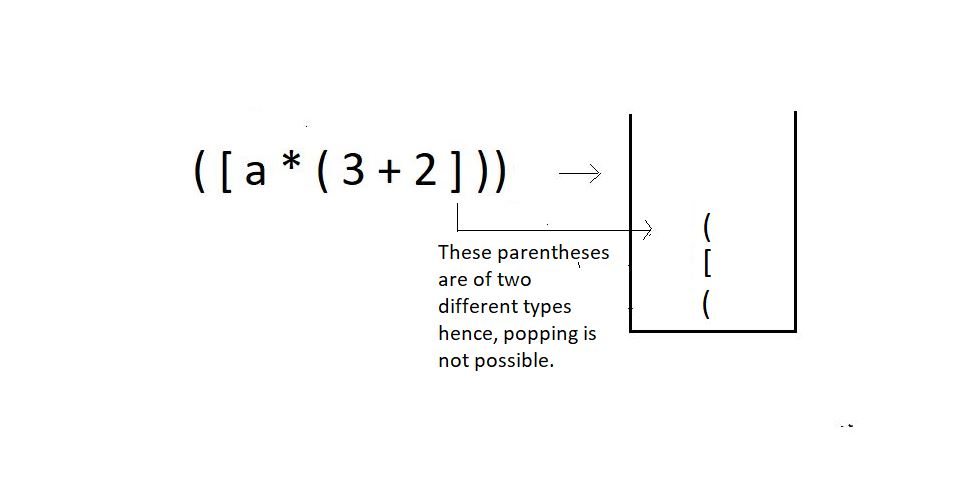
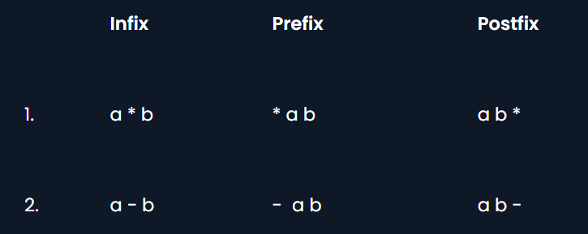
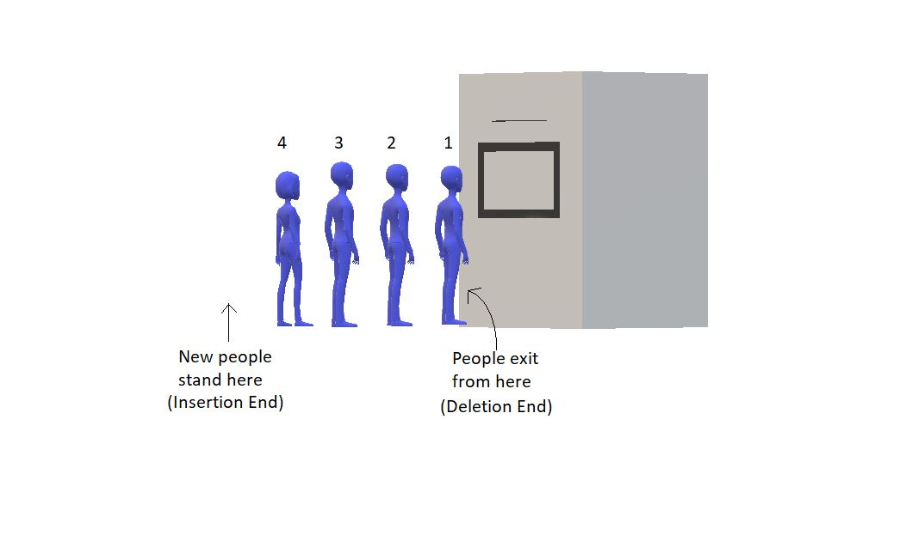
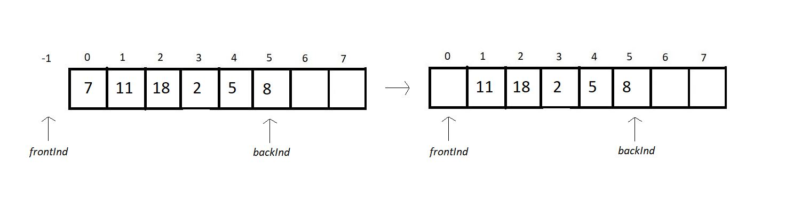

# Q31. Write peek(), stackTop() and Other Operations on Stack Using Linked List


[Click here](Lect21to30.md#q22-and-23-and-25-and-26-explain-stack-in-detail-and-perform-all-operation)


---

# Q32 , Q33, Q34. Explain parenthesis checking using a stack with code

### **Parenthesis Matching Using a Stack**

**Parenthesis matching** is a common application of stacks, where we check if all the opening and closing brackets (`()`, `{}`, `[]`) are properly matched in an expression. The stack is used to ensure the brackets follow the correct order and are balanced.

---

### **Algorithm Explanation**
1. **Input**: A string containing brackets.
2. **Use Stack**:
   - Push opening brackets (`(`, `{`, `[`) onto the stack.
   - For every closing bracket (`)`, `}`, `]`), check:
     - If the stack is empty, the expression is unbalanced.
     - If the stack's top matches the current closing bracket, pop the stack.
     - If not, the expression is unbalanced.
3. **Final Check**:
   - If the stack is empty after processing the entire string, the expression is balanced.
   - If the stack is not empty, the expression is unbalanced.
4. **Complexity**:
   - **Time Complexity**: O(n) (We traverse the string once.)
   - **Space Complexity**: O(n) (Stack stores at most n characters.)

---

### **Code in C++**
```cpp
#include <iostream>
#include <stack>
#include <string>
using namespace std;

// Function to check if brackets are balanced
bool isMatchingPair(char open, char close) {
    return (open == '(' && close == ')') || 
           (open == '{' && close == '}') || 
           (open == '[' && close == ']');
}

bool isBalanced(string expression) {
    stack<char> stk;

    for (char ch : expression) {
        if (ch == '(' || ch == '{' || ch == '[') {
            // Push opening brackets onto the stack
            stk.push(ch);
        } else if (ch == ')' || ch == '}' || ch == ']') {
            // Check for matching pair
            if (stk.empty() || !isMatchingPair(stk.top(), ch)) {
                return false; // Unmatched closing bracket
            }
            stk.pop(); // Pop the matched opening bracket
        }
    }

    // If the stack is empty, all brackets are matched
    return stk.empty();
}

int main() {
    string expression;

    cout << "Enter an expression with brackets: ";
    cin >> expression;

    if (isBalanced(expression)) {
        cout << "The expression is balanced." << endl;
    } else {
        cout << "The expression is not balanced." << endl;
    }

    return 0;
}
```

---

### **Example Walkthrough**
#### Input: `{[()]}`
1. Push `{` → Stack: `{`.
2. Push `[` → Stack: `{ [`.
3. Push `(` → Stack: `{ [ (`.
4. Pop `)` → Matches with `(` → Stack: `{ [`.
5. Pop `]` → Matches with `[` → Stack: `{`.
6. Pop `}` → Matches with `{` → Stack: Empty.
7. **Output**: Balanced.

#### Input: `{[(])}`
1. Push `{`, `[`, `(` → Stack: `{ [ (`. 
2. Pop `)` → Doesn't match with `[` → **Output**: Not balanced.

---

### **Key Points**
- **Stack Operations**:
  - Push for opening brackets.
  - Pop and match for closing brackets.
- **Validation**:
  - Unmatched closing brackets or leftover opening brackets indicate imbalance.
- **Efficiency**:
  - Linear time complexity ensures the solution is optimal.



  ---

# Q35 and 36. Explain
1. Explain in detail what is Infix, Prefix and Postfix Expressions
2. Why these methods?
3. Explain process of Converting infix to postfix and Converting infix to prefix


### **1. What are Infix, Prefix, and Postfix Expressions?**

Expressions in mathematics or programming can be represented in three different notations: **Infix**, **Prefix**, and **Postfix**.

#### **Infix Expression**
- **Definition**: In an infix expression, the operator is placed **between the operands**.
- **Example**: `A + B`, `(A + B) * C`
- **Characteristics**:
  - Commonly used in arithmetic expressions.
  - Requires parentheses to specify the order of operations when there are multiple operators.
  - Evaluated based on operator precedence and associativity.

#### **Prefix Expression (Polish Notation)**
- **Definition**: In a prefix expression, the operator is placed **before the operands**.
- **Example**: `+ A B`, `* + A B C`
- **Characteristics**:
  - No need for parentheses, as the position of the operator unambiguously determines the order of operations.
  - Easier for computers to parse.

#### **Postfix Expression (Reverse Polish Notation)**
- **Definition**: In a postfix expression, the operator is placed **after the operands**.
- **Example**: `A B +`, `A B + C *`
- **Characteristics**:
  - No need for parentheses or precedence rules.
  - Particularly useful for stack-based evaluation.

---

### **2. Why These Methods?**

When we evaluate a mathematical expression, we have a rule in mind, named BODMAS, where we have operators’ precedence in this order; brackets, of, division, multiplication, addition, subtraction. But what would you do when you get to evaluate a 1000 character long-expression, or even longer one? You will try to automate the process. But there is one issue. Computers don’t follow BODMAS; rather, they have their own operator precedence. And this is where we need these postfix and prefix notations. In programming, we use postfix notations more often, likewise, following the precedence order of machines.

- **Infix**:
  - Natural for humans to read and write.
  - Requires complex algorithms to parse due to parentheses and precedence rules.
  
- **Prefix**:
  - Eliminates the need for parentheses.
  - Suitable for recursion-based evaluation.
  - Used in compilers and function call parsing.

- **Postfix**:
  - Simplifies the process of evaluation.
  - Efficiently implemented using a stack.
  - Widely used in calculators and stack-based programming languages.

---

### **3. Converting Infix to Postfix and Prefix**

#### **Infix to Postfix Conversion**
**Steps**:
1. **Use a Stack for Operators**:
   - Push operators onto the stack and pop them based on precedence.
2. **Operands are Output Directly**:
   - Add operands (variables or constants) to the result immediately.
3. **Handle Parentheses**:
   - Push opening parentheses `(` onto the stack.
   - Pop and output all operators until a matching `)` is found.

**Algorithm**:
1. Scan the infix expression from left to right.
2. If the current symbol is:
   - **Operand**: Add to the output.
   - **Operator**: Push onto the stack after popping operators of higher or equal precedence.
   - **Opening Parenthesis (`(`)**: Push onto the stack.
   - **Closing Parenthesis (`)`)**: Pop and output all operators until the opening parenthesis is encountered.
3. After scanning, pop all remaining operators from the stack.

**Example**:  
Infix: `(A + B) * C`  
Postfix: `A B + C *`

---

#### **Infix to Prefix Conversion**
**Steps**:
1. **Reverse the Infix Expression**:
   - Reverse the string (swap opening and closing parentheses).
2. **Convert to Postfix**:
   - Apply the same rules as infix-to-postfix conversion on the reversed string.
3. **Reverse the Postfix Expression**:
   - The result is the prefix expression.

**Algorithm**:
1. Reverse the infix expression.
2. Follow the postfix conversion rules.
3. Reverse the postfix result.

**Example**:  
Infix: `(A + B) * C`  
Reversed Infix: `C * (B + A)`  
Postfix of Reversed Infix: `C B A + *`  
Reversed Postfix: `* + A B C`  
Prefix: `* + A B C`

---

### **Key Points**
- **Precedence**: Operators like `*` and `/` have higher precedence than `+` and `-`.
- **Associativity**:
  - Left-to-right for most operators.
  - Right-to-left for operators like `^`.
- **Parentheses**: Simplify order resolution but are omitted in postfix and prefix notations.

---

### **Advantages of Postfix and Prefix**
1. **No Parentheses**: Simplifies parsing and evaluation.
2. **Efficient Evaluation**: Especially useful in stack-based architectures.
3. **Clarity**: Operators and operands are unambiguously arranged.



---

# Q37. Explain
1. Write a code for Infix to Postfix 
2. Provide 5 example and their ouput iteration
3. Write a code for Infix to Prefix 
4. Provide 5 example and their ouput iteration
5. Common Functions in `<cctype>`


### 1. **Code for Infix to Postfix Conversion (C++)**
```cpp
#include <iostream>
#include <stack> // stack ka structure not needed
#include <cctype> // for isalnum function
using namespace std;

// Function to determine precedence of operators
int precedence(char op) {
    if (op == '+' || op == '-') return 1;
    if (op == '*' || op == '/') return 2;
    if (op == '^') return 3;
    return 0;
}

// Function to check if a character is an operator
bool isOperator(char ch) {
    return (ch == '+' || ch == '-' || ch == '*' || ch == '/' || ch == '^');
}

// Function to convert infix to postfix
string infixToPostfix(string infix) {
    stack<char> st;
    string postfix = "";

    for (char ch : infix) {
        // If operand, add to output
        if (isalnum(ch)) { //to check ch is alphanumeric, meaning it is either a letter (A-Z, a-z) or a digit (0-9).
            postfix += ch;
        }
        // If '(', push to stack
        else if (ch == '(') {
            st.push(ch);
        }
        // If ')', pop until '('
        else if (ch == ')') {
            while (!st.empty() && st.top() != '(') {
                postfix += st.top();
                st.pop();
            }
            st.pop(); // Remove '('
        }
        // If operator, handle precedence
        else if (isOperator(ch)) {
            while (!st.empty() && precedence(st.top()) >= precedence(ch)) {
                postfix += st.top();
                st.pop();
            }
            st.push(ch);
        }
    }

    // Pop remaining operators
    while (!st.empty()) {
        postfix += st.top();
        st.pop();
    }

    return postfix;
}

// Main function to demonstrate the conversion
int main() {
    string infix;
    cout << "Enter an infix expression: ";
    cin >> infix;

    string postfix = infixToPostfix(infix);
    cout << "Postfix expression: " << postfix << endl;

    return 0;
}
```

---

### 2. **Examples and Output with Iteration Steps**

#### **Example 1**
- **Input**: `A+B*C`
- **Steps**:
  1. Read `A` → Add to postfix → `A`
  2. Read `+` → Push to stack → Stack: `+`
  3. Read `B` → Add to postfix → `AB`
  4. Read `*` → Push to stack → Stack: `+, *`
  5. Read `C` → Add to postfix → `ABC`
  6. Pop stack to postfix → `ABC*+`
- **Output**: `ABC*+`

---

#### **Example 2**
- **Input**: `(A+B)*C`
- **Steps**:
  1. Read `(` → Push to stack → Stack: `(`
  2. Read `A` → Add to postfix → `A`
  3. Read `+` → Push to stack → Stack: `(, +`
  4. Read `B` → Add to postfix → `AB`
  5. Read `)` → Pop stack to postfix until `(` → `AB+` → Stack: Empty
  6. Read `*` → Push to stack → Stack: `*`
  7. Read `C` → Add to postfix → `AB+C`
  8. Pop stack to postfix → `AB+C*`
- **Output**: `AB+C*`

---

#### **Example 3**
- **Input**: `A*B+C/D`
- **Steps**:
  1. Read `A` → Add to postfix → `A`
  2. Read `*` → Push to stack → Stack: `*`
  3. Read `B` → Add to postfix → `AB`
  4. Read `+` → Pop `*` to postfix, then push `+` → `AB*` → Stack: `+`
  5. Read `C` → Add to postfix → `AB*C`
  6. Read `/` → Push to stack → Stack: `+, /`
  7. Read `D` → Add to postfix → `AB*CD`
  8. Pop stack to postfix → `AB*CD/+`
- **Output**: `AB*CD/+`

---

#### **Example 4**
- **Input**: `A+B*(C^D-E)`
- **Steps**:
  1. Read `A` → Add to postfix → `A`
  2. Read `+` → Push to stack → Stack: `+`
  3. Read `B` → Add to postfix → `AB`
  4. Read `*` → Push to stack → Stack: `+, *`
  5. Read `(` → Push to stack → Stack: `+, *, (`
  6. Read `C` → Add to postfix → `ABC`
  7. Read `^` → Push to stack → Stack: `+, *, (, ^`
  8. Read `D` → Add to postfix → `ABCD`
  9. Read `-` → Pop `^` to postfix, then push `-` → `ABCD^` → Stack: `+, *, (, -`
  10. Read `E` → Add to postfix → `ABCD^E`
  11. Read `)` → Pop stack to postfix until `(` → `ABCD^E-` → Stack: `+, *`
  12. Pop stack to postfix → `ABCD^E-*+`
- **Output**: `ABCD^E-*+`

---

#### **Example 5**
- **Input**: `((A+B)*C-D)^(E+F)`
- **Steps**:
  1. Handle innermost parentheses first, `(A+B)` → Postfix: `AB+`
  2. Multiply with `C`: `AB+C*`
  3. Subtract `D`: `AB+C*D-`
  4. Handle `(E+F)`: `EF+`
  5. Apply `^`: `AB+C*D-EF+^`
- **Output**: `AB+C*D-EF+^`


---

### 3. **Code for Infix to Prefix Conversion (C++)**
To convert an infix expression to a prefix expression, the process is slightly different. First, we reverse the infix expression, swap `(` with `)` and vice versa, convert to postfix, and finally reverse the postfix result to get the prefix expression.

```cpp
#include <iostream>
#include <stack>
#include <algorithm> // for reverse function
#include <cctype>    // for isalnum function
using namespace std;

// Function to determine precedence of operators
int precedence(char op) {
    if (op == '+' || op == '-') return 1;
    if (op == '*' || op == '/') return 2;
    if (op == '^') return 3;
    return 0;
}

// Function to check if a character is an operator
bool isOperator(char ch) {
    return (ch == '+' || ch == '-' || ch == '*' || ch == '/' || ch == '^');
}

// Function to convert infix to postfix
string infixToPostfix(string infix) {
    stack<char> st;
    string postfix = "";

    for (char ch : infix) {
        // If operand, add to output
        if (isalnum(ch)) {
            postfix += ch;
        }
        // If '(', push to stack
        else if (ch == '(') {
            st.push(ch);
        }
        // If ')', pop until '('
        else if (ch == ')') {
            while (!st.empty() && st.top() != '(') {
                postfix += st.top();
                st.pop();
            }
            st.pop(); // Remove '('
        }
        // If operator, handle precedence
        else if (isOperator(ch)) {
            while (!st.empty() && precedence(st.top()) >= precedence(ch)) {
                postfix += st.top();
                st.pop();
            }
            st.push(ch);
        }
    }

    // Pop remaining operators
    while (!st.empty()) {
        postfix += st.top();
        st.pop();
    }

    return postfix;
}

// Function to convert infix to prefix
string infixToPrefix(string infix) {
    // Reverse the infix expression
    reverse(infix.begin(), infix.end());

    // Swap '(' with ')' and vice versa
    for (char &ch : infix) {
        if (ch == '(') ch = ')';
        else if (ch == ')') ch = '(';
    }

    // Convert to postfix
    string postfix = infixToPostfix(infix);

    // Reverse the postfix expression to get prefix
    reverse(postfix.begin(), postfix.end());
    return postfix;
}

// Main function to demonstrate the conversion
int main() {
    string infix;
    cout << "Enter an infix expression: ";
    cin >> infix;

    string prefix = infixToPrefix(infix);
    cout << "Prefix expression: " << prefix << endl;

    return 0;
}
```

---

### 4. **Examples and Iteration Steps**

#### **Example 1**
- **Input**: `A+B*C`
- **Steps**:
  1. Reverse: `C*B+A`
  2. Convert to postfix: `CB*A+`
  3. Reverse postfix: `+A*BC`
- **Output**: `+A*BC`

---

#### **Example 2**
- **Input**: `(A+B)*C`
- **Steps**:
  1. Reverse: `C*(B+A)`
  2. Swap brackets: `C)*(B+A(`
  3. Convert to postfix: `CBA+*`
  4. Reverse postfix: `*+ABC`
- **Output**: `*+ABC`

---

#### **Example 3**
- **Input**: `A*B+C/D`
- **Steps**:
  1. Reverse: `D/C+B*A`
  2. Swap brackets: `D/C+B*A`
  3. Convert to postfix: `DC/BA*+`
  4. Reverse postfix: `+*AB/CD`
- **Output**: `+*AB/CD`

---

#### **Example 4**
- **Input**: `(A+B)*(C-D)`
- **Steps**:
  1. Reverse: `(D-C)*(B+A)`
  2. Swap brackets: `(D-C)*(B+A)`
  3. Convert to postfix: `DC-BA+*`
  4. Reverse postfix: `*+AB-CD`
- **Output**: `*+AB-CD`

---

#### **Example 5**
- **Input**: `((A+B)*C-D)^(E+F)`
- **Steps**:
  1. Reverse: `(F+E)^(D-C*(B+A))`
  2. Swap brackets: `(F+E)^(D-C*(B+A))`
  3. Convert to postfix: `FE+DCBA+*-^`
  4. Reverse postfix: `^-*+ABCD+EF`
- **Output**: `^-*+ABCD+EF`

---


### 5.**Common Functions in `<cctype>`**
The `<cctype>` header in C++ is part of the C++ Standard Library and provides functions to classify and transform individual characters. It is the C++ version of the C header `<ctype.h>` and contains character-handling functions.

These functions are often used to check the type of a character (e.g., whether it is a letter, digit, etc.) or to convert its case (e.g., uppercase to lowercase).

1. **Character Classification**
   - `isalnum(c)` : Checks if `c` is an alphanumeric character (a letter or digit).
   - `isalpha(c)` : Checks if `c` is an alphabetic character.
   - `isdigit(c)` : Checks if `c` is a digit (`0-9`).
   - `islower(c)` : Checks if `c` is a lowercase letter.
   - `isupper(c)` : Checks if `c` is an uppercase letter.
   - `isspace(c)` : Checks if `c` is a whitespace character (space, tab, newline, etc.).
   - `ispunct(c)` : Checks if `c` is a punctuation character.
   - `isxdigit(c)` : Checks if `c` is a hexadecimal digit (`0-9`, `a-f`, `A-F`).

2. **Character Conversion**
   - `tolower(c)` : Converts `c` to lowercase (if possible).
   - `toupper(c)` : Converts `c` to uppercase (if possible).

---

### **Example Usage**

```cpp
#include <iostream>
#include <cctype>
using namespace std;

int main() {
    char ch = 'A';

    // Check if character is uppercase
    if (isupper(ch)) {
        cout << ch << " is an uppercase letter." << endl;
    }

    // Convert to lowercase
    ch = tolower(ch);
    cout << "Lowercase: " << ch << endl;

    // Check if character is a digit
    char digit = '5';
    if (isdigit(digit)) {
        cout << digit << " is a digit." << endl;
    }

    return 0;
}
```

**Output**:
```
A is an uppercase letter.
Lowercase: a
5 is a digit.
```

### **Why Use `<cctype>`?**
- Simplifies operations on individual characters.
- Ensures better readability and portability of your code.
- Useful in parsing strings, validating input, or converting characters.


# Q38 , Q39 and Q40. Explain Queue in detail.

### What is a Queue?

A **queue** is a linear data structure that follows the **FIFO** principle: **First In, First Out**. This means that the element inserted first is the one to be removed first, similar to a line of people waiting for a service.

---

### **Key Characteristics of a Queue**
1. **FIFO Order**: Elements are added at the rear and removed from the front.
2. **Operations**:
   - **Enqueue**: Add an element to the rear of the queue.
   - **Dequeue**: Remove an element from the front of the queue.
   - **Peek/Front**: Access the front element without removing it.
   - **IsEmpty**: Check if the queue is empty.
   - **IsFull**: Check if the queue is full (for fixed-size queues).

---

### **Types of Queues**
1. **Simple Queue**: Basic FIFO queue.
2. **Circular Queue**: The rear connects back to the front, forming a circle.
3. **Priority Queue**: Elements are dequeued based on priority rather than order.
4. **Double-Ended Queue (Deque)**: Elements can be added or removed from both ends.

---



### **Queue Operations with Code (C++)**

```cpp
#include <iostream>
using namespace std;

class Queue {
private:
    int front, rear, size;
    int* queue;

public:
    // Constructor
    Queue(int capacity) {
        size = capacity;
        queue = new int[size];
        front = -1;
        rear = -1;
    }

    // Destructor
    ~Queue() {
        delete[] queue;
    }

    // Enqueue Operation
    void enqueue(int value) {
        if (rear == size - 1) {
            cout << "Queue is full. Cannot enqueue " << value << endl;
            return;
        }
        if (front == -1) front = 0; // Initialize front
        queue[++rear] = value;
        cout << "Enqueued: " << value << endl;
    }

    // Dequeue Operation
    void dequeue() {
        if (front == -1 || front > rear) {
            cout << "Queue is empty. Cannot dequeue." << endl;
            return;
        }
        cout << "Dequeued: " << queue[front++] << endl;
    }

    // Peek/Front Operation
    void peek() {
        if (front == -1 || front > rear) {
            cout << "Queue is empty." << endl;
            return;
        }
        cout << "Front Element: " << queue[front] << endl;
    }

    // Check if the Queue is Empty
    bool isEmpty() {
        return (front == -1 || front > rear);
    }

    // Display the Queue
    void display() {
        if (front == -1 || front > rear) {
            cout << "Queue is empty." << endl;
            return;
        }
        cout << "Queue Elements: ";
        for (int i = front; i <= rear; i++) {
            cout << queue[i] << " ";
        }
        cout << endl;
    }
};

int main() {
    Queue q(5);

    q.enqueue(10);
    q.enqueue(20);
    q.enqueue(30);

    q.display();

    q.dequeue();
    q.peek();

    q.enqueue(40);
    q.enqueue(50);
    q.enqueue(60); // Queue will be full now

    q.display();

    q.dequeue();
    q.dequeue();
    q.display();

    return 0;
}
```

---

### **Output**

```
Enqueued: 10
Enqueued: 20
Enqueued: 30
Queue Elements: 10 20 30 
Dequeued: 10
Front Element: 20
Enqueued: 40
Enqueued: 50
Queue is full. Cannot enqueue 60
Queue Elements: 20 30 40 50 
Dequeued: 20
Dequeued: 30
Queue Elements: 40 50 
```

---

### **Time Complexity of Operations**
1. **Enqueue**:  O(1) 
2. **Dequeue**:  O(1) 
3. **Peek/Front**:  O(1) 
4. **IsEmpty**:  O(1) 
5. **Display**:  O(n) , where  n  is the number of elements in the queue.

---

### **Why Use a Queue?**
Queues are widely used in scenarios where **order matters**, such as:
1. **CPU Scheduling**: Processes are executed in order of arrival.
2. **Printers**: Print jobs are handled in the order they are received.
3. **Breadth-First Search (BFS)**: Uses a queue to explore all nodes level by level.
4. **Messaging Systems**: Messages are sent and processed in the order they arrive.

This example and explanation demonstrate how queues function and how operations can be performed efficiently.
