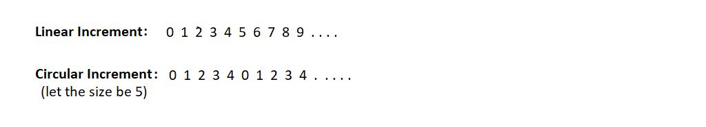
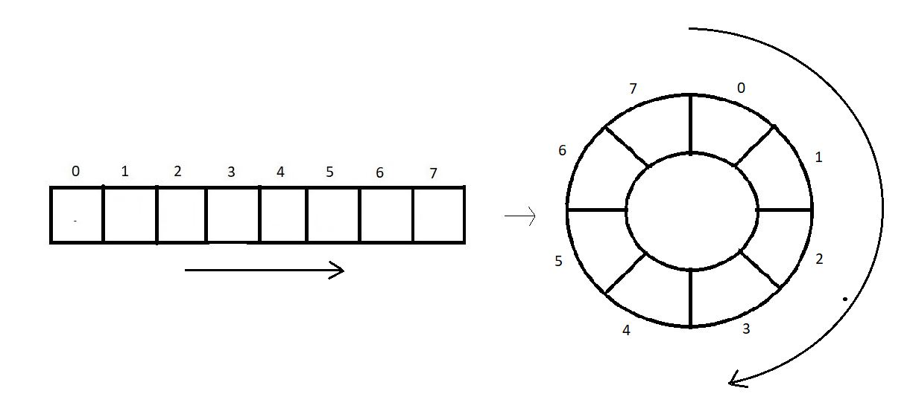
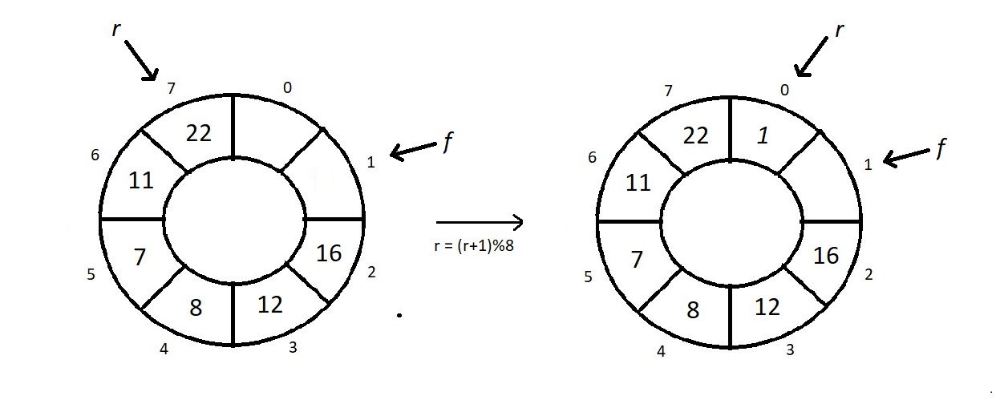
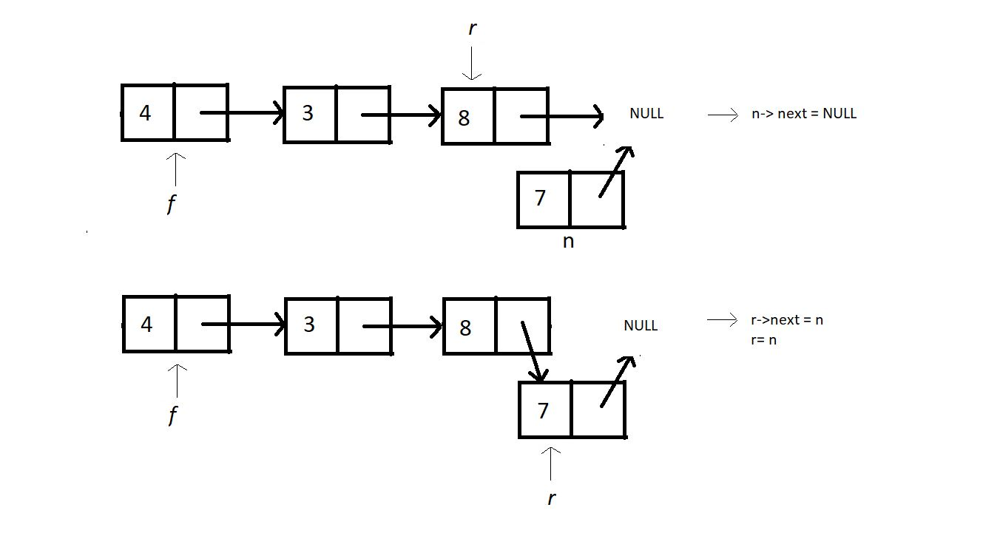
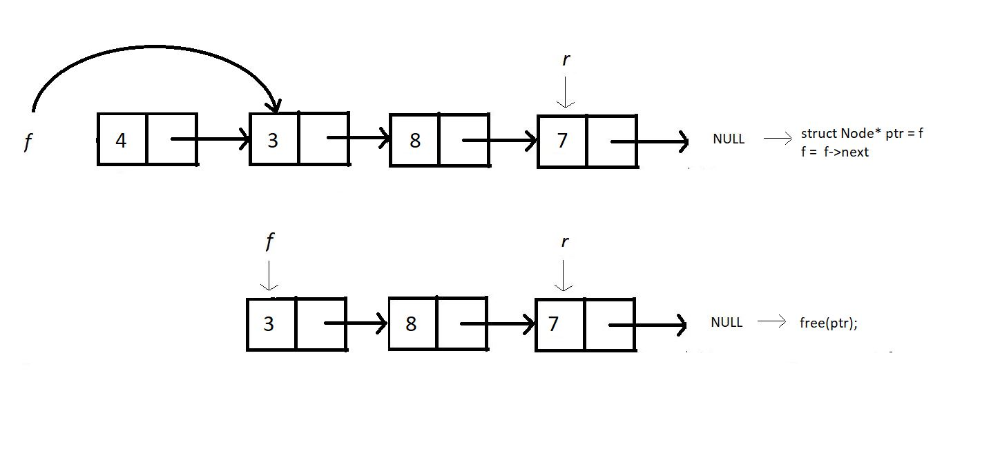

# Q41. Write a code of queue using struct (Extra)

```cpp

#include<stdio.h>
#include<stdlib.h>
 
struct queue
{
    int size;
    int f;
    int r;
    int* arr;
};
 
 
int isEmpty(struct queue *q){
    if(q->r==q->f){
        return 1;
    }
    return 0;
}
 
int isFull(struct queue *q){
    if(q->r==q->size-1){
        return 1;
    }
    return 0;
}
 
void enqueue(struct queue *q, int val){
    if(isFull(q)){
        printf("This Queue is fulln");
    }
    else{
        q->r++;
        q->arr[q->r] = val;
        printf("Enqued element: %dn", val);
    }
}
 
int dequeue(struct queue *q){
    int a = -1;
    if(isEmpty(q)){
        printf("This Queue is emptyn");
    }
    else{
        q->f++;
        a = q->arr[q->f]; 
    }
    return a;
}
 
int main(){
    struct queue q;
    q.size = 4;
    q.f = q.r = 0;
    q.arr = (int*) malloc(q.size*sizeof(int));
    
    // Enqueue few elements
    enqueue(&q, 12);
    enqueue(&q, 15);
    enqueue(&q, 1); 
    printf("Dequeuing element %dn", dequeue(&q));
    printf("Dequeuing element %dn", dequeue(&q));
    printf("Dequeuing element %dn", dequeue(&q)); 
    enqueue(&q, 45);
    enqueue(&q, 45);
    enqueue(&q, 45);
 
    if(isEmpty(&q)){
        printf("Queue is emptyn");
    }
    if(isFull(&q)){
        printf("Queue is fulln");
    }
 
    return 0;
}

```

---

# Q42, Q43, Q44. Explain circular queue in detail


### **What is a Circular Queue?**

A **Circular Queue** is a linear data structure in which the last position is connected back to the first position, forming a circle. Unlike a simple queue, the circular queue efficiently utilizes space by reusing vacated positions when elements are dequeued.

---

### **Why Circular Queue?**
1. **Efficient Space Utilization**: Avoids wasted space in a fixed-size queue when elements are dequeued.
2. **Fixed Memory**: Useful in scenarios with limited memory, such as real-time systems or embedded systems.

---

### **Key Characteristics**
1. **Front**: Points to the first element in the queue.
2. **Rear**: Points to the last element in the queue.
3. The next position after the rear is connected back to the front.
4. A circular queue is full when:
   ```
   (rear + 1) % size == front
   ```
5. A circular queue is empty when:
   ```
   front == -1
   ```

---

### **Operations in Circular Queue**
1. **Enqueue**: Add an element to the rear.
2. **Dequeue**: Remove an element from the front.
3. **Peek**: Access the front element without removing it.
4. **IsEmpty**: Check if the queue is empty.
5. **IsFull**: Check if the queue is full.
6. **Display**: Show all elements in the queue.

---

In circular queues, we mainly focus on the point that we don’t increment our indices linearly. Linearly increasing indices cause the case of overflow when our index reaches the limit, which is size-1. 

In linear increment, i becomes i+1.

But in a circular increment ; i becomes (i+1)%size. This gives an upper cap to the maximum value making the index repeat itself.





---
**Condition for isEmpty:**

1. If our f equals r, then there is no element in our queue, and this is the case of an empty queue.
Condition for isFull:

2. If our (r+1)%size equals f, then there is no space left in our queue, and this is the case of a full queue.


### **C++ Implementation of Circular Queue**

```cpp
#include <iostream>
using namespace std;

class CircularQueue {
private:
    int front, rear, size;
    int* queue;

public:
    // Constructor
    CircularQueue(int capacity) {
        size = capacity;
        queue = new int[size];
        front = -1;
        rear = -1;
    }

    // Destructor
    ~CircularQueue() {
        delete[] queue;
    }

    // Enqueue Operation
    void enqueue(int value) {
        if ((rear + 1) % size == front) {
            cout << "Queue is full. Cannot enqueue " << value << endl;
            return;
        }
        if (front == -1) front = 0; // Initialize front for the first element
        rear = (rear + 1) % size;
        queue[rear] = value;
        cout << "Enqueued: " << value << endl;
    }

    // Dequeue Operation
    void dequeue() {
        if (front == -1) {
            cout << "Queue is empty. Cannot dequeue." << endl;
            return;
        }
        cout << "Dequeued: " << queue[front] << endl;
        if (front == rear) {
            // Queue becomes empty after removing the last element
            front = rear = -1;
        } else {
            front = (front + 1) % size;
        }
    }

    // Peek Operation
    void peek() {
        if (front == -1) {
            cout << "Queue is empty." << endl;
            return;
        }
        cout << "Front Element: " << queue[front] << endl;
    }

    // Check if the Queue is Empty
    bool isEmpty() {
        return (front == -1);
    }

    // Check if the Queue is Full
    bool isFull() {
        return ((rear + 1) % size == front);
    }

    // Display the Queue
    void display() {
        if (front == -1) {
            cout << "Queue is empty." << endl;
            return;
        }
        cout << "Queue Elements: ";
        int i = front;
        while (true) {
            cout << queue[i] << " ";
            if (i == rear) break;
            i = (i + 1) % size;
        }
        cout << endl;
    }
};

int main() {
    CircularQueue q(5);

    q.enqueue(10);
    q.enqueue(20);
    q.enqueue(30);
    q.enqueue(40);

    q.display();

    q.dequeue();
    q.peek();

    q.enqueue(50);
    q.enqueue(60); // Queue will be full now

    q.display();

    q.dequeue();
    q.dequeue();
    q.display();

    q.enqueue(70);
    q.enqueue(80);
    q.display();

    return 0;
}
```

---

### **Output**

```
Enqueued: 10
Enqueued: 20
Enqueued: 30
Enqueued: 40
Queue Elements: 10 20 30 40 
Dequeued: 10
Front Element: 20
Enqueued: 50
Queue is full. Cannot enqueue 60
Queue Elements: 20 30 40 50 
Dequeued: 20
Dequeued: 30
Queue Elements: 40 50 
Enqueued: 70
Enqueued: 80
Queue Elements: 40 50 70 80 
```

---

### **Time Complexity**
1. **Enqueue**:  O(1) 
2. **Dequeue**:  O(1) 
3. **Peek**:  O(1) 
4. **IsEmpty / IsFull**:  O(1) 
5. **Display**:  O(n) , where  n  is the number of elements in the queue.

---

### **Applications of Circular Queue**
1. **CPU Scheduling**: Round-robin scheduling.
2. **Memory Management**: Fixed-size buffers in embedded systems.
3. **Traffic Management**: Handling network packet traffic.
4. **Multithreading**: Task scheduling in multithreaded environments. 

---

### C Code

```c
#include<stdio.h>
#include<stdlib.h>
 
struct circularQueue
{
    int size;
    int f;
    int r;
    int* arr;
};
 
 
int isEmpty(struct circularQueue *q){
    if(q->r==q->f){
        return 1;
    }
    return 0;
}
 
int isFull(struct circularQueue *q){
    if((q->r+1)%q->size == q->f){
        return 1;
    }
    return 0;
}
 
void enqueue(struct circularQueue *q, int val){
    if(isFull(q)){
        printf("This Queue is full");
    }
    else{
        q->r = (q->r +1)%q->size;
        q->arr[q->r] = val; 
        printf("Enqued element: %dn", val);
    }
}
 
int dequeue(struct circularQueue *q){
    int a = -1;
    if(isEmpty(q)){
        printf("This Queue is empty");
    }
    else{
        q->f = (q->f +1)%q->size;
        a = q->arr[q->f]; 
    }
    return a;
}
 
 
int main(){
    struct circularQueue q;
    q.size = 4;
    q.f = q.r = 0;
    q.arr = (int*) malloc(q.size*sizeof(int));
    
    // Enqueue few elements
    enqueue(&q, 12);
    enqueue(&q, 15);
    enqueue(&q, 1); 
    printf("Dequeuing element %dn", dequeue(&q));
    printf("Dequeuing element %dn", dequeue(&q));
    printf("Dequeuing element %dn", dequeue(&q)); 
    enqueue(&q, 45);
    enqueue(&q, 45);
    enqueue(&q, 45);
 
    if(isEmpty(&q)){
        printf("Queue is emptyn");
    }
    if(isFull(&q)){
        printf("Queue is fulln");
    }
 
    return 0;
}

```

---

# Q45 and Q46. Explain Queue Using Linked Lists in detail. Provide code and perform all operation.

### Queue Using Linked List

A **Queue** is a linear data structure that follows the **FIFO (First In, First Out)** principle. Elements are inserted at the **rear** and removed from the **front**. Implementing a queue using a linked list ensures dynamic memory allocation and does not require predefining the size of the queue.

### Why Use a Linked List for a Queue?
- **Dynamic Size**: Unlike an array, it grows as needed.
- **Efficient Operations**: Insertion and deletion are efficient with O(1) time complexity when pointers are properly managed.

---

### Operations on Queue Using Linked List

1. **Enqueue**: Insert an element at the rear of the queue.
2. **Dequeue**: Remove an element from the front of the queue.
3. **Peek/Front**: Get the value of the front element.
4. **IsEmpty**: Check if the queue is empty.

---




### Code for Queue Using Linked List in C++


### Code: Queue Using Linked List with Traversal Function

```cpp
#include <iostream>
using namespace std;

// Node structure for Linked List
struct Node {
    int data;
    Node* next;

    Node(int val) {
        data = val;
        next = nullptr;
    }
};

// Queue class using Linked List
class Queue {
private:
    Node* front; // Pointer to the front of the queue
    Node* rear;  // Pointer to the rear of the queue

public:
    // Constructor
    Queue() {
        front = nullptr;
        rear = nullptr;
    }

    // Check if the queue is empty
    bool isEmpty() {
        return front == nullptr;
    }

    // Enqueue operation
    void enqueue(int val) {
        Node* newNode = new Node(val);
        if (isEmpty()) {
            front = rear = newNode;
        } else {
            rear->next = newNode;
            rear = newNode;
        }
        cout << "Enqueued: " << val << endl;
    }

    // Dequeue operation
    int dequeue() {
        if (isEmpty()) {
            cout << "Queue is empty. Dequeue operation failed." << endl;
            return -1;
        }
        Node* temp = front;
        int val = front->data;
        front = front->next;
        if (front == nullptr) {
            rear = nullptr; // If queue becomes empty, update rear
        }
        delete temp;
        return val;
    }

    // Get the front element
    int peek() {
        if (isEmpty()) {
            cout << "Queue is empty. No front element." << endl;
            return -1;
        }
        return front->data;
    }

    // Display the queue
    void display() {
        if (isEmpty()) {
            cout << "Queue is empty." << endl;
            return;
        }
        Node* temp = front;
        cout << "Queue: ";
        while (temp != nullptr) {
            cout << temp->data << " ";
            temp = temp->next;
        }
        cout << endl;
    }


    // Destructor
    ~Queue() {
        while (!isEmpty()) {
            dequeue();
        }
    }
};

int main() {
    Queue q;

    // Example 1
    cout << "Example 1:" << endl;
    q.enqueue(10);
    q.enqueue(20);
    q.enqueue(30);
    q.display();
    q.traverse(); // Traversal
    cout << "Dequeued: " << q.dequeue() << endl;
    q.display();
    cout << endl;

    // Example 2
    cout << "Example 2:" << endl;
    q.enqueue(40);
    q.enqueue(50);
    q.enqueue(60);
    q.display();
    q.traverse(); // Traversal
    cout << "Dequeued: " << q.dequeue() << endl;
    cout << "Front: " << q.peek() << endl;
    q.display();
    cout << endl;

    // Example 3
    cout << "Example 3:" << endl;
    q.enqueue(70);
    q.display();
    q.traverse(); // Traversal
    cout << "Dequeued: " << q.dequeue() << endl;
    q.display();
    cout << endl;

    // Example 4
    cout << "Example 4:" << endl;
    q.enqueue(80);
    q.enqueue(90);
    q.enqueue(100);
    q.display();
    q.traverse(); // Traversal
    cout << "Dequeued: " << q.dequeue() << endl;
    cout << "Dequeued: " << q.dequeue() << endl;
    q.display();
    cout << endl;

    // Example 5
    cout << "Example 5:" << endl;
    q.enqueue(110);
    q.enqueue(120);
    q.display();
    q.traverse(); // Traversal
    cout << "Dequeued: " << q.dequeue() << endl;
    cout << "Front: " << q.peek() << endl;
    q.display();

    return 0;
}
```

---

### Output with Traversal Iterations

#### **Example 1**
1. Enqueue 10 → Queue: `10` → Traversing: `10`
2. Enqueue 20 → Queue: `10 20` → Traversing: `10 20`
3. Enqueue 30 → Queue: `10 20 30` → Traversing: `10 20 30`
4. Dequeue → Removes `10` → Queue: `20 30` → Traversing: `20 30`

#### **Example 2**
1. Enqueue 40 → Queue: `20 30 40` → Traversing: `20 30 40`
2. Enqueue 50 → Queue: `20 30 40 50` → Traversing: `20 30 40 50`
3. Enqueue 60 → Queue: `20 30 40 50 60` → Traversing: `20 30 40 50 60`
4. Dequeue → Removes `20` → Queue: `30 40 50 60` → Traversing: `30 40 50 60`

#### **Example 3**
1. Enqueue 70 → Queue: `30 40 50 60 70` → Traversing: `30 40 50 60 70`
2. Dequeue → Removes `30` → Queue: `40 50 60 70` → Traversing: `40 50 60 70`

#### **Example 4**
1. Enqueue 80 → Queue: `40 50 60 70 80` → Traversing: `40 50 60 70 80`
2. Enqueue 90 → Queue: `40 50 60 70 80 90` → Traversing: `40 50 60 70 80 90`
3. Enqueue 100 → Queue: `40 50 60 70 80 90 100` → Traversing: `40 50 60 70 80 90 100`
4. Dequeue → Removes `40` → Queue: `50 60 70 80 90 100` → Traversing: `50 60 70 80 90 100`

#### **Example 5**
1. Enqueue 110 → Queue: `50 60 70 80 90 100 110` → Traversing: `50 60 70 80 90 100 110`
2. Enqueue 120 → Queue: `50 60 70 80 90 100 110 120` → Traversing: `50 60 70 80 90 100 110 120`
3. Dequeue → Removes `50` → Queue: `60 70 80 90 100 110 120` → Traversing: `60 70 80 90 100 110 120`


Traversal ensures that all elements of the queue can be viewed at any time without disrupting the queue's structure.
---

### Time Complexity

| Operation   | Time Complexity |
|-------------|-----------------|
| Enqueue     | O(1)            |
| Dequeue     | O(1)            |
| Peek        | O(1)            |
| IsEmpty     | O(1)            |
| Display     | O(n)            |

This implementation efficiently manages dynamic memory and avoids the fixed size limitation of array-based queues.


### Code in C

```c
#include <stdio.h>
#include <stdlib.h>
 
struct Node *f = NULL;
struct Node *r = NULL;
 
struct Node
{
    int data;
    struct Node *next;
};
 
void linkedListTraversal(struct Node *ptr)
{
    printf("Printing the elements of this linked listn");
    while (ptr != NULL)
    {
        printf("Element: %dn", ptr->data);
        ptr = ptr->next;
    }
}
 
void enqueue(int val)
{
    struct Node *n = (struct Node *) malloc(sizeof(struct Node));
    if(n==NULL){
        printf("Queue is Full");
    }
    else{
        n->data = val;
        n->next = NULL;
        if(f==NULL){
            f=r=n;
        }
        else{
            r->next = n;
            r=n;
        }
    }
}
 
int dequeue()
{
    int val = -1;
    struct Node *ptr = f;
    if(f==NULL){
        printf("Queue is Emptyn");
    }
    else{
        f = f->next;
        val = ptr->data;
        free(ptr);
    }
    return val;
}
 
int main()
{
    linkedListTraversal(f);
    printf("Dequeuing element %dn", dequeue());
    enqueue(34);
    enqueue(4);
    enqueue(7);
    enqueue(17);
    printf("Dequeuing element %dn", dequeue());
    printf("Dequeuing element %dn", dequeue());
    printf("Dequeuing element %dn", dequeue());
    printf("Dequeuing element %dn", dequeue());
    linkedListTraversal(f);
    return 0;
}
```


---

# Q47. Explain Double-Ended Queue in detail. Perform all operation

### **Double-Ended Queue (DEque)**

A **Double-Ended Queue** (Deque) is a generalized form of a queue that allows insertion and deletion of elements at both ends (front and rear). It is a versatile data structure that supports both **FIFO (First In First Out)** and **LIFO (Last In First Out)** operations.

---

### **Types of Deque**
1. **Input-restricted Deque:** Insertions can only be performed at one end (rear), but deletions are allowed at both ends.
2. **Output-restricted Deque:** Deletions can only be performed at one end (front), but insertions are allowed at both ends.

---

### **Operations on Deque**
1. **Insert at front (enqueueFront)**  
   Adds an element at the front of the deque.
2. **Insert at rear (enqueueRear)**  
   Adds an element at the rear of the deque.
3. **Delete from front (dequeueFront)**  
   Removes an element from the front of the deque.
4. **Delete from rear (dequeueRear)**  
   Removes an element from the rear of the deque.
5. **Peek Front**  
   Returns the element at the front without removing it.
6. **Peek Rear**  
   Returns the element at the rear without removing it.
7. **Check if empty**  
   Checks whether the deque is empty.
8. **Check if full**  
   Checks whether the deque is full.

---

### **Implementation in C++**

Here is the implementation of a circular deque using an array.

```cpp
#include <iostream>
using namespace std;

class Deque {
private:
    int* arr;    // Array to store elements
    int size;    // Maximum size of the deque
    int front;   // Index of the front element
    int rear;    // Index of the rear element

public:
    // Constructor
    Deque(int size) {
        this->size = size;
        arr = new int[size];
        front = -1;
        rear = -1;
    }

    // Check if deque is full
    bool isFull() {
        return (front == 0 && rear == size - 1) || (front == rear + 1);
    }

    // Check if deque is empty
    bool isEmpty() {
        return front == -1;
    }

    // Insert at front
    void enqueueFront(int value) {
        if (isFull()) {
            cout << "Deque is full. Cannot insert at front." << endl;
            return;
        }

        if (isEmpty()) {
            front = rear = 0;
        } else if (front == 0) {
            front = size - 1;
        } else {
            front--;
        }

        arr[front] = value;
        cout << "Inserted " << value << " at front." << endl;
    }

    // Insert at rear
    void enqueueRear(int value) {
        if (isFull()) {
            cout << "Deque is full. Cannot insert at rear." << endl;
            return;
        }

        if (isEmpty()) {
            front = rear = 0;
        } else if (rear == size - 1) {
            rear = 0;
        } else {
            rear++;
        }

        arr[rear] = value;
        cout << "Inserted " << value << " at rear." << endl;
    }

    // Delete from front
    int dequeueFront() {
        if (isEmpty()) {
            cout << "Deque is empty. Cannot delete from front." << endl;
            return -1;
        }

        int value = arr[front];

        if (front == rear) {
            front = rear = -1; // Queue becomes empty
        } else if (front == size - 1) {
            front = 0;
        } else {
            front++;
        }

        return value;
    }

    // Delete from rear
    int dequeueRear() {
        if (isEmpty()) {
            cout << "Deque is empty. Cannot delete from rear." << endl;
            return -1;
        }

        int value = arr[rear];

        if (front == rear) {
            front = rear = -1; // Queue becomes empty
        } else if (rear == 0) {
            rear = size - 1;
        } else {
            rear--;
        }

        return value;
    }

    // Peek front
    int peekFront() {
        if (isEmpty()) {
            cout << "Deque is empty. No front element." << endl;
            return -1;
        }
        return arr[front];
    }

    // Peek rear
    int peekRear() {
        if (isEmpty()) {
            cout << "Deque is empty. No rear element." << endl;
            return -1;
        }
        return arr[rear];
    }

    // Display the deque
    void display() {
        if (isEmpty()) {
            cout << "Deque is empty." << endl;
            return;
        }

        cout << "Deque elements: ";
        int i = front;
        while (true) {
            cout << arr[i] << " ";
            if (i == rear) break;
            i = (i + 1) % size;
        }
        cout << endl;
    }

    // Destructor
    ~Deque() {
        delete[] arr;
    }
};

int main() {
    Deque dq(5);

    dq.enqueueRear(10);
    dq.enqueueRear(20);
    dq.enqueueRear(30);
    dq.display();

    dq.enqueueFront(5);
    dq.enqueueFront(1);
    dq.display();

    cout << "Deleted from rear: " << dq.dequeueRear() << endl;
    dq.display();

    cout << "Deleted from front: " << dq.dequeueFront() << endl;
    dq.display();

    cout << "Front element: " << dq.peekFront() << endl;
    cout << "Rear element: " << dq.peekRear() << endl;

    return 0;
}
```

---

### **Example Execution**
#### **Input**
```cpp
dq.enqueueRear(10);
dq.enqueueRear(20);
dq.enqueueRear(30);
dq.enqueueFront(5);
dq.enqueueFront(1);
dq.dequeueRear();
dq.dequeueFront();
```

#### **Output**
```plaintext
Inserted 10 at rear.
Inserted 20 at rear.
Inserted 30 at rear.
Deque elements: 10 20 30
Inserted 5 at front.
Inserted 1 at front.
Deque elements: 1 5 10 20 30
Deleted from rear: 30
Deque elements: 1 5 10 20
Deleted from front: 1
Deque elements: 5 10 20
Front element: 5
Rear element: 20
```

---

### **Explanation of Operations**
1. **Enqueue at Rear:** Adds elements to the end (`10`, `20`, `30`).
2. **Enqueue at Front:** Adds elements to the beginning (`5`, `1`).
3. **Dequeue from Rear:** Removes the last element (`30`).
4. **Dequeue from Front:** Removes the first element (`1`).
5. **Display:** Prints all elements currently in the deque.
6. **Peek Front/Rear:** Displays the current front and rear elements.


### **Implementation of Deque Using Linked List**

```cpp
#include <iostream>
using namespace std;

class Node {
public:
    int data;
    Node* prev;
    Node* next;

    Node(int value) {
        data = value;
        prev = nullptr;
        next = nullptr;
    }
};

class Deque {
private:
    Node* front;
    Node* rear;

public:
    // Constructor
    Deque() {
        front = nullptr;
        rear = nullptr;
    }

    // Check if deque is empty
    bool isEmpty() {
        return front == nullptr;
    }

    // Insert at the front
    void enqueueFront(int value) {
        Node* newNode = new Node(value);
        if (isEmpty()) {
            front = rear = newNode;
        } else {
            newNode->next = front;
            front->prev = newNode;
            front = newNode;
        }
        cout << "Inserted " << value << " at the front." << endl;
    }

    // Insert at the rear
    void enqueueRear(int value) {
        Node* newNode = new Node(value);
        if (isEmpty()) {
            front = rear = newNode;
        } else {
            rear->next = newNode;
            newNode->prev = rear;
            rear = newNode;
        }
        cout << "Inserted " << value << " at the rear." << endl;
    }

    // Delete from the front
    int dequeueFront() {
        if (isEmpty()) {
            cout << "Deque is empty. Cannot delete from front." << endl;
            return -1;
        }
        Node* temp = front;
        int value = temp->data;

        if (front == rear) {
            front = rear = nullptr; // Deque becomes empty
        } else {
            front = front->next;
            front->prev = nullptr;
        }

        delete temp;
        return value;
    }

    // Delete from the rear
    int dequeueRear() {
        if (isEmpty()) {
            cout << "Deque is empty. Cannot delete from rear." << endl;
            return -1;
        }
        Node* temp = rear;
        int value = temp->data;

        if (front == rear) {
            front = rear = nullptr; // Deque becomes empty
        } else {
            rear = rear->prev;
            rear->next = nullptr;
        }

        delete temp;
        return value;
    }

    // Peek at the front
    int peekFront() {
        if (isEmpty()) {
            cout << "Deque is empty. No front element." << endl;
            return -1;
        }
        return front->data;
    }

    // Peek at the rear
    int peekRear() {
        if (isEmpty()) {
            cout << "Deque is empty. No rear element." << endl;
            return -1;
        }
        return rear->data;
    }

    // Display the deque
    void display() {
        if (isEmpty()) {
            cout << "Deque is empty." << endl;
            return;
        }

        cout << "Deque elements: ";
        Node* temp = front;
        while (temp != nullptr) {
            cout << temp->data << " ";
            temp = temp->next;
        }
        cout << endl;
    }

    // Destructor
    ~Deque() {
        while (!isEmpty()) {
            dequeueFront();
        }
    }
};

int main() {
    Deque dq;

    dq.enqueueRear(10);
    dq.enqueueRear(20);
    dq.enqueueRear(30);
    dq.display();

    dq.enqueueFront(5);
    dq.enqueueFront(1);
    dq.display();

    cout << "Deleted from rear: " << dq.dequeueRear() << endl;
    dq.display();

    cout << "Deleted from front: " << dq.dequeueFront() << endl;
    dq.display();

    cout << "Front element: " << dq.peekFront() << endl;
    cout << "Rear element: " << dq.peekRear() << endl;

    return 0;
}
```

---

### **Explanation**

1. **Node Structure:**  
   Each node has three fields:
   - `data`: Stores the element.
   - `prev`: Pointer to the previous node.
   - `next`: Pointer to the next node.

2. **Front and Rear Pointers:**  
   - `front` points to the first node.
   - `rear` points to the last node.

3. **Dynamic Memory Allocation:**  
   Nodes are created dynamically using `new` to ensure the deque can grow as needed.

---

### **Operations**

1. **Insert at Front (`enqueueFront`)**  
   Adds a new node at the beginning of the list. Adjusts the `prev` pointer of the existing front node.

2. **Insert at Rear (`enqueueRear`)**  
   Adds a new node at the end of the list. Adjusts the `next` pointer of the existing rear node.

3. **Delete from Front (`dequeueFront`)**  
   Removes the first node. Updates the `front` pointer and adjusts the `prev` pointer of the new front node.

4. **Delete from Rear (`dequeueRear`)**  
   Removes the last node. Updates the `rear` pointer and adjusts the `next` pointer of the new rear node.

5. **Peek Operations:**  
   - `peekFront`: Returns the data at the front node.
   - `peekRear`: Returns the data at the rear node.

6. **Display (`display`)**  
   Traverses the list from `front` to `rear`, printing each element.

---

### **Example Execution**

#### **Input**
```cpp
dq.enqueueRear(10);
dq.enqueueRear(20);
dq.enqueueRear(30);
dq.enqueueFront(5);
dq.enqueueFront(1);
dq.dequeueRear();
dq.dequeueFront();
dq.display();
```

#### **Output**
```plaintext
Inserted 10 at the rear.
Inserted 20 at the rear.
Inserted 30 at the rear.
Deque elements: 10 20 30
Inserted 5 at the front.
Inserted 1 at the front.
Deque elements: 1 5 10 20 30
Deleted from rear: 30
Deque elements: 1 5 10 20
Deleted from front: 1
Deque elements: 5 10 20
```
---

# Q48. Explain Sorting Algorithms in detail. Why Sorting? Types?

### **Sorting Algorithms in Detail**

---

### **What is Sorting?**

Sorting refers to the process of arranging elements in a particular order, such as ascending or descending. Sorting is widely used in computer science to optimize data retrieval and improve efficiency in various operations.

---

### **Why Sorting?**

1. **Data Organization:** Sorting organizes data, making it easier to search, update, and manage.
2. **Efficiency:** Sorted data allows faster operations like searching (e.g., binary search).
3. **Applications:** Sorting is essential in algorithms like merging datasets, removing duplicates, and ranking.
4. **Prerequisite for Algorithms:** Many algorithms require sorted data as input.

- There are social media applications, news applications, even your emails or file managers, where you want things to be arranged according to dates. You want the newest on top and oldest at the end. And this feature uses the method of sorting. And more specifically, sorting based on the date of publishing/modification.
- Another example is the product delivery applications, be it delivering food like Swiggy, Zomato, or other shopping applications such as Amazon and Flipkart. You want the top-rated products on the top for your convenience. Sometimes you would need the products to be sorted according to their prices, be it the cheapest at first or the costliest at first. So, every one of these uses the sorting algorithm. 
---

### **Types of Sorting Algorithms**

Sorting algorithms can be broadly classified based on:

1. **Comparison-Based Sorting**
   - Compares elements and rearranges them.
   - Examples: Bubble Sort, Quick Sort, Merge Sort.

2. **Non-Comparison-Based Sorting**
   - Relies on the properties of elements (e.g., keys, digits).
   - Examples: Counting Sort, Radix Sort.

---

### **Comparison of Sorting Algorithms**

| **Algorithm**   | **Best Time** | **Average Time** | **Worst Time** | **Space Complexity** | **Stable**  | **Method**          |
|------------------|---------------|------------------|----------------|-----------------------|-------------|---------------------|
| Bubble Sort      | O(n)      | O(n^2)       | O(n^2)     | O(1)             | Yes         | Exchange-based      |
| Selection Sort   | O(n^2)    | O(n^2)       | O(n^2)     | O(1)             | No          | Selection-based     |
| Insertion Sort   | O(n)      | O(n^2)       | O(n^2)     | O(1)             | Yes         | Insertion-based     |
| Merge Sort       | O(n log n) | O(n log n) | O(n log n)| O(n)             | Yes         | Divide and Conquer  |
| Quick Sort       | O(n log n) | O(n log n) | O(n^2)     | O(log n)        | No          | Divide and Conquer  |
| Heap Sort        | O(n log n) | O(n log n) | O(n log n)| O(1)             | No          | Selection-based     |
| Counting Sort    | O(n + k)  | O(n + k)     | O(n + k)   | O(k)             | Yes         | Non-comparison-based |
| Radix Sort       | O(nk)     | O(nk)        | O(nk)      | O(n + k)         | Yes         | Non-comparison-based |

---

# Q49. Explain.
1. Time Complexity
2. Space Complexity
3. Stability
4. Internal & External Sorting Algorithms
5. Adaptivity
6. Recursiveness

### **Key Concepts in Sorting Algorithms**

---

### **1. Time Complexity**
- **Definition:** Measures the amount of time an algorithm takes to run as a function of the input size n.
- **Categories:**
  1. **Best Case:** Input leads to the fewest possible steps.
  2. **Average Case:** Steps required for a random input.
  3. **Worst Case:** Maximum steps required for the worst input.

**Examples:**
| **Algorithm**     | **Best Case** | **Average Case** | **Worst Case**  |
|--------------------|---------------|------------------|-----------------|
| Bubble Sort        | O(n)      | O(n^2)       | O(n^2)      |
| Merge Sort         | O(n log n) | O(n log n) | O(n log n) |
| Quick Sort         | O(n log n) | O(n log n) | O(n^2)      |


We observe the time complexity of an algorithm to see which algorithm works efficiently for larger data sets and which algorithm works faster with smaller data sets. What if one sorting algorithm sorts only 4 elements efficiently and fails to sort 1000 elements. What if it takes too much time to sort a large data set? These are the cases where we say the time complexity of an algorithm is very poor.
In general, O(N log N) is considered a better algorithm time complexity than O(N 2), and most of our algorithms’ time complexity revolves around these two

- Note: Lesser the time complexity, the better is the algorithm.
---

### **2. Space Complexity**
- **Definition:** Measures the amount of memory space required by an algorithm, including:
  1. **Auxiliary Space:** Extra space other than the input.
  2. **In-place Sorting:** Sorting is done within the original input with no extra space.

**Examples:**
| **Algorithm**     | **Space Complexity** |
|--------------------|-----------------------|
| Bubble Sort        | O(1)             |
| Merge Sort         | O(n)             |
| Quick Sort         | O(log n)        |

The space complexity criterion helps us compare the space the algorithm uses to sort any data set. If an algorithm consumes a lot of space for larger inputs, it is considered a poor algorithm for sorting large data sets. In some cases, we might prefer a higher space complexity algorithm if it proposes exceptionally low time complexity, but not in general.

---

### **3. Stability**
- **Definition:** A sorting algorithm is **stable** if it preserves the relative order of records with equal keys.
- **Importance:** Critical when sorting data with multiple keys.

**Examples:**
| **Algorithm**     | **Stable**   |
|--------------------|--------------|
| Bubble Sort        | Yes          |
| Merge Sort         | Yes          |
| Quick Sort         | No           |


The stability of an algorithm is judged by the fact whether the order of the elements having equal status when sorted on some basis is preserved or not. It probably sounded technical, but let me explain. 

Suppose you have a set of numbers, 6, 1, 2, 7, 6, and we want to sort them in increasing order by using an algorithm. Then the result would be 1, 2, 6, 6, 7. But the key thing to look at is whether the 6s follow the same order as that given in the input or they have changed. That is, whether the first 6 still comes before the second 6 or not. If they do, then the algorithm we followed is called stable, otherwise unstable.

---

### **4. Internal vs External Sorting Algorithms**
- **Internal Sorting:** All data fits into the main memory.
  - **Examples:** Bubble Sort, Quick Sort, Merge Sort.
- **External Sorting:** Used when data is too large for memory, relies on external storage.
  - **Example:** Multiway Merge Sort.

---

### **5. Adaptivity**
- **Definition:** An algorithm is **adaptive** if it performs better on already sorted or partially sorted input.
- **Examples:**
  - **Adaptive Algorithms:** Insertion Sort, Bubble Sort.
  - **Non-Adaptive Algorithms:** Merge Sort, Quick Sort.

---

### **6. Recursiveness**
- **Definition:** A sorting algorithm is recursive if it calls itself with smaller subsets of the data.
- **Examples:**
  - **Recursive Algorithms:** Merge Sort, Quick Sort.
  - **Non-Recursive Algorithms:** Bubble Sort, Insertion Sort.

---

### **Conclusion**
Understanding these properties helps in selecting the most suitable algorithm based on the problem constraints like input size, memory availability, and the importance of stability or adaptivity.

---

# Q50. Explain Bubble Sort Algorithm in detail.

### **Bubble Sort Algorithm**

#### **Definition:**
Bubble Sort is a simple sorting algorithm that repeatedly steps through the list, compares adjacent elements, and swaps them if they are in the wrong order. This process is repeated until the list is sorted.
- Bubble Sort is named because, like bubbles rising to the surface in water, the largest elements "bubble up" to their correct positions at the end of the array after each iteration.
---

### **Steps of the Algorithm:**
1. Start at the beginning of the array.
2. Compare the first element with the second element:
   - If the first element is greater, swap them.
   - Otherwise, move to the next pair.
3. Continue until the end of the array.
4. Repeat the above steps for n-1 passes, where n is the number of elements.
5. After each pass, the largest element in the unsorted part "bubbles up" to its correct position.

---


### **Time Complexity:**
- **Best Case (Already Sorted):** O(n)
- **Worst Case (Reversed Order):** O(n^2)
- **Average Case:** O(n^2)

---

### **Space Complexity:**
- **Auxiliary Space:** O(1), as no extra memory is used.

---

### **Code Implementation:**
```cpp
#include <iostream>
using namespace std;

void bubbleSort(int arr[], int n) {
    bool swapped; // To optimize for the best case
    for (int i = 0; i < n - 1; i++) {
        swapped = false;
        for (int j = 0; j < n - i - 1; j++) {
            if (arr[j] > arr[j + 1]) {
                // Swap the elements
                int temp = arr[j];
                arr[j] = arr[j + 1];
                arr[j + 1] = temp;
                swapped = true;
            }
        }
        // If no swaps occurred, the array is already sorted
        if (!swapped) break;
    }
}

void printArray(int arr[], int n) {
    for (int i = 0; i < n; i++) {
        cout << arr[i] << " ";
    }
    cout << endl;
}

int main() {
    int arr[] = {64, 34, 25, 12, 22, 11, 90};
    int n = sizeof(arr) / sizeof(arr[0]);
    
    cout << "Original Array: ";
    printArray(arr, n);

    bubbleSort(arr, n);

    cout << "Sorted Array: ";
    printArray(arr, n);

    return 0;
}
```

---

### **Example with Iterations:**

#### **Input Array:** `{64, 34, 25, 12, 22, 11, 90}`

---

#### **Iteration 1:**
1. Compare `64` and `34` → Swap → `{34, 64, 25, 12, 22, 11, 90}`
2. Compare `64` and `25` → Swap → `{34, 25, 64, 12, 22, 11, 90}`
3. Compare `64` and `12` → Swap → `{34, 25, 12, 64, 22, 11, 90}`
4. Compare `64` and `22` → Swap → `{34, 25, 12, 22, 64, 11, 90}`
5. Compare `64` and `11` → Swap → `{34, 25, 12, 22, 11, 64, 90}`
6. Compare `64` and `90` → No Swap → `{34, 25, 12, 22, 11, 64, 90}`

**After Iteration 1:** Largest element `90` is in its correct position.

---

#### **Iteration 2:**
1. Compare `34` and `25` → Swap → `{25, 34, 12, 22, 11, 64, 90}`
2. Compare `34` and `12` → Swap → `{25, 12, 34, 22, 11, 64, 90}`
3. Compare `34` and `22` → Swap → `{25, 12, 22, 34, 11, 64, 90}`
4. Compare `34` and `11` → Swap → `{25, 12, 22, 11, 34, 64, 90}`

**After Iteration 2:** Second largest element `64` is in its correct position.

---

#### **Iteration 3:**
1. Compare `25` and `12` → Swap → `{12, 25, 22, 11, 34, 64, 90}`
2. Compare `25` and `22` → Swap → `{12, 22, 25, 11, 34, 64, 90}`
3. Compare `25` and `11` → Swap → `{12, 22, 11, 25, 34, 64, 90}`

**After Iteration 3:** Third largest element `34` is in its correct position.

---

#### **Iteration 4:**
1. Compare `12` and `22` → No Swap → `{12, 22, 11, 25, 34, 64, 90}`
2. Compare `22` and `11` → Swap → `{12, 11, 22, 25, 34, 64, 90}`

**After Iteration 4:** Fourth largest element `25` is in its correct position.

---

#### **Iteration 5:**
1. Compare `12` and `11` → Swap → `{11, 12, 22, 25, 34, 64, 90}`

**After Iteration 5:** Fifth largest element `22` is in its correct position.

---

### **Final Output:** `{11, 12, 22, 25, 34, 64, 90}`

---

### **Advantages of Bubble Sort:**
- Simple and easy to implement.
- No extra space required.

### **Disadvantages of Bubble Sort:**
- Inefficient for large datasets.
- Time complexity of O(n^2) makes it unsuitable for large n.