# Q51. Bubble Sort Code

[Click here](Lect41to50.md#q50-explain-bubble-sort-algorithm-in-detail)


---

# Q52 and Q53. Explain Insertion Sort Algorithm in detail. Explain with code and all iteration properly to understand
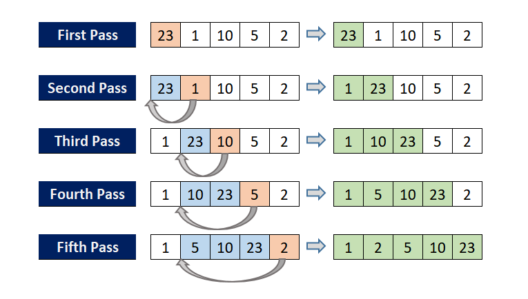
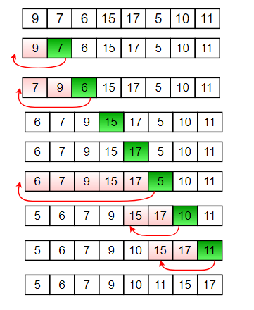


**Insertion Sort** is a simple and efficient sorting algorithm that builds the final sorted array one element at a time. It works by taking one element from the unsorted portion and placing it in its correct position in the sorted portion.  

### **Definition:**  
Insertion Sort is a comparison-based sorting algorithm that iterates through an array, removes one element at a time, and inserts it into its correct position within the already sorted part of the array.

### **Time Complexity:**  
- **Best Case (Already Sorted):** O(n)  
- **Average Case:** O(n^2)  
- **Worst Case (Reverse Sorted):** O(n^2)  

### **Space Complexity:**  
- O(1) (In-place sorting)  

### **Algorithm Steps:**  
1. Start from the second element (index 1) and assume the first element is sorted.  
2. Compare the selected element with elements in the sorted part.  
3. Shift larger elements one position ahead to make space.  
4. Insert the selected element at its correct position.  
5. Repeat the process for all elements.  


### **Code Implementation:**
```cpp
#include <iostream>
using namespace std;

void insertionSort(int arr[], int n) {
    for (int i = 1; i < n; i++) {
        int key = arr[i]; // Current element to be inserted
        int j = i - 1;

        // Move elements of arr[0..i-1] that are greater than key
        // one position ahead of their current position
        while (j >= 0 && arr[j] > key) {
            arr[j + 1] = arr[j];
            j--;
        }
        arr[j + 1] = key; // Insert key into its correct position
    }
}

void printArray(int arr[], int n) {
    for (int i = 0; i < n; i++) {
        cout << arr[i] << " ";
    }
    cout << endl;
}

int main() {
    int arr[] = {12, 11, 13, 5, 6};
    int n = sizeof(arr) / sizeof(arr[0]);

    cout << "Original Array: ";
    printArray(arr, n);

    insertionSort(arr, n);

    cout << "Sorted Array: ";
    printArray(arr, n);

    return 0;
}
```

```cpp
   // -1   0    1   2   3   4   5
   //      12,| 54, 65, 07, 23, 09 --> i=1, key=54, j=0
   //      12,| 54, 65, 07, 23, 09 --> 1st pass done (i=1)!

   //      12, 54,| 65, 07, 23, 09 --> i=2, key=65, j=1
   //      12, 54,| 65, 07, 23, 09 --> 2nd pass done (i=2)!

   //      12, 54, 65,| 07, 23, 09 --> i=3, key=7, j=2
   //      12, 54, 65,| 65, 23, 09 --> i=3, key=7, j=1
   //      12, 54, 54,| 65, 23, 09 --> i=3, key=7, j=0
   //      12, 12, 54,| 65, 23, 09 --> i=3, key=7, j=-1
   //      07, 12, 54,| 65, 23, 09 --> i=3, key=7, j=-1--> 3rd pass done (i=3)!

   // Fast forwarding and 4th and 5th pass will give:
   //      07, 12, 54, 65,| 23, 09 --> i=4, key=23, j=3
   //      07, 12, 23, 54,| 65, 09 --> After the 4th pass

   //      07, 12, 23, 54, 65,| 09 --> i=5, key=09, j=4
   //      07, 09, 12, 23, 54, 65| --> After the 5th pass 
    
```

### **Example with Iterations:**

#### **Input Array:** `{12, 11, 13, 5, 6}`

---

#### **Iteration 1 (Key = 11):**
1. Compare `11` with `12`. Since `11 < 12`, shift `12` to the right.
2. Insert `11` at the correct position.
   - **Array After Iteration 1:** `{11, 12, 13, 5, 6}`

---

#### **Iteration 2 (Key = 13):**
1. Compare `13` with `12`. Since `13 > 12`, no shifting is needed.
   - **Array After Iteration 2:** `{11, 12, 13, 5, 6}`

---

#### **Iteration 3 (Key = 5):**
1. Compare `5` with `13`. Since `5 < 13`, shift `13` to the right.
2. Compare `5` with `12`. Since `5 < 12`, shift `12` to the right.
3. Compare `5` with `11`. Since `5 < 11`, shift `11` to the right.
4. Insert `5` at the correct position.
   - **Array After Iteration 3:** `{5, 11, 12, 13, 6}`

---

#### **Iteration 4 (Key = 6):**
1. Compare `6` with `13`. Since `6 < 13`, shift `13` to the right.
2. Compare `6` with `12`. Since `6 < 12`, shift `12` to the right.
3. Compare `6` with `11`. Since `6 < 11`, shift `11` to the right.
4. Insert `6` at the correct position.
   - **Array After Iteration 4:** `{5, 6, 11, 12, 13}`

---

### **Final Output:** `{5, 6, 11, 12, 13}`

---

### **Advantages of Insertion Sort:**
1. Simple and easy to implement.
2. Efficient for small or nearly sorted datasets (O(n) in the best case).
3. In-place algorithm (requires no additional memory).

### **Disadvantages of Insertion Sort:**
1. Inefficient for large datasets due to O(n^2) complexity.
2. Requires significant shifting for large datasets in the worst case.


### **1. Is Insertion Sort Adaptive?**

**Yes, Insertion Sort is adaptive.**

- **Reason:** Insertion Sort adapts to the existing order of the array. 
  - If the input array is already sorted or partially sorted, the algorithm reduces unnecessary comparisons and shifts.
  - For an already sorted array, the time complexity is O(n), as no elements need to be moved, making it highly efficient in this case.

---

### **2. Is Insertion Sort Stable?**

**Yes, Insertion Sort is stable.**

- **Reason:** Stability in sorting means that equal elements retain their relative order in the sorted output as they were in the input.
  - In Insertion Sort, elements are only shifted when they are greater than the key being inserted. This ensures that equal elements remain in their original relative order, preserving stability.

---

### **Inserion sort NAME**

The name **Insertion Sort** comes from the way the algorithm processes the input data. 

### Explanation:

- In this sorting method, elements from the unsorted portion of the array are **"inserted"** one at a time into their correct position in the sorted portion of the array. 
- The sorted portion grows incrementally as each element is placed in its correct position, just like how cards are arranged in your hand in a card game.

### Analogy:
Imagine you're playing a card game, and you pick up cards one by one:
1. You place the first card (it is already "sorted").
2. For each new card, you find its correct position relative to the cards already in your hand.
3. You **insert** the new card into its correct position.

This **process of inserting** each element into the sorted section gives the algorithm its name: **Insertion Sort**.

---

# Q54 and Q55. Explain 
1. Selection Sort in detail, Perform all operation , explain with code
2. Explain Selection sort is stable or not
3. Explain Selection sort is adaptive or not
4. Explain why the Selection Sort algorithm got its name

### **Selection Sort Algorithm**

### **Selection Sort**  
Selection Sort is a simple comparison-based sorting algorithm that repeatedly selects the smallest (or largest) element from the unsorted portion and places it at the correct position in the sorted portion.  

### **Definition:**  
Selection Sort is a sorting algorithm that divides the array into a sorted and an unsorted section. It repeatedly finds the minimum element from the unsorted part and swaps it with the first element of the unsorted section.  

### **Time Complexity:**  
- **Best Case:** O(n^2)  
- **Average Case:** O(n^2)  
- **Worst Case:** O(n^2)  

### **Space Complexity:**  
- O(1) (In-place sorting)  

### **Algorithm Steps:**  
1. Start with the first element and assume it is the minimum.  
2. Traverse the rest of the array to find the actual minimum element.  
3. Swap the found minimum element with the first element.  
4. Move to the next index and repeat until the array is sorted.  

Would you like a Python implementation?
---
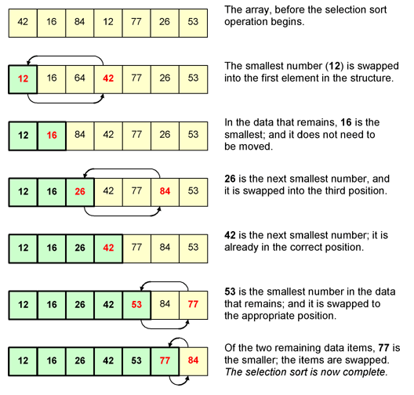

### **Code for Selection Sort (C++):**

```cpp
#include <iostream>
using namespace std;

void selectionSort(int arr[], int n) {
    for (int i = 0; i < n - 1; i++) {  // yaha n-1 hokar b <  hai, hm sirf phle n-1 element sort krte, nth vala automatically sorted ho jayega
        int minIndex = i; // Assume the first element is the smallest
        for (int j = i + 1; j < n; j++) {
            if (arr[j] < arr[minIndex]) {
                minIndex = j; // Update the index of the smallest element
            }
        }
        // Swap the smallest element with the first element of the unsorted part
        swap(arr[minIndex], arr[i]);
    }
}

void displayArray(int arr[], int n) {
    for (int i = 0; i < n; i++) {
        cout << arr[i] << " ";
    }
    cout << endl;
}

int main() {
    int arr[] = {64, 25, 12, 22, 11};
    int n = sizeof(arr) / sizeof(arr[0]);
    
    cout << "Original array: ";
    displayArray(arr, n);
    
    selectionSort(arr, n);
    
    cout << "Sorted array: ";
    displayArray(arr, n);
    
    return 0;
}
```
```c
    // Input Array (There will be total n-1 passes. 5-1 = 4 in this case!)
    //  00  01  02  03  04
    // |03, 05, 02, 13, 12

    // After first pass
    //  00  01  02  03  04
    //  02,|05, 03, 13, 12

    // After second pass
    // 00  01  02  03  04
    // 02, 03,|05, 13, 12

    // After third pass
    // 00  01  02  03  04
    // 02, 03, 05,|13, 12

    // After fourth pass
    // 00  01  02  03  04
    // 02, 03, 05, 12,|13


```
---

### **Iteration Example:**

**Input Array:** `{64, 25, 12, 22, 11}`  
**Step-by-Step Explanation:**

1. **Pass 1:**
   - Unsorted Part: `{64, 25, 12, 22, 11}`
   - Smallest Element: `11`
   - Swap `11` with `64`.
   - Array After Pass 1: `{11, 25, 12, 22, 64}`

2. **Pass 2:**
   - Unsorted Part: `{25, 12, 22, 64}`
   - Smallest Element: `12`
   - Swap `12` with `25`.
   - Array After Pass 2: `{11, 12, 25, 22, 64}`

3. **Pass 3:**
   - Unsorted Part: `{25, 22, 64}`
   - Smallest Element: `22`
   - Swap `22` with `25`.
   - Array After Pass 3: `{11, 12, 22, 25, 64}`

4. **Pass 4:**
   - Unsorted Part: `{25, 64}`
   - Smallest Element: `25` (already in place).
   - Array After Pass 4: `{11, 12, 22, 25, 64}`

5. **Final Array:** `{11, 12, 22, 25, 64}`

---

### **Is Selection Sort Stable?**

- **No, Selection Sort is not stable.**
  - Stability means maintaining the relative order of equal elements.
  - In Selection Sort, swapping can disturb the relative order of equal elements. For example, if two `5`s are in the array and one appears earlier, a swap might place the second `5` before the first.
Selection sort algorithm is not a stable algorithm. Since the smallest element is replaced with the first element at each pass, it may jumble up positions of equal elements very easily. Hence, unstable. Refer to the example below:
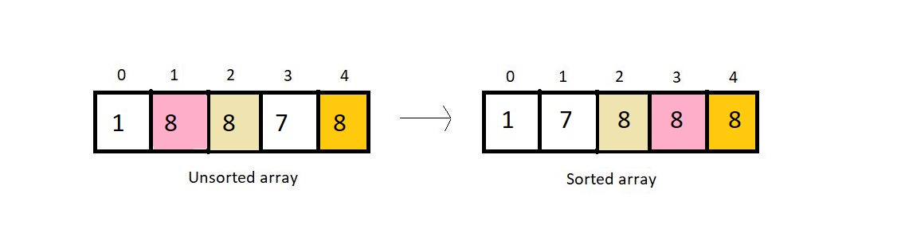
---

### **Is Selection Sort Adaptive?**

- **No, Selection Sort is not adaptive.**
  - An adaptive algorithm adjusts its behavior based on the initial order of elements. 
  - Selection Sort always performs O(n^2) comparisons regardless of whether the array is already sorted, partially sorted, or unsorted.

- It is not a recursive algorithm, since we didn’t use recursion here.
- Selection sort would anyways compare every element with the min element, regardless of the fact if the array is sorted or not, hence selection sort is not an adaptive algorithm by default.
- This algorithm offers the benefit of making the least number of swaps to sort an array. We don’t make any redundant swaps here.
---

### **Why is it Called Selection Sort?**

The algorithm is called **Selection Sort** because at each step, it **selects** the smallest (or largest) element from the unsorted part of the array and places it in its correct position in the sorted part.

# Q56. Explain
1. Explain Quick Sort in detail, Perform all operation , explain with code
2. Explain Quick sort is stable or not
3. Explain Quick sort is adaptive or not
4. Explain why the Quick Sort algorithm got its name

### **Quick Sort Algorithm:**
### **Quicksort**  
Quicksort is a highly efficient and widely used **divide-and-conquer** sorting algorithm. It works by selecting a **pivot** element and partitioning the array such that elements smaller than the pivot are on the left and elements greater than the pivot are on the right. This process is recursively applied to both subarrays.

### **Definition:**  
Quicksort is a sorting algorithm that selects a pivot, partitions the array around it, and recursively sorts the left and right subarrays.

### **Time Complexity:**  
- **Best Case:** O(n log n)  
- **Average Case:** O(n log n)  
- **Worst Case (Unbalanced partitioning, e.g., sorted or reverse-sorted array with a bad pivot choice):** O(n^2)  

### **Space Complexity:**  
- **In-place version:** O(log n) (for recursion stack)  

### **Algorithm Steps:**  
1. **Choose a Pivot** (commonly first, last, middle, or random element).  
2. **Partition the Array**: Rearrange elements such that those smaller than the pivot go to the left, and those greater go to the right.  
3. **Recursively Apply Quicksort** to the left and right subarrays.  
4. **Base Case**: If the array has one or zero elements, it is already sorted.  

Would you like a Python implementation?
---

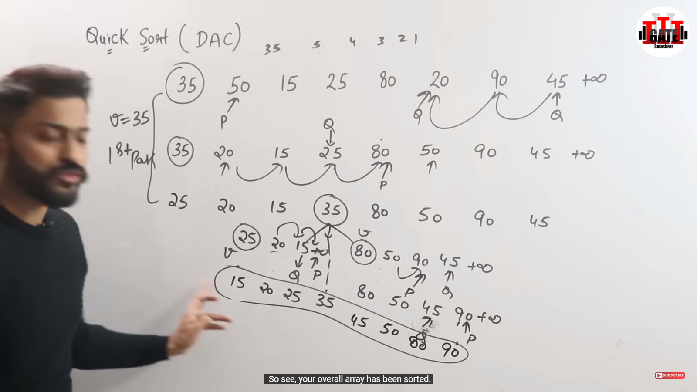

### **Example of QuickSort Partition (Short Version)**  
#### **Given Array:** `{10, 80, 30, 90, 40, 50, 70}`  
#### **Pivot:** `70`  

**Iterations:**  

1. Compare & swap: `{10, 30, 80, 90, 40, 50, 70}`  
2. Compare & swap: `{10, 30, 40, 90, 80, 50, 70}`  
3. Compare & swap: `{10, 30, 40, 50, 80, 90, 70}`  
4. Swap pivot: `{10, 30, 40, 50, 70, 90, 80}`  

**Partition Index:** `4`

### **Quick Sort Code in C++**

```cpp
#include <iostream>
using namespace std;

// Function to partition the array
int partition(int arr[], int low, int high) {
    int pivot = arr[high];  // Choosing the last element as the pivot
    int i = low;            // Starting `i` from `low`
    //OR i = low - 1; ye b kr skte

    for (int j = low; j < high; j++) {
        if (arr[j] < pivot) {  // If element is smaller than pivot
            swap(arr[i], arr[j]);  // Swap first, then move `i`
            i++;  // Move `i` to the next position
        }
    }
    swap(arr[i], arr[high]);  // Place pivot at correct position
    return i;  // Return partition index
}


// Quick Sort function
void quickSort(int arr[], int low, int high) {
    if (low < high) {
        int pi = partition(arr, low, high); // Partitioning index
        quickSort(arr, low, pi - 1);        // Recursively sort left subarray
        quickSort(arr, pi + 1, high);       // Recursively sort right subarray
    }
}

// Function to display the array
void displayArray(int arr[], int size) {
    for (int i = 0; i < size; i++) {
        cout << arr[i] << " ";
    }
    cout << endl;
}

int main() {
    int arr[] = {10, 7, 8, 9, 1, 5};
    int n = sizeof(arr) / sizeof(arr[0]);

    cout << "Original array: ";
    displayArray(arr, n);

    quickSort(arr, 0, n - 1);

    cout << "Sorted array: ";
    displayArray(arr, n);

    return 0;
}
```

  
Below is a detailed iteration example for QuickSort using the array  
`{10, 7, 8, 9, 1, 5}`  
with step-by-step partitioning and recursive calls.

---

### **Step 1: Initial Array Partition**  
**Array:** `{10, 7, 8, 9, 1, 5}`  
**Indices:** Low = 0, High = 5  
**Pivot:** `5` (last element)  
**Initial `i` value:** `i = low - 1 = -1`

#### **Partitioning (Iteration over j from 0 to 4):**

| **Index j** | **Element arr[j]** | **Check:** `arr[j] < pivot` | **`i` (before possible increment)** | **Action & Array State**                      |
|-------------|--------------------|-----------------------------|---------------------------------------|-----------------------------------------------|
| 0           | 10                 | 10 < 5 → **False**          | -1                                    | No swap; Array remains `{10, 7, 8, 9, 1, 5}`   |
| 1           | 7                  | 7 < 5 → **False**           | -1                                    | No swap; Array remains `{10, 7, 8, 9, 1, 5}`   |
| 2           | 8                  | 8 < 5 → **False**           | -1                                    | No swap; Array remains `{10, 7, 8, 9, 1, 5}`   |
| 3           | 9                  | 9 < 5 → **False**           | -1                                    | No swap; Array remains `{10, 7, 8, 9, 1, 5}`   |
| 4           | 1                  | 1 < 5 → **True**            | Increment `i` to 0                    | Swap `arr[0]` and `arr[4]`: `{1, 7, 8, 9, 10, 5}` |

After finishing the loop, we place the pivot in its correct position by swapping:
- **Swap:** `arr[i+1]` with `arr[high]` → Swap `arr[1]` and `arr[5]`

**Array after partition:**  
`{1, 5, 8, 9, 10, 7}`  
**Pivot Index:** `1`

---

### **Step 2: Recursively Sort the Left Subarray**  
**Left Subarray:** From index `0` to `pivot index - 1` → `{1}`  
- Contains only one element → **Already sorted**

---

### **Step 3: Recursively Sort the Right Subarray**  
**Right Subarray:** From index `pivot index + 1 = 2` to `high = 5` → `{8, 9, 10, 7}`  
**New Pivot:** `7` (last element)  
**Initial `i` value:** `i = low - 1 = 2 - 1 = 1`

#### **Partitioning (Iteration over j from 2 to 4):**

| **Index j** | **Element arr[j]** | **Check:** `arr[j] < pivot` | **`i` (before possible increment)** | **Action & Array State**                         |
|-------------|--------------------|-----------------------------|---------------------------------------|--------------------------------------------------|
| 2           | 8                  | 8 < 7 → **False**           | 1                                     | No swap; Array remains `{1, 5, 8, 9, 10, 7}`      |
| 3           | 9                  | 9 < 7 → **False**           | 1                                     | No swap; Array remains `{1, 5, 8, 9, 10, 7}`      |
| 4           | 10                 | 10 < 7 → **False**          | 1                                     | No swap; Array remains `{1, 5, 8, 9, 10, 7}`      |

After the loop, swap the pivot into its correct position:
- **Swap:** `arr[i+1]` with `arr[high]` → Swap `arr[2]` and `arr[5]`

**Array after partition:**  
`{1, 5, 7, 9, 10, 8}`  
**Pivot Index:** `2`

---

### **Step 4: Recursively Sort Subarrays of `{7, 9, 10, 8}`**

#### **Left of Pivot (Index 2):**  
- Subarray: from index `2` to `pivot index - 1 = 1` → *Empty*  
- Nothing to sort.

#### **Right Subarray:**  
- Subarray: from index `pivot index + 1 = 3` to `high = 5` → `{9, 10, 8}`  
- **New Pivot:** `8` (last element)  
- **Initial `i` value:** `i = low - 1 = 3 - 1 = 2`

##### **Partitioning (Iteration over j from 3 to 4):**

| **Index j** | **Element arr[j]** | **Check:** `arr[j] < pivot` | **`i` (before possible increment)** | **Action & Array State**                         |
|-------------|--------------------|-----------------------------|---------------------------------------|--------------------------------------------------|
| 3           | 9                  | 9 < 8 → **False**           | 2                                     | No swap; Array remains `{1, 5, 7, 9, 10, 8}`      |
| 4           | 10                 | 10 < 8 → **False**          | 2                                     | No swap; Array remains `{1, 5, 7, 9, 10, 8}`      |

After the loop, swap the pivot:
- **Swap:** `arr[i+1]` with `arr[high]` → Swap `arr[3]` and `arr[5]`

**Array after partition:**  
`{1, 5, 7, 8, 10, 9}`  
**Pivot Index:** `3`

---

### **Step 5: Final Recursive Call on Subarray `{10, 9}`**  
**Subarray:** from index `4` to `5` → `{10, 9}`  
**New Pivot:** `9`  
**Initial `i` value:** `i = low - 1 = 4 - 1 = 3`

##### **Partitioning (Iteration for j = 4 only):**

| **Index j** | **Element arr[j]** | **Check:** `arr[j] < pivot` | **`i` (before possible increment)** | **Action & Array State**                          |
|-------------|--------------------|-----------------------------|---------------------------------------|---------------------------------------------------|
| 4           | 10                 | 10 < 9 → **False**          | 3                                     | No swap; Array remains `{1, 5, 7, 8, 10, 9}`       |

After the loop, swap the pivot:
- **Swap:** `arr[i+1]` with `arr[high]` → Swap `arr[4]` and `arr[5]`

**Array after partition:**  
`{1, 5, 7, 8, 9, 10}`  
**Pivot Index:** `4`

---

### **Final Sorted Array**  
`{1, 5, 7, 8, 9, 10}`

---

### **Summary of Iterations**

| **Step** | **Subarray**           | **Pivot** | **Resulting Array**            | **Pivot Index** |
|----------|------------------------|-----------|--------------------------------|-----------------|
| 1        | `{10, 7, 8, 9, 1, 5}`   | 5         | `{1, 5, 8, 9, 10, 7}`           | 1               |
| 2        | Left: `{1}`            | -         | Already sorted                 | -               |
| 3        | Right: `{8, 9, 10, 7}`   | 7         | `{1, 5, 7, 9, 10, 8}`           | 2               |
| 4        | Right: `{9, 10, 8}`      | 8         | `{1, 5, 7, 8, 10, 9}`           | 3               |
| 5        | Right: `{10, 9}`         | 9         | `{1, 5, 7, 8, 9, 10}`           | 4               |

Each recursive call partitions the current subarray, and once the subarrays reduce to a single element (or empty), the entire array becomes sorted.


--- 

### Method 2:


### **C++ Code**

```cpp
#include <iostream>
using namespace std;

void printArray(int *A, int n) {
    for (int i = 0; i < n; i++) {
        cout << A[i] << " ";
    }
    cout << endl;
}

int partition(int A[], int low, int high) {
    int pivot = A[low];
    int i = low + 1;
    int j = high;
    int temp;

    do {
        while (A[i] <= pivot && i <= high) {
            i++;
        }

        while (A[j] > pivot && j >= low) {
            j--;
        }

        if (i < j) {
            temp = A[i];
            A[i] = A[j];
            A[j] = temp;
        }
    } while (i < j);

    // Swap A[low] and A[j]
    temp = A[low];
    A[low] = A[j];
    A[j] = temp;
    return j;
}

void quickSort(int A[], int low, int high) {
    if (low < high) {
        int partitionIndex = partition(A, low, high); 
        quickSort(A, low, partitionIndex - 1);  // Sort left subarray
        quickSort(A, partitionIndex + 1, high); // Sort right subarray
    }
}

int main() {
    int A[] = {9, 4, 4, 8, 7, 5, 6};
    int n = 7;

    cout << "Original Array: ";
    printArray(A, n);

    quickSort(A, 0, n - 1);

    cout << "Sorted Array: ";
    printArray(A, n);

    return 0;
}
```

---

### **Detailed Iteration Process**

Given Input: `{9, 4, 4, 8, 7, 5, 6}`  

#### **Step 1: Initial Call to QuickSort**
- **Array:** `{9, 4, 4, 8, 7, 5, 6}`
- **Low = 0, High = 6**
- **Pivot = 9**

##### **Partitioning Process**
1. `i = 1`, `j = 6`  
2. `A[i] = 4` (≤ pivot) → Increment `i`.  
3. `A[i] = 4` (≤ pivot) → Increment `i`.  
4. `A[i] = 8` (≤ pivot) → Increment `i`.  
5. `A[i] = 7` (≤ pivot) → Increment `i`.  
6. `A[i] = 5` (≤ pivot) → Increment `i`.  
7. `A[i] = 6` (≤ pivot) → Increment `i`.  
8. `i = 7`, `j = 6`.  
9. Swap `A[low]` and `A[j]`: `{6, 4, 4, 8, 7, 5, 9}`.  

**Result:** Pivot Index = `6`.  

---

#### **Step 2: Left Subarray (`Low = 0, High = 5`)**
- **Array:** `{6, 4, 4, 8, 7, 5, 9}`
- **Pivot = 6**

##### **Partitioning Process**
1. `i = 1`, `j = 5`.  
2. `A[i] = 4` (≤ pivot) → Increment `i`.  
3. `A[i] = 4` (≤ pivot) → Increment `i`.  
4. `A[i] = 8` (> pivot).  
5. `A[j] = 5` (≤ pivot) → Swap `A[i]` and `A[j]`: `{6, 4, 4, 5, 7, 8, 9}`.  
6. `i = 4`, `j = 4`.  
7. Swap `A[low]` and `A[j]`: `{5, 4, 4, 6, 7, 8, 9}`.  

**Result:** Pivot Index = `3`.  

---

#### **Step 3: Left Subarray (`Low = 0, High = 2`)**
- **Array:** `{5, 4, 4, 6, 7, 8, 9}`
- **Pivot = 5**

##### **Partitioning Process**
1. `i = 1`, `j = 2`.  
2. `A[i] = 4` (≤ pivot) → Increment `i`.  
3. `A[i] = 4` (≤ pivot) → Increment `i`.  
4. `i = 3`, `j = 2`.  
5. Swap `A[low]` and `A[j]`: `{4, 4, 5, 6, 7, 8, 9}`.  

**Result:** Pivot Index = `2`.  

---

#### **Step 4: Left Subarray (`Low = 0, High = 1`)**
- **Array:** `{4, 4, 5, 6, 7, 8, 9}`
- Pivot = 4.  
- Already sorted since all elements are equal.

---

#### **Step 5: Right Subarray (`Low = 4, High = 5`)**
- **Array:** `{4, 4, 5, 6, 7, 8, 9}`
- **Pivot = 7**

##### **Partitioning Process**
1. `i = 5`, `j = 5`.  
2. `A[i] = 8` (> pivot).  
3. Swap `A[low]` and `A[j]`: `{4, 4, 5, 6, 7, 8, 9}`.  

**Result:** Pivot Index = `5`.

---

### **Final Sorted Array**
**Output:** `{4, 4, 5, 6, 7, 8, 9}`  


---

### **Quick Sort Is Stable or Not?**

#### **Explanation:**
Quick Sort is **not stable**. A stable sorting algorithm preserves the relative order of equal elements. In Quick Sort, during the partitioning process, elements with the same value may not maintain their original order.

#### **Example to Demonstrate Unstable Behavior:**
Consider the array `[(3, A), (3, B), (1, C)]`, where the second value indicates the original position:
- After partitioning, the relative order of `(3, A)` and `(3, B)` may change, leading to instability.

---

### **Quick Sort Is Adaptive or Not?**

#### **Explanation:**
Quick Sort is **not adaptive**. The algorithm doesn't take advantage of an already sorted or partially sorted array. It will still go through all the recursive calls and perform partitioning.

#### **Example for Non-Adaptiveness:**
Even if the input array is sorted, Quick Sort will still perform its recursive partitioning.

---

### **Why Is Quick Sort Called "Quick"?**

Quick Sort is called "Quick" because it is highly efficient in terms of average-case time complexity:
- It has an average-case time complexity of O(n log n), which is faster compared to algorithms like Bubble Sort and Insertion Sort.
- Its partitioning approach ensures that large sections of the array are sorted in fewer steps, making it quick for large datasets.

---

# Q57. Explain Analysis of QuickSort Sorting 

### **Analysis of QuickSort Sorting Algorithm**

QuickSort is a **Divide-and-Conquer** sorting algorithm that is widely used because of its efficiency and simplicity. Here is a detailed analysis of QuickSort:

---
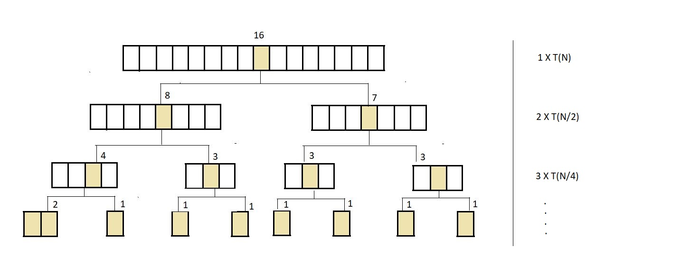

### **1. Time Complexity**
#### **Best Case (O(n log n)):**
- Occurs when the pivot divides the array into two nearly equal halves repeatedly.
- For each level of recursion:
  - Partition operation takes O(n) time (as every element is compared with the pivot).
- Number of recursion levels is O(\log n) when the array is split evenly.
- Total Time Complexity: O(n) \times O(\log n) = O(n \log n).

#### **Worst Case (O(n²)):**
- Occurs when the pivot is the smallest or largest element, causing highly unbalanced partitions:
  - One partition has n-1 elements, and the other has 0 elements.
  - Number of recursion levels becomes O(n).
  - Partitioning takes O(n) at each level.
- Total Time Complexity: O(n) \times O(n) = O(n^2).

#### **Average Case (O(n log n)):**
- On average, the pivot divides the array into partitions with sizes roughly proportional to p \times (1-p), where p is the split ratio.
- Number of recursion levels is approximately O(\log n).
- Total Time Complexity: O(n) \times O(\log n) = O(n \log n).

---

### **2. Space Complexity**
- **In-place Algorithm:** QuickSort sorts the array without using extra space for a separate data structure.
- **Auxiliary Space:** Space is used for recursion stack:
  - Best Case: O(\log n) (balanced partitions).
  - Worst Case: O(n) (unbalanced partitions).

---

### **3. Stability**
- **Is QuickSort Stable?**  
  - No, QuickSort is not stable because it swaps elements that might have the same value but different original positions. Stability can be enforced by modifying the partitioning process, but this increases complexity.

---

### **4. Adaptivity**
- **Is QuickSort Adaptive?**  
  - No, QuickSort does not take advantage of partially sorted arrays. It processes the entire array regardless of the initial order.

---

### **5. Recursiveness**
- QuickSort is a **recursive algorithm**:
  - Divides the array into subarrays.
  - Recursively sorts the subarrays until the base case (array size  \leq 1 ) is reached.
- Tail-recursion optimization can be applied to improve efficiency.

---

### **6. Internal vs. External Sorting**
- QuickSort is an **internal sorting algorithm** because it works in main memory and does not rely on external storage.

---

### **Why QuickSort Is Named So?**
- The name "QuickSort" is derived from its ability to sort faster than other comparison-based sorting algorithms like Bubble Sort or Selection Sort, particularly for large datasets.
- It achieves this through its efficient partitioning strategy and O(n \log n) average time complexity.

---

### **Pros of QuickSort**
1. **Fast:** Often faster in practice compared to other O(n \log n) algorithms like Merge Sort due to better cache performance.
2. **In-place:** Requires minimal additional memory.

---

### **Cons of QuickSort**
1. **Worst Case Performance:** O(n^2) if the pivot is poorly chosen.
2. **Not Stable:** Does not preserve the relative order of equal elements.

---

This detailed analysis explains the strengths, weaknesses, and behavior of QuickSort under various scenarios, making it a powerful yet context-dependent algorithm.

---

# Q58 and Q59. Explain
1. Explain Merge Sort in detail, Perform all operation , explain with code
2. Explain Merge sort is stable or not
3. Explain Merge sort is adaptive or not
4. Explain why the Merge Sort algorithm got its name
5. Explain Analysis of MergeSort algorithm

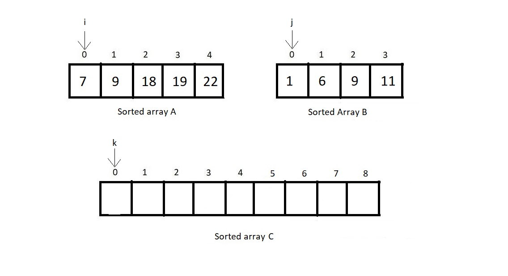
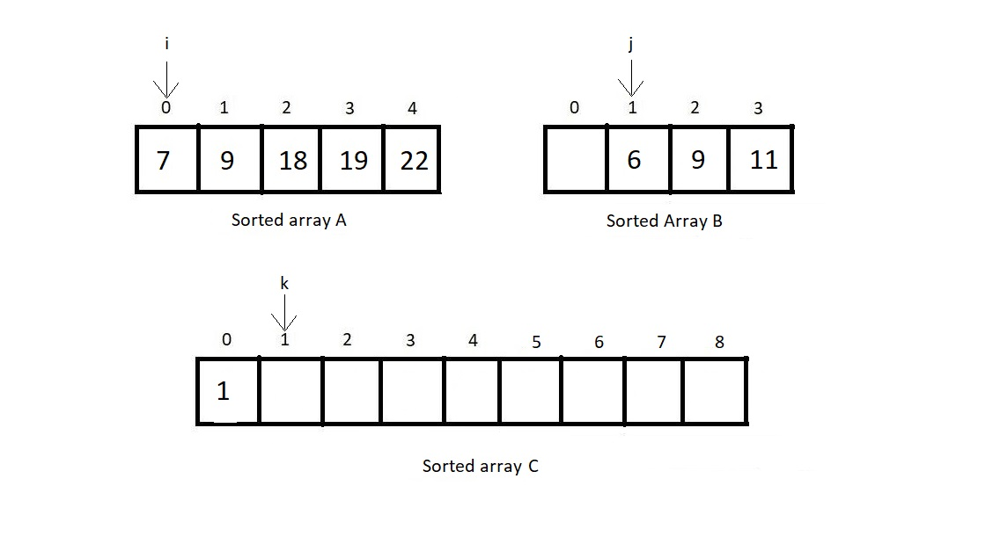

### **1. Merge Sort Algorithm**

#### **What is Merge Sort?**
Merge Sort is a **Divide-and-Conquer** sorting algorithm. It divides the input array into two halves, recursively sorts them, and then merges the two sorted halves into a single sorted array.

---

#### **Steps of Merge Sort**
1. **Divide:** Split the array into two halves until each subarray contains only one element.
2. **Conquer:** Sort the subarrays recursively.
3. **Combine:** Merge the sorted subarrays into a single sorted array.

---

#### **Merge Sort Code**

```cpp
#include <iostream>
#include <vector>
using namespace std;

// Function to merge two sorted subarrays
void merge(vector<int>& arr, int low, int mid, int high) {
    int n1 = mid - low + 1; // Size of left subarray
    int n2 = high - mid;    // Size of right subarray

    vector<int> left(n1), right(n2);

    // Copy data to temporary arrays
    for (int i = 0; i < n1; i++) left[i] = arr[low + i];
    for (int i = 0; i < n2; i++) right[i] = arr[mid + 1 + i];

    int i = 0, j = 0, k = low;

    // Merge the two arrays
    while (i < n1 && j < n2) {
        if (left[i] <= right[j]) {
            arr[k] = left[i];
            i++;
        } else {
            arr[k] = right[j];
            j++;
        }
        k++;
    }

    // Copy remaining elements of left array
    while (i < n1) {
        arr[k] = left[i];
        i++;
        k++;
    }

    // Copy remaining elements of right array
    while (j < n2) {
        arr[k] = right[j];
        j++;
        k++;
    }
}

// Function to perform Merge Sort
void mergeSort(vector<int>& arr, int low, int high) {
    if (low < high) {
        int mid = low + (high - low) / 2;

        // Recursively sort the two halves
        mergeSort(arr, low, mid);
        mergeSort(arr, mid + 1, high);

        // Merge the sorted halves
        merge(arr, low, mid, high);
    }
}

void printArray(const vector<int>& arr) {
    for (int num : arr) cout << num << " ";
    cout << endl;
}

int main() {
    vector<int> arr = {12, 11, 13, 5, 6, 7};
    cout << "Original array: ";
    printArray(arr);

    mergeSort(arr, 0, arr.size() - 1);

    cout << "Sorted array: ";
    printArray(arr);
    return 0;
}
```
### Iterations
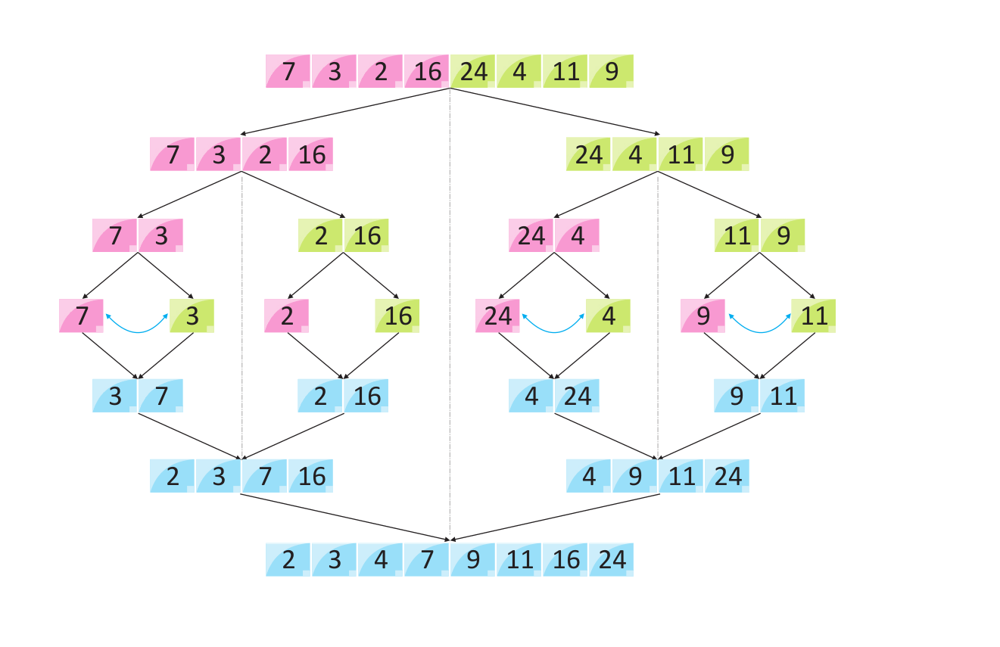

**Input Array:** `[12, 11, 13, 5, 6, 7]`

---

### **Step 1: Initial Split (Divide Step)**

**Original Array:** `[12, 11, 13, 5, 6, 7]`  
Split the array into two halves:
- Left: `[12, 11, 13]`
- Right: `[5, 6, 7]`

---

#### **Iteration 1: Splitting Left Subarray `[12, 11, 13]`**
- Split `[12, 11, 13]` into:
  - Left: `[12]` (single element, so it's sorted)
  - Right: `[11, 13]`

---

#### **Iteration 2: Splitting Right Subarray `[11, 13]`**
- Split `[11, 13]` into:
  - Left: `[11]` (sorted)
  - Right: `[13]` (sorted)

---

### **Step 2: Merging Back (Combine Step)**

#### **Iteration 3: Merge `[11]` and `[13]`**
Merge `[11]` and `[13]`:
- Compare `11` with `13`:
  - `11 <= 13` → Place `11` first.
  - Place `13` next.
- Merged Result: `[11, 13]`

---

#### **Iteration 4: Merge `[12]` and `[11, 13]`**
Merge `[12]` and `[11, 13]`:
- Compare `12` with `11`:
  - `11 < 12` → Place `11` first.
- Compare `12` with `13`:
  - `12 < 13` → Place `12` next.
- Place `13` last.
- Merged Result: `[11, 12, 13]`

---

#### **Iteration 5: Splitting Right Subarray `[5, 6, 7]`**
Split `[5, 6, 7]` into:
- Left: `[5]` (sorted)
- Right: `[6, 7]`

---

#### **Iteration 6: Splitting `[6, 7]`**
Split `[6, 7]` into:
- Left: `[6]` (sorted)
- Right: `[7]` (sorted)

---

### **Step 3: Merge `[6]` and `[7]`**
Merge `[6]` and `[7]`:
- Compare `6` with `7`:
  - `6 <= 7` → Place `6` first.
  - Place `7` next.
- Merged Result: `[6, 7]`

---

### **Step 4: Merge `[5]` and `[6, 7]`**
Merge `[5]` and `[6, 7]`:
- Compare `5` with `6`:
  - `5 < 6` → Place `5` first.
- Place `6` and `7` next.
- Merged Result: `[5, 6, 7]`

---

### **Step 5: Final Merge**
Merge `[11, 12, 13]` and `[5, 6, 7]`:
- Compare `11` with `5`:
  - `5 < 11` → Place `5` first.
- Compare `11` with `6`:
  - `6 < 11` → Place `6` next.
- Compare `11` with `7`:
  - `7 < 11` → Place `7` next.
- Place `11`, `12`, and `13` next.
- Final Sorted Array: `[5, 6, 7, 11, 12, 13]`

---

### **Detailed Iterations Table**

| **Iteration** | **Operation**             | **Left Subarray** | **Right Subarray** | **Merged Result**     |
|---------------|---------------------------|-------------------|--------------------|-----------------------|
| 1             | Split `[12, 11, 13]`      | `[12]`            | `[11, 13]`         | N/A                   |
| 2             | Split `[11, 13]`          | `[11]`            | `[13]`             | N/A                   |
| 3             | Merge `[11]` and `[13]`   | `[11]`            | `[13]`             | `[11, 13]`           |
| 4             | Merge `[12]` and `[11,13]`| `[12]`            | `[11, 13]`         | `[11, 12, 13]`       |
| 5             | Split `[5, 6, 7]`         | `[5]`             | `[6, 7]`           | N/A                   |
| 6             | Split `[6, 7]`            | `[6]`             | `[7]`              | N/A                   |
| 7             | Merge `[6]` and `[7]`     | `[6]`             | `[7]`              | `[6, 7]`             |
| 8             | Merge `[5]` and `[6, 7]`  | `[5]`             | `[6, 7]`           | `[5, 6, 7]`          |
| 9             | Merge `[11, 12, 13]` and `[5, 6, 7]`| `[11, 12, 13]` | `[5, 6, 7]` | `[5, 6, 7, 11, 12, 13]` |

--- 

### **Final Sorted Array:** `[5, 6, 7, 11, 12, 13]`
---

#### **Example with Iterations**
Consider the array: [12, 11, 13, 5, 6, 7].

1. **Divide:**
   - Split the array: [12, 11, 13] and [5, 6, 7].
   - Further split: [12], [11, 13], [5], [6, 7].
   - Continue splitting until each subarray contains one element.

2. **Merge:**
   - Merge [12] and [11, 13] into [11, 12, 13].
   - Merge [5] and [6, 7] into [5, 6, 7].
   - Merge the two halves [11, 12, 13] and [5, 6, 7] into the final sorted array [5, 6, 7, 11, 12, 13].

---

### **2. Is Merge Sort Stable?**
- **Yes, Merge Sort is stable.**
  - Stability means that if two elements have the same value, they will remain in the same relative order as in the input.
  - Merge Sort achieves stability by ensuring elements from the left subarray are placed before elements from the right subarray when merging.

---

### **3. Is Merge Sort Adaptive?**
- **No, Merge Sort is not adaptive.**
  - Adaptive algorithms take advantage of the existing order in the array to reduce the number of operations.
  - Merge Sort always divides and conquers, even if the array is already sorted.

---

### **4. Why Is It Called Merge Sort?**
- Merge Sort is named after its key operation: **merging**.
  - It merges two sorted subarrays to produce a larger sorted array.
  - This merging process is fundamental to how the algorithm works.

---

### **5. Analysis of Merge Sort**

#### **Time Complexity**
- **Best Case:** O(n log n) (always divides and merges).
- **Worst Case:** O(n log n) (same as best case).
- **Average Case:** O(n log n).

#### **Space Complexity**
- Requires O(n) additional space for the temporary arrays used in merging.

#### **Stability**
- As explained above, Merge Sort is stable.

#### **Adaptivity**
- Merge Sort is not adaptive.

---

### **Advantages**
1. Always has O(n \log n) time complexity.
2. Stable sorting algorithm.
3. Works well for large datasets and linked lists.

### **Disadvantages**
1. Requires additional O(n) space, making it less memory-efficient.
2. Not adaptive, so it does not leverage existing order in the data.

---

# Q60. Explain
1. Explain Count Sort in detail, Perform all operation , explain with code
2. Explain iteration of evry flow
3. Explain Count sort is stable or not 
4. Explain Count sort is adaptive or not 
5. Explain why the Count Sort algorithm got its name 
6. Explain Analysis of CountSort algorithm

Here’s the explanation and detailed steps for Count Sort using the provided code. The code is modified to C++ and explained with iterations.

---

### **1. Explanation of Count Sort**

The code implements the Count Sort algorithm, which is a non-comparison-based sorting algorithm. It works by counting the frequency of each element and reconstructing the sorted array based on these counts.

---

### **C++ Code**

```cpp
#include <iostream>
#include <climits>
#include <vector>
using namespace std;

// Function to print an array
void printArray(const vector<int>& A) {
    for (int i = 0; i < A.size(); i++) {
        cout << A[i] << " ";
    }
    cout << endl;
}

// Function to find the maximum element in an array
int maximum(const vector<int>& A) {
    int max = INT_MIN;
    for (int i = 0; i < A.size(); i++) {
        if (max < A[i]) {
            max = A[i];
        }
    }
    return max;
}

    // int maxElement = *max_element(arr.begin(), arr.end());
    // int minElement = *min_element(arr.begin(), arr.end());
    // we can use this also, just need to add algorithm library


// Function to perform Count Sort
void countSort(vector<int>& A) {
    int n = A.size();
    
    // Find the maximum element in the array
    int max = maximum(A);

    // Create and initialize the count array
    vector<int> count(max + 1, 0); // Initialize all elements to 0 with size max+1

    // Count occurrences of each element
    for (int i = 0; i < n; i++) {
        count[A[i]]++;
    }

    // Reconstruct the sorted array
    int i = 0; // Counter for count array
    int j = 0; // Counter for original array
    while (i <= max) {
        if (count[i] > 0) {
            A[j] = i;
            count[i]--;
            j++;
        } else {
            i++;
        }
    }
}

int main() {
    vector<int> A = {9, 1, 4, 14, 4, 15, 6};
    cout << "Original Array: ";
    printArray(A);

    countSort(A);

    cout << "Sorted Array: ";
    printArray(A);

    return 0;
}
```

---

### **2. Iteration of Every Flow**

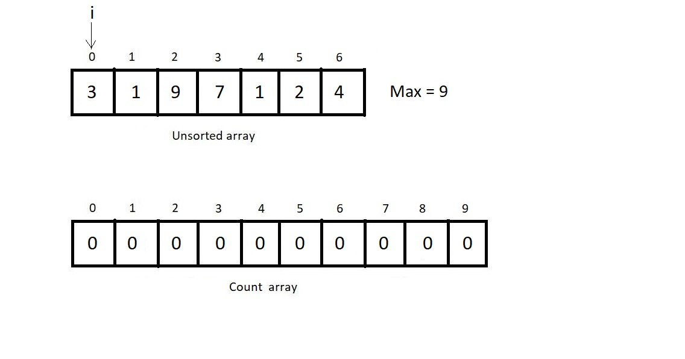
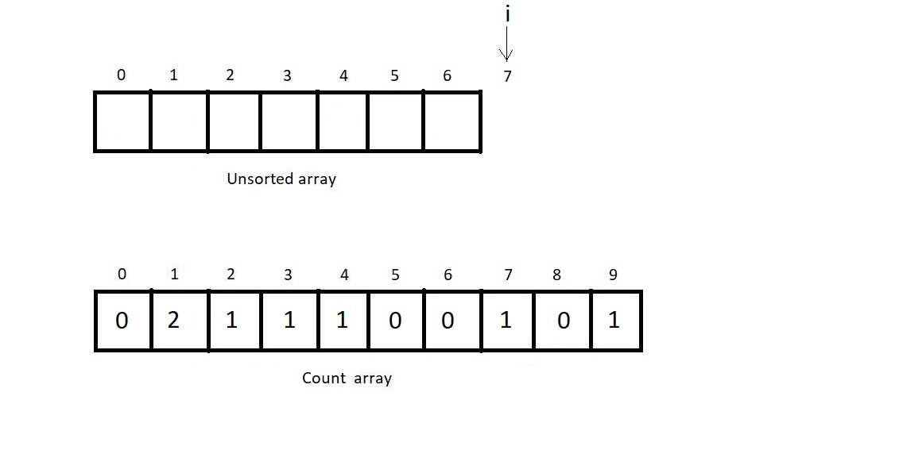

#### **Input Array:**
`[9, 1, 4, 14, 4, 15, 6]`

#### **Step 1: Find Maximum**
- Traverse the array to find the maximum element.
- Maximum value: `15`.

---

#### **Step 2: Create Count Array**
- Create a `count` array of size `16` (max value + 1) initialized with `0`.
- Increment the count for each element:
  - For `9`: `count[9]++`
  - For `1`: `count[1]++`
  - For `4`: `count[4]++`
  - For `14`: `count[14]++`
  - For `4`: `count[4]++`
  - For `15`: `count[15]++`
  - For `6`: `count[6]++`

**Count Array After Incrementing:**  
`[0, 1, 0, 0, 2, 0, 1, 0, 0, 1, 0, 0, 0, 0, 1, 1]`

---

#### **Step 3: Reconstruct the Sorted Array**
Iterate through the `count` array and reconstruct the sorted array:
- For `i = 1`: Add `1` to the result → `[1]`
- For `i = 4`: Add `4` twice → `[1, 4, 4]`
- For `i = 6`: Add `6` → `[1, 4, 4, 6]`
- For `i = 9`: Add `9` → `[1, 4, 4, 6, 9]`
- For `i = 14`: Add `14` → `[1, 4, 4, 6, 9, 14]`
- For `i = 15`: Add `15` → `[1, 4, 4, 6, 9, 14, 15]`

**Sorted Array:** `[1, 4, 4, 6, 9, 14, 15]`

---

### **3. Is Count Sort Stable?**
**Yes**, Count Sort is stable as it maintains the relative order of equal elements when implemented correctly (traversing input in reverse while constructing the sorted array).

---

### **4. Is Count Sort Adaptive?**
**No**, Count Sort is not adaptive because it always processes all elements and their counts, regardless of whether the input is partially sorted.

---

### **5. Why Count Sort Got Its Name?**
The algorithm is named Count Sort because it counts the occurrences of each element to determine its position in the sorted array.

---

### **6. Analysis of Count Sort**

| **Aspect**        | **Details**                                                                 |
|--------------------|-----------------------------------------------------------------------------|
| **Time Complexity** |  O(n + k) , where  n  is the number of elements,  k  is the range. |
| **Space Complexity**|  O(k) , for the count array.                                           |
| **Stability**       | Stable.                                                                   |
| **Adaptivity**      | Not adaptive.                                                             |
| **Best Use Case**   | Sorting integers or objects with a limited range.                         |