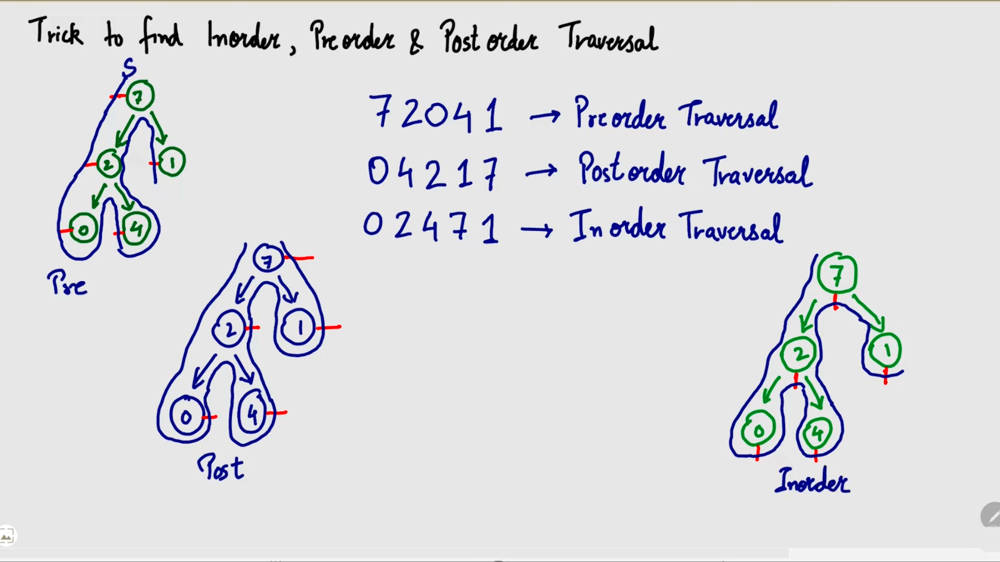

# Q61. Explain TREE in detail. Explain all Terminologies

### **Tree in Data Structure**

A **tree** is a hierarchical data structure that consists of nodes connected by edges. It is widely used for representing hierarchical data like file systems, organizational structures, etc.

---

### **Basic Structure of a Tree**
1. **Node**: Each element in the tree is called a node.
2. **Edge**: A connection between two nodes.
3. **Root**: The topmost node of the tree.
4. **Child**: A node connected to another node directly below it.
5. **Parent**: A node directly connected above a given node.
6. **Leaf**: A node with no children.
7. **Subtree**: A tree formed by a node and its descendants.
8. **Path**: A sequence of nodes from one node to another.

---

### **Key Terminologies in Tree**

#### **1. Root Node**
- The topmost node of a tree.
- It does not have any parent.
- Example: In a family tree, the root node represents the oldest ancestor.
- The topmost node of a tree is called the root.

#### **2. Child Node**
- Nodes that are directly connected and below a parent node.
- Example: A person’s children in a family tree.

#### **3. Parent Node**
- The immediate predecessor of a node.
- Example: A person’s parent in a family tree.

#### **4. Sibling**
- Nodes that share the same parent.
- Example: Two siblings in a family tree.

#### **5. Leaf Node**
- A node with no children.
- Example: The youngest family members in a tree.

#### **6. Internal Node**
- A node that has at least one child.
- Example: An ancestor who has descendants.

#### **7. Path**
- A sequence of nodes from one node to another.
- Example: Path from the root to a leaf.

#### **8. Depth**
- The length of the path from the root to a node.
- Example: If a node is 3 levels below the root, its depth is 3.

#### **9. Height**
- The length of the longest path from a node to a leaf.
- Example: The height of a tree starting from the root.
Height of a node is the number of edges in between the deepest leaf and that node. And depth of a node is the number of edges between the root and that node.

#### **10. Degree**
- The number of children a node has.
- Example: If a node has three children, its degree is 3.

#### **11. Level**
- The distance of a node from the root node.
- Example: The root node is at level 0.

#### **12. Subtree**
- A tree that is part of another tree.
- Example: A branch of a tree is a subtree.

#### **13. Binary Tree**
- A tree where each node has at most two children (left and right).

#### **14. Full Binary Tree**
- A binary tree where every node has either 0 or 2 children.

#### **15. Complete Binary Tree**
- A binary tree where all levels except the last are fully filled, and all nodes in the last level are as far left as possible.

#### **16. Perfect Binary Tree**
- A binary tree where all internal nodes have two children, and all leaf nodes are at the same level.

#### **17. Balanced Tree**
- A tree where the height of the left and right subtrees of every node differs by at most 1.

#### **18. Traversals**
- Methods to visit all the nodes in a tree.
  - **Inorder (Left, Root, Right)**
  - **Preorder (Root, Left, Right)**
  - **Postorder (Left, Right, Root)**
  - **Level Order (Breadth-First)**

---

### **Properties of a Tree**
1. A tree with \( N \) nodes has \( N - 1 \) edges.
2. A binary tree with \( L \) leaves has at least \( \lceil \log_2(L + 1) \rceil \) levels.
3. The maximum number of nodes at level \( L \) in a binary tree is \( 2^L \).

---

### **Applications of Trees - WHY TREES?**
1. **Hierarchical Data Representation**: File systems, XML/HTML DOM.
2. **Searching and Sorting**: Binary Search Tree (BST).
3. **Network Routing**: Spanning trees in computer networks.
4. **Expression Evaluation**: Abstract Syntax Trees (AST).

### A tree with n nodes has n-1 Why n-1?
Because in a tree, there is one and only edge corresponding to all the nodes except the root node. The root node has no parent, hence no edge pointing to it. Therefore, a total of n-1 edges.


---

# Q62 and Q63. Explain 
1. what is Binary Tree in detail.
2. Explain types of binary tree

### **Introduction**

Data structures are broadly classified into two types: **linear** and **non-linear**.

1. **Linear Data Structures**: These structures store elements in a sequential manner, where each element is connected to its previous and next elements in a single chain. Examples include:
   - **Arrays**: Contiguous memory locations holding elements of the same type.
   - **Queues**: Follows First In First Out (FIFO) order.
   - **Stacks**: Operates on Last In First Out (LIFO) principle.
   - **Linked Lists**: Elements (nodes) are connected using pointers.

2. **Non-Linear Data Structures**: These structures organize data hierarchically or in an interrelated manner, allowing multiple connections between elements. **Trees** are the most common example.

---

### **Tree Data Structure**

A **tree** is a hierarchical, non-linear data structure that consists of nodes connected by edges. Trees are widely used in scenarios where data needs to be organized and searched efficiently, such as in databases, file systems, and hierarchical data models.

#### **Key Features of Trees**
1. A tree starts at the **root node** and branches into child nodes.
2. Each node contains:
   - **Data**.
   - **Child pointers** (left and/or right in the case of binary trees).
3. Trees have no cycles, making them a connected acyclic graph.

---

### **Tree Terminologies**

1. **Root**: The topmost node of the tree.
2. **Parent**: A node that has children nodes connected to it.
3. **Child**: A node that is connected to its parent node.
4. **Siblings**: Nodes that share the same parent.
5. **Leaf Node**: A node with no children (terminal node).
6. **Internal Node**: A node with at least one child.
7. **Edge**: A connection between two nodes.
8. **Path**: A sequence of nodes where each pair is connected by an edge.
9. **Height of a Node**: The number of edges on the longest path from the node to a leaf.
10. **Height of the Tree**: The height of the root node.
11. **Depth of a Node**: The number of edges from the root to the node.
12. **Level**: Nodes at the same depth form a level.
13. **Subtree**: A tree formed by taking any node as the root and its descendants.
14. **Degree of a Node**: The number of children a node has.

---

### **Binary Tree**

A **binary tree** is a type of tree where each node can have at most two children, typically referred to as:
- **Left child**
- **Right child**

---


### **Types of Binary Trees**

#### **1. Full or Strict Binary Tree**
- Each node has either 0 or 2 children.
- No node has only one child.

**Example**:
```
        1
      /   \
     2     3
    / \
   4   5
```


#### **2. Perfect Binary Tree**
- All internal nodes have two children.
- All leaf nodes are at the same level.

**Example**:
```
        1
      /   \
     2     3
    / \   / \
   4   5 6   7
```


#### **3. Complete Binary Tree**
- All levels except possibly the last are completely filled.
- Nodes in the last level are filled from left to right.

**Example**:
```
        1
      /   \
     2     3
    / \
   4   5
```


#### **4. Degenerate Tree**
- Each parent node has only one child.
- Similar to a linked list.

**Left-Skewed**:
```
    1
   /
  2
 /
3
```

**Right-Skewed**:
```
1
 \
  2
   \
    3
```


#### **5. Skewed Tree**
- A degenerate tree where nodes are aligned in one direction:
  - **Left-skewed**: All nodes have left children.
  - **Right-skewed**: All nodes have right children.


---

### **Properties and Comparisons of Binary Tree Types**

| **Tree Type**         | **Definition**                                                                                     | **Is Balanced?**     | **Example**                              |
|------------------------|---------------------------------------------------------------------------------------------------|-----------------------|------------------------------------------|
| **Full Binary Tree**   | Every node has either 0 or 2 children.                                                            | No                    | \( 1 \to 2,3 \to 4,5 \)                 |
| **Perfect Binary Tree**| All internal nodes have 2 children, and all leaf nodes are at the same level.                     | Perfectly Balanced    | \( 1 \to 2,3 \to 4,5,6,7 \)             |
| **Complete Binary Tree**| All levels filled except possibly the last, filled from left to right.                           | Balanced              | \( 1 \to 2,3 \to 4,5 \)                 |
| **Degenerate Tree**    | Each parent node has only one child.                                                              | No                    | \( 1 \to 2 \to 3 \to ... \)             |
| **Skewed Tree**        | Similar to a degenerate tree but in one direction.                                                | No                    | \( 1 \to 2 \to 3 \to ... \)             |

---

### **Why Use Trees?**
- **Efficient Searching**: Trees reduce the time complexity for searching data compared to linear structures like arrays or linked lists.
- **Hierarchical Data Representation**: Trees model relationships like parent-child effectively.
- **Ease of Traversal**: Different traversal techniques (preorder, inorder, postorder, level order) make accessing data flexible.
- **Applications**:
  - **Binary Search Tree (BST)** for dynamic data organization.
  - **Heaps** for priority queues.
  - **Tries** for dictionary and prefix storage.

---

# Q64. Explain Representation of a Binary Tree in detail
1. Array representation of Binary trees
2. Linked Representation of Binary Trees
 
### Representation of Binary Trees in Detail

In the previous discussion, we explored different types of binary trees with examples to understand their concepts better. Now, let's dive into the techniques for representing binary trees in programming. Two main methods are used for binary tree representation:  
1. **Array Representation**  
2. **Linked Representation**

---

### **1. Array Representation of Binary Trees**

This method involves using an array to represent the structure of a binary tree.

#### **Explanation**:
- Binary trees are traversed level by level, starting from the root and from left to right. Each node is mapped to an index in the array.
- The root node is assigned index `0`.  
- **Indexing Rules**:  
  - **Left Child** of a node at index `i`: Stored at index `2i + 1`.  
  - **Right Child** of a node at index `i`: Stored at index `2i + 2`.  
  - **Parent** of a node at index `i`: Stored at index `(i - 1) / 2`.

#### **Example 1: Complete Binary Tree**

Consider this binary tree:

```
        1
      /   \
     2     3
    / \   /
   4   5 6
```

Its **array representation**:
\[ 1, 2, 3, 4, 5, 6 \]

**Explanation**:
- Index `0`: Root node `1`.  
- Index `1`: Left child of `1` → `2`.  
- Index `2`: Right child of `1` → `3`.  
- Index `3`: Left child of `2` → `4`.  
- Index `4`: Right child of `2` → `5`.  
- Index `5`: Left child of `3` → `6`.

---

#### **Example 2: Sparse Binary Tree**

For sparse binary trees, we add `NULL` (or a placeholder value) for missing nodes to maintain the indexing.

Tree:

```
        1
      /   \
     2     3
      \      \
       4      5
```

**Array Representation**:  
\[ 1, 2, 3, NULL, 4, NULL, 5 \]


#### **Advantages**:
1. Easy to implement and understand.
2. Efficient for **complete** and **perfect binary trees**.

#### **Disadvantages**:
1. Wastes memory for sparse trees (due to unused array slots for `NULL` values).
2. Size constraints: Arrays require a predefined size, which limits dynamic growth.
3. Insertion and deletion operations are inefficient due to array resizing and element shifting.

---

But was this even an efficient approach? Like Binary Trees are made only for efficient traversal and insertion and deletion and using an array for that really makes the process troublesome. Each of these operations becomes quite costly to accomplish. And that size constraint was already for making things worse. So overall, we would say that the array representation of a binary is not a very good choice. And what are the other options?

We have another method to represent binary trees called the linked representation of binary trees. Don’t confuse this with linked lists you have studied. And the reason why I am saying that is because linked lists are lists that are linear data structures.


### **2. Linked Representation of Binary Trees**

This method uses a **linked structure**, where each node contains three parts:
1. **Data**: The value of the node.
2. **Left Pointer**: Points to the left child.
3. **Right Pointer**: Points to the right child.


#### **Node Structure in C**:
```c
struct Node {
    int data;
    struct Node* left;
    struct Node* right;
};
```

#### **Representation**:
For the same binary tree:

```
        1
      /   \
     2     3
    / \   /
   4   5 6
```

**Linked Representation**:

```plaintext
   [1]
  /   \
[2]   [3]
 / \   /
[4][5][6]
```

Each node has pointers to its children, which closely resembles a real binary tree.

#### **Advantages**:
1. Dynamically allocates memory, making it suitable for sparse trees.
2. Efficient for insertion and deletion, as pointers are updated without shifting elements.

#### **Disadvantages**:
1. Slightly more complex to implement compared to arrays.
2. Slower random access because nodes are traversed using pointers.

---

### **Comparison: Array vs. Linked Representation**

| **Aspect**                | **Array Representation**                            | **Linked Representation**                         |
|---------------------------|----------------------------------------------------|--------------------------------------------------|
| **Memory Usage**           | Wastes memory in sparse trees (unused slots).      | Allocates memory only for nodes in the tree.     |
| **Insertion/Deletion**     | Inefficient due to resizing/shifting.              | Efficient by updating pointers.                  |
| **Traversal**              | Faster using index-based access.                  | Slower as pointers are used for traversal.       |
| **Dynamic Growth**         | Limited by predefined size of the array.           | Supports dynamic growth.                         |
| **Best Fit**               | Suitable for complete or perfect binary trees.     | Suitable for sparse or dynamic binary trees.     |

---

### **Conclusion**
- **Array Representation** is best for complete/perfect binary trees where nodes are densely packed.  
- **Linked Representation** is ideal for sparse trees or when dynamic memory allocation is needed.


---

# Q65. Explain Linked Representation Of Binary Tree with code.

In contrast to the linked representation of binary trees, we found its array representation to be futile at the end because of its size constraint and the complexity of its implementation.


### Linked Representation of Binary Tree in C++

In the linked representation of a binary tree, each node is represented as an object containing three components:  
1. **Data**: The value stored in the node.  
2. **Pointer to the Left Child**: Points to the left child of the node.  
3. **Pointer to the Right Child**: Points to the right child of the node.  

This method dynamically allocates memory for each node and links them using pointers, making it more efficient for sparse trees and dynamic operations like insertion and deletion.

---

### **Node Structure in C++**
We define a node structure using a class or struct. Each node contains three fields:
1. `data` - Stores the value of the node.  
2. `left` - A pointer to the left child.  
3. `right` - A pointer to the right child.

```cpp
#include <iostream>
using namespace std;

class Node {
public:
    int data;          // Data part
    Node* left;        // Pointer to the left child
    Node* right;       // Pointer to the right child

    // Constructor to initialize a new node
    Node(int val) {
        data = val;
        left = NULL;
        right = NULL;
    }
};
```

---

### **Tree Construction Example**
Let's construct the following binary tree using the linked representation:

```
        1
      /   \
     2     3
    / \   /
   4   5 6
```

#### **Code to Build and Traverse the Tree**

```cpp
// Preorder Traversal (Root -> Left -> Right)
void preOrder(Node* root) {
    if (root == NULL) return;
    cout << root->data << " ";  // Visit the root node
    preOrder(root->left);       // Recursively traverse the left subtree
    preOrder(root->right);      // Recursively traverse the right subtree
}

int main() {
    // Creating nodes
    Node* root = new Node(1);
    root->left = new Node(2);
    root->right = new Node(3);
    root->left->left = new Node(4);
    root->left->right = new Node(5);
    root->right->left = new Node(6);

    // Preorder traversal of the tree
    cout << "Preorder Traversal: ";
    preOrder(root);

    return 0;
}
```

---

### **Explanation of Code**
1. **Node Creation**:
   - Each node is dynamically allocated using `new` and initialized with data and pointers to `NULL` children.

2. **Tree Construction**:
   - The `root` is the topmost node of the tree (`Node* root = new Node(1)`).
   - Children are assigned to `left` and `right` pointers of nodes.

3. **Traversal**:
   - The `preOrder` function recursively visits the root, left subtree, and right subtree.

---

### **Output**

For the above tree, the output will be:
```
Preorder Traversal: 1 2 4 5 3 6
```

---

### **Advantages of Linked Representation**
1. **Dynamic Memory Allocation**: Memory is allocated only for the nodes that exist in the tree, avoiding wastage.
2. **Efficient Operations**: Insertion and deletion are more efficient compared to array representation since they only involve pointer adjustments.

---

### **Complexity Analysis**
1. **Space Complexity**: \( O(n) \) for \( n \) nodes.
2. **Time Complexity for Traversal**: \( O(n) \), as each node is visited once.

This method is highly efficient and versatile, making it the preferred choice for representing binary trees in programming.

### C Code

```c
#include<stdio.h>
#include<malloc.h>

struct node{
    int data;
    struct node* left;
    struct node* right;
};

struct node* createNode(int data){
    struct node *n; // creating a node pointer
    n = (struct node *) malloc(sizeof(struct node)); // Allocating memory in the heap
    n->data = data; // Setting the data
    n->left = NULL; // Setting the left and right children to NULL
    n->right = NULL; // Setting the left and right children to NULL
    return n; // Finally returning the created node
}

int main(){
    /*
    // Constructing the root node
    struct node *p;
    p = (struct node *) malloc(sizeof(struct node));
    p->data = 2;
    p->left = NULL;
    p->right = NULL;

    // Constructing the second node
    struct node *p1;
    p1 = (struct node *) malloc(sizeof(struct node));
    p->data = 1;
    p1->left = NULL;
    p1->right = NULL;

    // Constructing the third node
    struct node *p2;
    p2 = (struct node *) malloc(sizeof(struct node));
    p->data = 4;
    p2->left = NULL;
    p2->right = NULL;
    */
   
    // Constructing the root node - Using Function (Recommended)
    struct node *p = createNode(2);
    struct node *p1 = createNode(1);
    struct node *p2 = createNode(4);

    // Linking the root node with left and right children
    p->left = p1;
    p->right = p2;
    return 0;
}
```

---

# Q66, Q67, Q68 and Q69. What is Traversal? Explain Traversal in Binary Tree (InOrder, PostOrder and PreOrder Traversals) in detail with code


### What is Traversal in a Binary Tree?

**Traversal** in a binary tree refers to the process of visiting each node in a specific order. Traversing a binary tree is necessary for performing operations like searching, updating, or displaying the contents of the tree.


### Types of Binary Tree Traversals

There are three main types of **Depth-First Search (DFS)** traversals in a binary tree:  
1. **InOrder Traversal**: Left -> Root -> Right  
2. **PreOrder Traversal**: Root -> Left -> Right  
3. **PostOrder Traversal**: Left -> Right -> Root  

### Textual representation of a binary tree diagram suitable for **InOrder**, **PreOrder**, and **PostOrder** traversal demonstrations:

```
        1
       / \
      2   3
     / \
    4   5
```

### **Explanation for Traversals**

#### **InOrder Traversal** (Left -> Root -> Right):
- Start at the leftmost node, visit it, then visit the root, and finally the right node.
- **Order**: `4 2 5 1 3`

Traversal:
1. Go to the leftmost child (4), visit it.
2. Back to parent (2), visit it.
3. Go to the right child of (2), visit it (5).
4. Back to root (1), visit it.
5. Go to the right child of root (3), visit it.

#### **PreOrder Traversal** (Root -> Left -> Right):
- Visit the root first, then traverse the left subtree, and finally the right subtree.
- **Order**: `1 2 4 5 3`

Traversal:
1. Start at root (1), visit it.
2. Go to the left child (2), visit it.
3. Go to the left child of (2), visit it (4).
4. Back to (2), go to its right child, visit it (5).
5. Back to root, go to the right child, visit it (3).

#### **PostOrder Traversal** (Left -> Right -> Root):
- Visit the left subtree, then the right subtree, and finally the root node.
- **Order**: `4 5 2 3 1`

Traversal:
1. Start at the leftmost node (4), visit it.
2. Back to parent (2), go to its right child, visit it (5).
3. Visit parent (2).
4. Back to root (1), go to the right child, visit it (3).
5. Visit root (1).


### **1. InOrder Traversal**

In **InOrder traversal**, we visit the left subtree, then the root node, and finally the right subtree.

#### **Steps**:
1. Recursively traverse the left subtree.
2. Visit the root node.
3. Recursively traverse the right subtree.

#### **Code for InOrder Traversal**

```cpp
#include <iostream>
using namespace std;

class Node {
public:
    int data;
    Node* left;
    Node* right;

    Node(int val) {
        data = val;
        left = NULL;
        right = NULL;
    }
};

void inOrder(Node* root) {
    if (root == NULL) return;
    inOrder(root->left);          // Traverse the left subtree
    cout << root->data << " ";    // Visit the root node
    inOrder(root->right);         // Traverse the right subtree
}

int main() {
    Node* root = new Node(1);
    root->left = new Node(2);
    root->right = new Node(3);
    root->left->left = new Node(4);
    root->left->right = new Node(5);

    cout << "InOrder Traversal: ";
    inOrder(root);

    return 0;
}
```

**Output**:
```
InOrder Traversal: 4 2 5 1 3
```

```
        1
       / \
      2   3
     / \
    4   5
   / \
NULL NULL

```
sbse phle left me jake jake null ko visit krega, then 4, then again NULL and so on

### **1. InOrder Traversal (Left -> Root -> Right)**
Traversal order: **4, 2, 5, 1, 3**

| Step | Current Node | Action               | Traversal Result |
|------|--------------|----------------------|------------------|
| 1    | 1            | Go to left subtree   |                  |
| 2    | 2            | Go to left subtree   |                  |
| 3    | 4            | Visit node           | **4**            |
| 4    | 2            | Visit node           | **4, 2**         |
| 5    | 2            | Go to right subtree  |                  |
| 6    | 5            | Visit node           | **4, 2, 5**      |
| 7    | 1            | Visit node           | **4, 2, 5, 1**   |
| 8    | 1            | Go to right subtree  |                  |
| 9    | 3            | Visit node           | **4, 2, 5, 1, 3**|

---
---

### **2. PreOrder Traversal**

In **PreOrder traversal**, we visit the root node first, then the left subtree, and finally the right subtree.

#### **Steps**:
1. Visit the root node.
2. Recursively traverse the left subtree.
3. Recursively traverse the right subtree.


#### **Code for PreOrder Traversal**

```cpp
void preOrder(Node* root) {
    if (root == NULL) return;
    cout << root->data << " ";    // Visit the root node
    preOrder(root->left);         // Traverse the left subtree
    preOrder(root->right);        // Traverse the right subtree
}

int main() {
    Node* root = new Node(1);
    root->left = new Node(2);
    root->right = new Node(3);
    root->left->left = new Node(4);
    root->left->right = new Node(5);

    cout << "PreOrder Traversal: ";
    preOrder(root);

    return 0;
}
```

**Output**:
```
PreOrder Traversal: 1 2 4 5 3
```
### **2. PreOrder Traversal (Root -> Left -> Right)**
Traversal order: **1, 2, 4, 5, 3**
```
        1
       / \
      2   3
     / \
    4   5
```


| Step | Current Node | Action               | Traversal Result |
|------|--------------|----------------------|------------------|
| 1    | 1            | Visit node           | **1**            |
| 2    | 1            | Go to left subtree   |                  |
| 3    | 2            | Visit node           | **1, 2**         |
| 4    | 2            | Go to left subtree   |                  |
| 5    | 4            | Visit node           | **1, 2, 4**      |
| 6    | 2            | Go to right subtree  |                  |
| 7    | 5            | Visit node           | **1, 2, 4, 5**   |
| 8    | 1            | Go to right subtree  |                  |
| 9    | 3            | Visit node           | **1, 2, 4, 5, 3**|

---

### **3. PostOrder Traversal**

In **PostOrder traversal**, we visit the left subtree first, then the right subtree, and finally the root node.

#### **Steps**:
1. Recursively traverse the left subtree.
2. Recursively traverse the right subtree.
3. Visit the root node.

#### **Code for PostOrder Traversal**

```cpp
void postOrder(Node* root) {
    if (root == NULL) return;
    postOrder(root->left);        // Traverse the left subtree
    postOrder(root->right);       // Traverse the right subtree
    cout << root->data << " ";    // Visit the root node
}

int main() {
    Node* root = new Node(1);
    root->left = new Node(2);
    root->right = new Node(3);
    root->left->left = new Node(4);
    root->left->right = new Node(5);

    cout << "PostOrder Traversal: ";
    postOrder(root);

    return 0;
}
```

**Output**:
```
PostOrder Traversal: 4 5 2 3 1
```

### **3. PostOrder Traversal (Left -> Right -> Root)**
Traversal order: **4, 5, 2, 3, 1**
```
        1
       / \
      2   3
     / \
    4   5
```


| Step | Current Node | Action               | Traversal Result |
|------|--------------|----------------------|------------------|
| 1    | 1            | Go to left subtree   |                  |
| 2    | 2            | Go to left subtree   |                  |
| 3    | 4            | Visit node           | **4**            |
| 4    | 2            | Go to right subtree  |                  |
| 5    | 5            | Visit node           | **4, 5**         |
| 6    | 2            | Visit node           | **4, 5, 2**      |
| 7    | 1            | Go to right subtree  |                  |
| 8    | 3            | Visit node           | **4, 5, 2, 3**   |
| 9    | 1            | Visit node           | **4, 5, 2, 3, 1**|

---

### **Comparison of Traversals**

| Traversal Type | Order                                   | Use Case                                   |
|----------------|-----------------------------------------|-------------------------------------------|
| **InOrder**    | Left -> Root -> Right                  | Retrieves data in sorted order for BST.   |
| **PreOrder**   | Root -> Left -> Right                  | Used for copying a tree or prefix notation. |
| **PostOrder**  | Left -> Right -> Root                  | Used for deleting or evaluating expressions. |

---

### **Complexity Analysis**
1. **Time Complexity**: \( O(n) \), as each node is visited exactly once.
2. **Space Complexity**: \( O(h) \), where \( h \) is the height of the tree (due to recursion stack).

### Q70. Short method for pre, post and inorder



