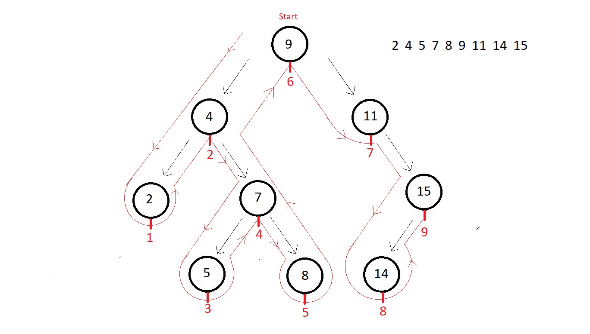

# Q71. Explain Binary Search Trees

A **Binary Search Tree (BST)** is a type of binary tree that satisfies the following properties:


### Binary Search Tree (BST):  
A **Binary Search Tree** is a type of **binary tree** that satisfies specific properties, making it efficient for searching, insertion, and deletion operations.  

### Properties:  
1. **Type of Binary Tree**:  
   A BST is a specialized form of a binary tree where each node has at most two children.  

2. **Node Values in Subtrees**:  
   - All nodes in the **left subtree** of a node are **less than the node's value**.  
   - All nodes in the **right subtree** of a node are **greater than the node's value**.  

3. **Left and Right Subtrees**:  
   Both the left and right subtrees of a BST are themselves binary search trees (i.e., they follow the BST properties).  

4. **No Duplicate Nodes**:  
   A BST typically does not allow duplicate values. Each key in the tree is unique.  

---


"The In-Order traversal of a Binary Search Tree (BST) gives an ascending sorted array."

This is a fundamental property of BSTs and serves as one of the easiest methods to verify if a binary tree is a valid Binary Search Tree.

---

### Operations in a BST:  
1. **Search**: Efficiently locate a node using the binary search property.  

2. **Insertion**: Insert a new value into the tree while maintaining the BST structure.  

3. **Deletion**:  
   - **Case 1**: Node has no children → Delete the node directly.  
   - **Case 2**: Node has one child → Replace the node with its child.  
   - **Case 3**: Node has two children → Replace the node with its in-order successor or predecessor.  

4. **Traversal**: Visit all nodes in a specific order:  
   - **In-order (Left, Root, Right)**: Produces sorted output.  
   - **Pre-order (Root, Left, Right)**.  
   - **Post-order (Left, Right, Root)**.  

---

### Example:  
Insert values: 8, 3, 10, 1, 6, 14, 4, 7, 13.  

The resulting BST:  
```
         8  
       /   \  
      3     10  
     / \      \  
    1   6      14  
       / \     /  
      4   7   13  
```  

### Applications:  
- Efficient searching and sorting.  
- Implementing associative arrays (e.g., maps, dictionaries).  
- Managing dynamic sorted data structures.  

---

# Q72. Explain Checking if a binary tree is a binary search tree or not with code


To check whether a binary tree is a Binary Search Tree (BST), we ensure that the values in the left subtree of any node are less than the node’s value, and the values in the right subtree are greater. Additionally, this condition should hold for every node in the tree.

Here’s an explanation and implementation in C++.

---

### **Approach**
1. A BST follows the rule:
   - `Left Subtree` values < `Node` value < `Right Subtree` values
2. Use a recursive approach:
   - Pass a valid range `[min, max]` for each node.
   - The current node's value should lie within this range.
   - Recursively validate the left and right subtrees with updated ranges.

---

### **C++ Code**

```cpp
#include <iostream>
using namespace std;

// Node structure
struct Node {
    int data;
    Node* left;
    Node* right;

    Node(int val) {
        data = val;
        left = nullptr;
        right = nullptr;
    }
};

// Helper function to check if the tree is a BST
bool isBSTUtil(Node* root, int minValue, int maxValue) {
    // Base case: An empty tree is a BST
    if (root == nullptr)
        return true;

    // Check the current node's value
    if (root->data <= minValue || root->data >= maxValue)
        return false;

    // Recursively check left and right subtrees
    return isBSTUtil(root->left, minValue, root->data) && 
           isBSTUtil(root->right, root->data, maxValue);
}

// Main function to check if the binary tree is a BST
bool isBST(Node* root) {
    return isBSTUtil(root, INT_MIN, INT_MAX);
}

// Helper function to create a simple binary tree
Node* createTree() {
    Node* root = new Node(10);
    root->left = new Node(5);
    root->right = new Node(15);
    root->left->left = new Node(2);
    root->left->right = new Node(7);
    return root;
}

int main() {
    Node* root = createTree();

    if (isBST(root))
        cout << "The tree is a Binary Search Tree (BST)." << endl;
    else
        cout << "The tree is NOT a Binary Search Tree (BST)." << endl;

    return 0;
}
```
---

### **Iteration of Checking BST for Given Tree**  

#### **Input Binary Tree:**  
```
        10
       /   \
      5     15
     / \
    2   7
```

**Function Call:** `isBST(root) → isBSTUtil(root, INT_MIN, INT_MAX)`

---

### **Step-by-Step Iteration:**
| Function Call                   | `root->data` | `minValue` | `maxValue` | Condition Check (`minValue < data < maxValue`) | Result |
|----------------------------------|-------------|------------|------------|----------------------------------|--------|
| `isBSTUtil(10, INT_MIN, INT_MAX)` | 10          | -∞         | ∞          | ✅ (`-∞ < 10 < ∞`)               | Continue |
| `isBSTUtil(5, INT_MIN, 10)`       | 5           | -∞         | 10         | ✅ (`-∞ < 5 < 10`)               | Continue |
| `isBSTUtil(2, INT_MIN, 5)`        | 2           | -∞         | 5          | ✅ (`-∞ < 2 < 5`)               | Continue |
| `isBSTUtil(nullptr, INT_MIN, 2)`  | -           | -∞         | 2          | ✅ (Base Case)                   | `true` |
| `isBSTUtil(nullptr, 2, 5)`        | -           | 2          | 5          | ✅ (Base Case)                   | `true` |
| `isBSTUtil(7, 5, 10)`             | 7           | 5          | 10         | ✅ (`5 < 7 < 10`)               | Continue |
| `isBSTUtil(nullptr, 5, 7)`        | -           | 5          | 7          | ✅ (Base Case)                   | `true` |
| `isBSTUtil(nullptr, 7, 10)`       | -           | 7          | 10         | ✅ (Base Case)                   | `true` |
| `isBSTUtil(15, 10, INT_MAX)`      | 15          | 10         | ∞          | ✅ (`10 < 15 < ∞`)              | Continue |
| `isBSTUtil(nullptr, 10, 15)`      | -           | 10         | 15         | ✅ (Base Case)                   | `true` |
| `isBSTUtil(nullptr, 15, INT_MAX)` | -           | 15         | ∞          | ✅ (Base Case)                   | `true` |

---

### **Final Output:**  
Since all conditions pass and return `true`, the output is:  
✅ **The tree is a Binary Search Tree (BST).**

---

# Q73, Q74, Q75. Perform and explain Searching operation on a BST


####  **Searching**

**Recursive Approach:**
- Start at the root.
- If the value matches the current node, return the node.
- If the value is smaller, search in the left subtree; otherwise, search in the right subtree.

**Iterative Approach:**
- Use a loop to traverse the tree instead of recursion.

**Code:**
```cpp
bool searchRecursive(Node* root, int key) {
    if (!root) return false; // Base case: empty tree or not found i.e root is NULL
    if (root->data == key) return true;
    if (key < root->data)
        return searchRecursive(root->left, key);
    else
        return searchRecursive(root->right, key);
}

bool searchIterative(Node* root, int key) {
    while (root) { // Traverse until we hit the base case or find the key i.e. root is NULL
        if (key == root->data) return true;
        root = (key < root->data) ? root->left : root->right;
    }
    return false;
}
```

### General code

```cpp
struct node * search(struct node* root, int key){
    if(root==NULL){
        return NULL;
    }
    if(key==root->data){
        return root;
    }
    else if(key<root->data){
        return search(root->left, key);
    }
    else{
        return search(root->right, key);
    }
}

```

---


# Q76 Perform and explain Insertion operation on a BST


### **BST Operations**

#### 1. **Insertion**
In a BST, insertion places the new value in its appropriate position based on the property:
- If the value is smaller than the current node, move to the left child.
- If the value is larger, move to the right child.

**Code (C++):**
```cpp
struct Node {
    int data;
    Node* left;
    Node* right;
    Node(int val) : data(val), left(nullptr), right(nullptr) {}
};

Node* insert(Node* root, int key) {
    if (!root) return new Node(key);  // If tree is empty or we've reached a null node, insert the key.
    if (key < root->data)  // If the key is smaller, insert in the left subtree.
        root->left = insert(root->left, key);
    else if (key > root->data)  // If the key is larger, insert in the right subtree.
        root->right = insert(root->right, key);
    return root;  // Return the root node after insertion.
}

```
### Iteration 

Sure! Let's break down the **iteration** for the insertion of **40** into the Binary Search Tree (BST) in a clear manner.

### Initial Tree Structure (Before Insertion):
```text
        50
       /
      30
     /
    20
```

Now, we want to insert `40` into this tree.

### **Insertion of 40**:

1. **Initial Step**:
   - **Current root**: `50`
   - **Key to insert**: `40`
   - Since `40 < 50`, we need to insert it in the **left subtree** of node `50`.
   - So, move to the **left child of 50**, which is `30`.

2. **Step 2**:
   - **Current node**: `30`
   - **Key to insert**: `40`
   - Since `40 > 30`, we need to insert it in the **right subtree** of node `30`.
   - So, move to the **right child of 30**, which is `NULL`.

3. **Step 3**:
   - **Current node**: `NULL`
   - **Key to insert**: `40`
   - We've reached an empty spot in the tree (the right child of `30`), so we insert `40` here.

### Resulting Tree (After Insertion):
```text
        50
       /
      30
     /  \
    20   40
```

---

### **Iterative Process with Explanation:**

| Step | Current Node | Action                                          | Traversal Result                |
|------|--------------|-------------------------------------------------|---------------------------------|
| 1    | 50           | 40 is smaller than 50, move to the left child   | Move to left subtree (30)       |
| 2    | 30           | 40 is greater than 30, move to the right child  | Move to right subtree (NULL)    |
| 3    | NULL         | Insert 40 at this position                      | Node 40 inserted as the right child of 30 |

### Explanation of Iteration:

- **Step 1**: We start by comparing `40` with the root node `50`. Since `40` is smaller than `50`, we move to the left child (`30`).
- **Step 2**: We then compare `40` with `30`. Since `40` is greater than `30`, we move to the right child of `30`, which is `NULL`.
- **Step 3**: As we've reached a `NULL` node, we create a new node with the value `40` and insert it as the right child of `30`.


### Second Method:


### **Insertion Function (Iterative)**


```cpp
#include <iostream>
using namespace std;

struct Node {
    int data;
    Node* left;
    Node* right;
    Node(int val) : data(val), left(nullptr), right(nullptr) {}
};

// Function to create a new node with given key
Node* createNode(int key) {
    return new Node(key);
}

// Iterative insert function
void insert(Node* &root, int key) {
    Node* prev = nullptr;
    
    // Traverse the tree until we find an empty spot
    while (root != nullptr) {
        prev = root;
        
        // Check if the key already exists
        if (key == root->data) {
            cout << "Cannot insert " << key << ", already in BST" << endl;
            return;
        }
        // Move left if the key is smaller
        else if (key < root->data) {
            root = root->left;
        }
        // Move right if the key is larger
        else {
            root = root->right;
        }
    }
    
    // Create a new node
    Node* newNode = createNode(key);
    
    // Attach the new node to the appropriate position
    if (key < prev->data) {
        prev->left = newNode;
    } else {
        prev->right = newNode;
    }
    cout << "Inserted " << key << " successfully." << endl;
}
```

### **Explanation of the Function:**

1. **Start with `root` and `prev` pointers**:
   - The `root` points to the current node we are evaluating in the tree.
   - The `prev` pointer keeps track of the parent node where the new node will be inserted.
   
2. **While loop**:
   - The loop continues traversing down the tree until we reach a `NULL` node, which indicates the correct position to insert the new node.
   - Inside the loop, the current node is compared with the key:
     - If the key is equal to the current node’s data, we print a message and return because we cannot insert a duplicate value.
     - If the key is smaller, we move to the left child (`root = root->left`).
     - If the key is larger, we move to the right child (`root = root->right`).

3. **Create and insert the new node**:
   - When we reach `NULL`, we create a new node with the value `key` using `createNode`.
   - We then attach this new node to the left or right child of the `prev` node based on the value of `key`.

4. **Print success message**:
   - Finally, we print a success message confirming that the new key has been inserted.

### **Example: Insertion of Keys in the Tree**

Let's use an example to demonstrate the insertion of multiple values into the tree.

**Initial Tree:**
```text
        50
```

1. **Insert 30**:
   - Root is `50`.
   - Since `30 < 50`, move to the left, which is `NULL`. Insert `30` as the left child of `50`.

**Tree after insertion of 30:**
```text
        50
       /
      30
```

2. **Insert 70**:
   - Root is `50`.
   - Since `70 > 50`, move to the right, which is `NULL`. Insert `70` as the right child of `50`.

**Tree after insertion of 70:**
```text
        50
       /  \
      30   70
```

3. **Insert 40**:
   - Root is `50`.
   - Since `40 < 50`, move to the left child (`30`).
   - Since `40 > 30`, move to the right child of `30`, which is `NULL`. Insert `40` as the right child of `30`.

**Tree after insertion of 40:**
```text
        50
       /  \
      30   70
        \
        40
```

---

### **Iteration Explanation for Insertion of 40**

| Step | Current Node | Action                                          | Tree Structure (After Action)       |
|------|--------------|-------------------------------------------------|-------------------------------------|
| 1    | 50           | 40 is smaller than 50, move to left child (30)   |                                     |
| 2    | 30           | 40 is greater than 30, move to right child (NULL)|                                     |
| 3    | NULL         | Insert 40 at this position                      | Insert 40 as right child of 30     |

### Conclusion

This iterative approach is simple and efficient. The `root` pointer is updated during the traversal to find the correct position for insertion, while the `prev` pointer tracks the parent node where the new node should be attached. This method avoids recursion and gives us a more explicit control over the process of insertion in the Binary Search Tree.

---

# Q77. Explain and implement the deletion operation in a Binary Search Tree.

You might be wondering how big a deal is deleting some nodes in a binary search tree. 

#### 3. **Deletion**
Deletion involves three cases:
1. Node to delete has **no children** → simply delete the node.
2. Node to delete has **one child** → replace the node with its child.
3. Node to delete has **two children** → replace the node with its **in-order successor** (smallest node in the right subtree).
- We can also replace the node with its **in-order predecessor** (largest node in the left subtree).


So, whenever we talk about deleting a node from binary search tree, we have the following three cases in mind:

1. The node is a leaf node. replace it with nullptr.
2. The node is a non-leaf node. ( two cases: one child or two children)
3. The node is the root node. Replace it with its in-order successor or predecessor.

**Code:**
```cpp
Node* findMin(Node* root) {
    while (root->left) root = root->left;
    return root;
}

Node* deleteNode(Node* root, int key) {
    if (!root) return nullptr;
    if (key < root->data)
        root->left = deleteNode(root->left, key);
    else if (key > root->data)
        root->right = deleteNode(root->right, key);
    else { // node to delete found
        // Case 1 & 2: No or one child
        if (!root->left) { // no left child i.e. right child only
            Node* temp = root->right;
            delete root;
            return temp;
        } else if (!root->right) {
            Node* temp = root->left;
            delete root;
            return temp;
        }
        // Case 3: Two children
        Node* temp = findMin(root->right); // find min in right subtree
        root->data = temp->data;
        root->right = deleteNode(root->right, temp->data);
    }
    return root;
}
```
Inorder predecessor is the node - left subtree ka rightmost child

---

## **Iteration Examples**

We’ll use the following tree for operations:

```
        15
       /  \
      10   20
     / \    \
    8  12    25
```

#### **1. Insertion**
Insert `18` into the tree:
1. Start at root (`15`), `18 > 15` → move to the right subtree.
2. At `20`, `18 < 20` → move to the left subtree (empty).
3. Insert `18` as the left child of `20`.

Result:
```
        15
       /  \
      10   20
     / \   / \
    8  12 18  25
```

---

#### **2. Search**

**Recursive Search for `12`:**
1. Start at root (`15`), `12 < 15` → search left subtree.
2. At `10`, `12 > 10` → search right subtree.
3. At `12`, found the node.

**Iterative Search for `18`:**
1. Start at root (`15`), `18 > 15` → move to the right subtree.
2. At `20`, `18 < 20` → move to the left subtree.
3. At `18`, found the node.

---

#### **3. Deletion**

**Delete `20`:**
1. Start at root (`15`), `20 > 15` → move to the right subtree.
2. At `20`, found the node. It has two children.
3. Find in-order successor (smallest in right subtree), which is `25`.
4. Replace `20` with `25`, then delete the original `25`.

Result:
```
        15
       /  \
      10   25
     / \   /
    8  12 18
```

---

### **Final Notes**
The above code and examples demonstrate the core BST operations. If you want more examples or additional operations like traversal, let me know!