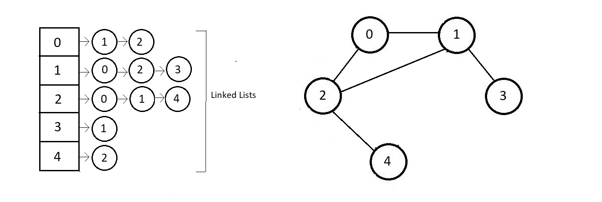
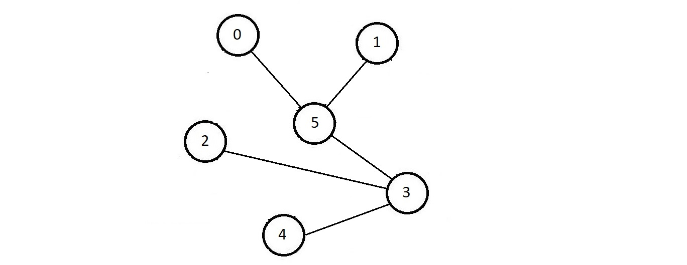
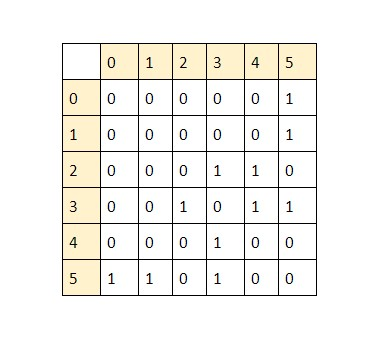
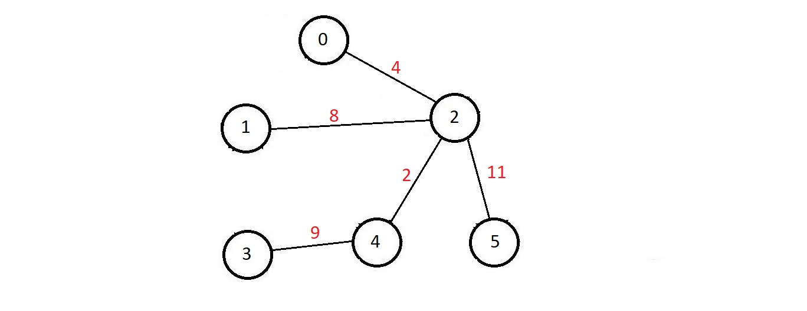
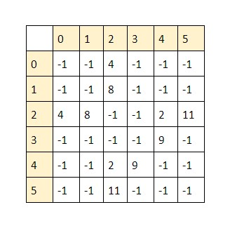
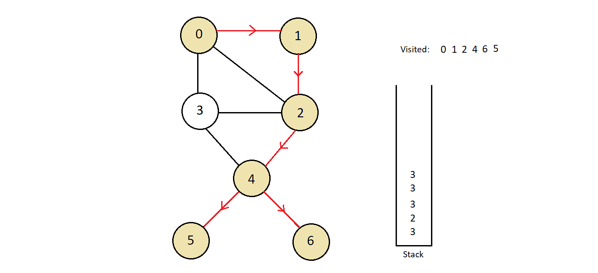

### Q81 and Q82. AVL Tress Not needed

# Q83. Explain Graphs in detail

**Introduction to Graphs | Graph Data Structure**

Graphs are one of the most fundamental data structures in computer science and mathematics. They are widely used to represent relationships between objects.

---
 
### **What is a Graph?**

A graph is a non-linear data structure consisting of a set of nodes (also called vertices) and edges that connect these nodes. Graphs are used to model relationships between entities in a structured manner. Unlike linear data structures such as arrays, linked lists, stacks, and queues, graphs provide a flexible way to represent complex relationships.

### **Components of a Graph**

1. **Vertices (Nodes)**: These are fundamental units of a graph. Each node contains data and can have connections with other nodes.
2. **Edges**: These are the connections between nodes. An edge can either be directed (having a specific direction) or undirected (no specific direction).
3. **Degree of a Node**:
   - **Indegree**: The number of edges directed toward a node.
   - **Outdegree**: The number of edges directed outward from a node.

### **Formal Definition of a Graph**

A graph **G** is represented mathematically as:

**G = (V, E)**

where:

- **V** is the set of vertices (nodes).
- **E** is the set of edges connecting these vertices.

For example, if **V = {0, 1, 2, 3, 4, 5}** and **E = {(0,1), (1,2), (0,4), (4,3), (3,5), (2,5), (2,3)}**, the edges define the connectivity between the nodes.

---

### **Types of Graphs**

Graphs can be classified based on the nature of their edges:

1. **Directed Graph (Digraph)**:

   - A graph in which each edge has a specific direction.
   - Example: In social media, a "follow" relationship where User A follows User B but not necessarily vice versa.

2. **Undirected Graph**:

   - A graph where edges have no direction, meaning the connection is bidirectional.
   - Example: A "friendship" relationship on Facebook where both users are friends with each other.

3. **Mixed Graph**:

   - A graph containing both directed and undirected edges. These are less common and usually studied in specialized applications.

---

### **Types of Edges**

1. **Directed Edge**: An edge that has a specified direction from one node to another.
2. **Undirected Edge**: An edge that does not have any direction and allows movement between nodes in both directions.

---

### **Applications of Graphs**

Graphs have a wide range of applications across various domains:

1. **Social Networks**: Used to model relationships (e.g., Facebook, LinkedIn connections).
2. **Navigation Systems**: Google Maps and GPS navigation systems use graphs to model road networks.
3. **Website Analysis**: Graphs help in monitoring backlinks, website structures, and page rankings.
4. **Computer Networks**: Used to model networks, routers, and connections between devices.
5. **Recommendation Systems**: Used in platforms like Amazon, Netflix, and YouTube to suggest products, movies, and videos.
6. **Biological and Chemical Networks**: Used in genomics and molecular chemistry to model interactions between entities.

---

### **Real-Life Example: Facebook Graph**

Facebook represents users as nodes and relationships (friendships, follows, etc.) as edges. The graph structure enables features like:

- Friend suggestions (based on mutual friends).
- Post visibility (determining who sees what content).
- Network analysis (understanding how people interact).

---

## Q84. Explain the representation of graphs

## **Graph Representation**

Graphs can be represented in various ways to suit different use cases. The two most common representations are:

1. **Adjacency List**
2. **Adjacency Matrix**

Other specialized representations include the **Edge List** and **Incidence Matrix**.

---

### **1. Adjacency List**
The **Adjacency List** is one of the most space-efficient ways to represent a graph. It consists of an array of lists, where each index of the array corresponds to a node, and the list at that index stores all the nodes adjacent to it.

#### **Example:**
Consider a graph with **V = {0, 1, 2, 3, 4}** and edges **E = {(0,1), (0,4), (1,2), (1,3), (1,4), (3,4), (3,2)}**.

| Vertex | Adjacency List |
|--------|----------------|
| 0      | → 1 → 4       |
| 1      | → 0 → 2 → 3 → 4 |
| 2      | → 1 → 3       |
| 3      | → 1 → 2 → 4   |
| 4      | → 0 → 1 → 3   |



#### **Advantages:**
- **Efficient space usage**: Uses **O(V + E)** space, making it suitable for sparse graphs.
- **Fast traversal**: Iterating over neighbors is efficient.

#### **Disadvantages:**
- Checking if an edge exists between two specific nodes can take **O(V)** in the worst case.

---

### **2. Adjacency Matrix**
The **Adjacency Matrix** is a 2D array of size **V × V**, where **V** is the number of vertices. Each cell **(i, j)** represents whether there is an edge between node **i** and node **j**.

#### **Example:**
For the same graph:

|   | 0 | 1 | 2 | 3 | 4 |
|---|---|---|---|---|---|
| 0 | 0 | 1 | 0 | 0 | 1 |
| 1 | 1 | 0 | 1 | 1 | 1 |
| 2 | 0 | 1 | 0 | 1 | 0 |
| 3 | 0 | 1 | 1 | 0 | 1 |
| 4 | 1 | 1 | 0 | 1 | 0 |

- A **1** means an edge exists between the vertices, while **0** means no edge.

#### **Advantages:**
- **Fast edge lookup**: Checking if an edge exists between two nodes is **O(1)**.
- **Easy implementation**: Simple and straightforward.

#### **Disadvantages:**
- **High space complexity**: Requires **O(V²)** space, making it inefficient for sparse graphs.
- **Inefficient traversal**: Iterating over neighbors requires scanning an entire row **O(V)**.



---

### **3. Edge List**
In the **Edge List**, we store all edges explicitly as a list of pairs (u, v).

#### **Example:**
For the same graph, the edge list would be:

```
[(0,1), (0,4), (1,2), (1,3), (1,4), (3,4), (3,2)]
```

---

### **4. Cost Adjacency Matrix:**


The cost adjacency matrix is another method of representation of weighted graphs, where we represent our graph in the form of a matrix where cells are either filled with 0 or the cost of the edge.




---

# Q85. Explain the traversal of graphs


## **What is Graph Traversal?**
Graph traversal is the process of visiting all the nodes (vertices) of a graph in a systematic manner. The goal is to explore the graph’s structure, process nodes, and find specific elements.

Traversal is fundamental in solving many problems, such as:
- **Finding the shortest path** (Google Maps, GPS navigation)
- **Detecting cycles in a graph** (circuit design, dependency resolution)
- **Connected component analysis** (social networks, clustering)
- **Solving puzzles and mazes** (game development)

---

## **Types of Graph Traversal**
There are two primary methods of traversing a graph:

1. **Breadth-First Search (BFS)**
2. **Depth-First Search (DFS)**

BFS is used when you need to explore graphs level by level, making it useful for shortest paths.
DFS is used when deep traversal is needed, such as in topological sorting, cycle detection, and puzzles.

# Q86. Now Explain BFS in detail with code in cpp

### **Breadth-First Search (BFS) in Detail**  

#### **What is BFS?**  
Breadth-First Search (BFS) is a **graph traversal algorithm** that explores all vertices at the present depth level before moving on to nodes at the next depth level. It uses a **queue (FIFO - First In, First Out)** data structure to maintain the order of exploration.

#### **Algorithm Steps:**
1. **Start from a given node (source).**
2. **Use a queue to keep track of nodes to be visited.**
3. **Mark the starting node as visited** and push it into the queue.
4. **Dequeue a node from the queue** and process it.
5. **Enqueue all unvisited neighbors** of the dequeued node and mark them as visited.
6. **Repeat the process** until the queue becomes empty.

---

## **C++ Implementation of BFS**
```cpp
#include <iostream>
#include <vector>
#include <queue>

using namespace std;

// Function to perform BFS traversal
void BFS(vector<vector<int>> &graph, int start) {
    int n = graph.size();
    vector<bool> visited(n, false);  // Track visited nodes
    queue<int> q;  // Queue for BFS

    visited[start] = true;  // Mark start node as visited
    q.push(start);  // Push start node into the queue

    while (!q.empty()) {
        int node = q.front();  // Get front element from queue
        q.pop();  // Remove it from queue
        cout << node << " ";  // Process the node (print)

        // Traverse all neighbors of the current node
        for (int neighbor : graph[node]) {
            if (!visited[neighbor]) {  // If not visited
                visited[neighbor] = true;
                q.push(neighbor);  // Push it to the queue
            }
        }
    }
}

int main() {
    // Graph represented as an adjacency list
    vector<vector<int>> graph = {
        {1, 2},   // Node 0 is connected to 1 and 2
        {0, 3, 4}, // Node 1 is connected to 0, 3, and 4
        {0, 5},   // Node 2 is connected to 0 and 5
        {1},      // Node 3 is connected to 1
        {1},      // Node 4 is connected to 1
        {2}       // Node 5 is connected to 2
    };

    cout << "BFS Traversal starting from node 0: ";
    BFS(graph, 0);

    return 0;
}
```

---

### **Example Execution and Iteration Steps**  
Consider the following graph:

```
     0
    / \
   1   2
  / \   \
 3   4   5
```

- **Adjacency List Representation:**
  ```
  0 -> {1, 2}
  1 -> {0, 3, 4}
  2 -> {0, 5}
  3 -> {1}
  4 -> {1}
  5 -> {2}
  ```

#### **Step-by-Step BFS Traversal (Starting from Node `0`):**
| **Iteration** | **Queue Content** | **Visited Nodes** | **Processed Node** |
|--------------|-----------------|-----------------|-----------------|
| **1** | `{0}` | `{0}` | **0** |
| **2** | `{1, 2}` | `{0, 1, 2}` | **1** |
| **3** | `{2, 3, 4}` | `{0, 1, 2, 3, 4}` | **2** |
| **4** | `{3, 4, 5}` | `{0, 1, 2, 3, 4, 5}` | **3** |
| **5** | `{4, 5}` | `{0, 1, 2, 3, 4, 5}` | **4** |
| **6** | `{5}` | `{0, 1, 2, 3, 4, 5}` | **5** |
| **7** | `{}` | `{0, 1, 2, 3, 4, 5}` | **Done** |

#### **Final Output of BFS Traversal:**
```
0 1 2 3 4 5
```

---

## **Time and Space Complexity Analysis**
- **Time Complexity:**  
  - **O(V + E)** (where V = number of vertices, E = number of edges).  
  - Each vertex is enqueued and dequeued once.  
  - Each edge is processed once in an adjacency list.

- **Space Complexity:**  
  - **O(V)** (for the visited array and queue).

---

## **Applications of BFS**
1. **Shortest Path in Unweighted Graphs** (like Google Maps, Maze Solving).
2. **Finding Connected Components in a Graph**.
3. **Crawling a Website** (used by search engines like Google).
4. **AI & Game Development** (pathfinding in grid-based games).
5. **Social Network Friend Suggestions** (finding the shortest link between two people).

---

## **Conclusion**
- **BFS explores level by level** and is best suited for **shortest path problems in unweighted graphs**.
- **It is implemented using a queue** and follows a **FIFO (First In, First Out) approach**.
- **Time Complexity is O(V + E), making it efficient** for graph traversal.

---

# Approach 2:


### **Optimized C++ Code:**
```cpp
#include <iostream>
#include <vector>
#include <queue>

using namespace std;

void BFS(vector<vector<int>> &graph, int start) {
    int n = graph.size();
    vector<bool> visited(n, false); // Track visited nodes
    queue<int> q; // STL Queue

    visited[start] = true;  // Mark start node as visited
    q.push(start);  // Push start node into the queue

    while (!q.empty()) {
        int node = q.front();  // Get front element from queue
        q.pop();  // Remove it from queue
        cout << node << " ";  // Process the node (print)

        // Traverse all neighbors of the current node
        for (int neighbor = 0; neighbor < n; neighbor++) {
            if (graph[node][neighbor] == 1 && !visited[neighbor]) {  // If connected and not visited
                visited[neighbor] = true;
                q.push(neighbor);  // Push it to the queue
            }
        }
    }
}

int main() {
    vector<vector<int>> graph = {
        {0,1,1,1,0,0,0},
        {1,0,1,0,0,0,0},
        {1,1,0,1,1,0,0},
        {1,0,1,0,1,0,0},
        {0,0,1,1,0,1,1},
        {0,0,0,0,1,0,0}, 
        {0,0,0,0,1,0,0} 
    };

    int startNode = 1; // Change start node if needed
    cout << "BFS Traversal starting from node " << startNode << ": ";
    BFS(graph, startNode);
    cout << endl;

    return 0;
}
```

---

### **Optimizations & Improvements:**
1. **Used `std::queue<int>` instead of a manually implemented queue**  
   - Reduces unnecessary code.  
   - More optimized and safe.

2. **Used `vector<vector<int>>` instead of a static 2D array**  
   - Makes it more dynamic and easier to modify.

3. **Used `vector<bool>` for visited tracking**  
   - Saves space compared to `int visited[7]`.

4. **Removed unnecessary variables and redundant operations**  
   - `isFull()` and `isEmpty()` functions are now managed by STL queue.

5. **Used `cout` instead of `printf`** for modern C++ style.  

---

### **Time Complexity:**
- **O(V + E)** (same as original)  
- Each node and edge is processed once.

---

### **Sample Output:**
```
BFS Traversal starting from node 1: 1 0 2 3 4 5 6
```

This **efficiently** achieves the same BFS traversal with **better readability, fewer lines of code, and improved performance**. 🚀

Sure! Let's go step by step through the **Breadth-First Search (BFS) traversal** for better understanding.

---

### **Graph Representation**  
We have the following **adjacency matrix** representing the graph:

```
    0  1  2  3  4  5  6  
  ----------------------
0 | 0  1  1  1  0  0  0  
1 | 1  0  1  0  0  0  0  
2 | 1  1  0  1  1  0  0  
3 | 1  0  1  0  1  0  0  
4 | 0  0  1  1  0  1  1  
5 | 0  0  0  0  1  0  0  
6 | 0  0  0  0  1  0  0  
```

We start **BFS from node 1**.

---

### **Step-by-step BFS Iteration**
1. **Start at node `1`**  
   - Mark `1` as **visited**  
   - Enqueue `1`  
   - **Queue:** `[1]`  
   - **Output:** `1`

2. **Process node `1`** (Dequeue)  
   - **Neighbors:** `0` and `2`  
   - Mark `0` and `2` as **visited**  
   - Enqueue `0`, `2`  
   - **Queue:** `[0, 2]`  
   - **Output:** `1 0 2`

3. **Process node `0`** (Dequeue)  
   - **Neighbors:** `2`, `3` (but `2` is already visited)  
   - Mark `3` as **visited**  
   - Enqueue `3`  
   - **Queue:** `[2, 3]`  
   - **Output:** `1 0 2 3`

4. **Process node `2`** (Dequeue)  
   - **Neighbors:** `3`, `4` (but `3` is already visited)  
   - Mark `4` as **visited**  
   - Enqueue `4`  
   - **Queue:** `[3, 4]`  
   - **Output:** `1 0 2 3 4`

5. **Process node `3`** (Dequeue)  
   - **Neighbors:** `4` (already visited)  
   - **Queue:** `[4]`  
   - **Output:** `1 0 2 3 4`

6. **Process node `4`** (Dequeue)  
   - **Neighbors:** `5`, `6`  
   - Mark `5`, `6` as **visited**  
   - Enqueue `5`, `6`  
   - **Queue:** `[5, 6]`  
   - **Output:** `1 0 2 3 4 5 6`

7. **Process node `5`** (Dequeue)  
   - **Neighbors:** None (all visited)  
   - **Queue:** `[6]`  
   - **Output:** `1 0 2 3 4 5 6`

8. **Process node `6`** (Dequeue)  
   - **Neighbors:** None (all visited)  
   - **Queue:** `[]` (empty)  
   - **Output:** `1 0 2 3 4 5 6`

---

### **Final BFS Traversal Order**
```
1 → 0 → 2 → 3 → 4 → 5 → 6
```
- We **explore all neighbors level-by-level** before moving deeper into the graph.

---

### **Why BFS?**
✅ **Finds shortest path** in an **unweighted graph**  
✅ **Uses a queue** (FIFO order ensures level-wise traversal)  
✅ **Efficient for connectivity checking**  

Let me know if you need any modifications! 🚀

---
 
# Q87. Explain Depth First Search (DFS) in detail with code



### **Depth First Search (DFS) - Explanation**

#### **What is DFS?**
Depth First Search (DFS) is a graph traversal algorithm that starts from a source node and explores as far as possible along each branch before backtracking. It uses a **stack** (either explicitly or via recursion) to keep track of visited nodes.

#### **How DFS Works?**
1. Start at a selected node (source node).
2. Mark the node as **visited**.
3. Explore **one of its unvisited neighbors** recursively.
4. If no unvisited neighbor exists, **backtrack**.
5. Repeat the process until all nodes are visited.

DFS explores **depth-first**, meaning it **goes deeper** into a graph before visiting neighbors at the same level.

---

## **DFS Algorithm - C++ Implementation**

```cpp
#include <iostream>
#include <vector>

using namespace std;

class Graph {
public:
    int vertices;
    vector<vector<int>> adjList;
    vector<bool> visited;

    Graph(int v) {
        vertices = v;
        adjList.resize(v);
        visited.resize(v, false);
    }

    void addEdge(int u, int v) {
        adjList[u].push_back(v);
        adjList[v].push_back(u); // Undirected graph
    }

    void DFS(int node) {
        cout << node << " "; // Print the node
        visited[node] = true;

        // Recur for all adjacent vertices
        for (int neighbor : adjList[node]) {
            if (!visited[neighbor]) {
                DFS(neighbor);
            }
        }
    }
};

int main() {
    Graph g(7); // Create a graph with 7 vertices (0 to 6)

    // Defining edges of the graph
    g.addEdge(0, 1);
    g.addEdge(0, 2);
    g.addEdge(0, 3);
    g.addEdge(1, 2);
    g.addEdge(2, 3);
    g.addEdge(2, 4);
    g.addEdge(3, 4);
    g.addEdge(4, 5);
    g.addEdge(4, 6);

    cout << "DFS Traversal starting from node 1: ";
    g.DFS(1); // Start DFS from node 1

    return 0;
}
```

---

## **Example DFS Traversal - Step by Step**
For the given graph:

```
    0 -- 1
    |  /  |
    2 -- 3
    |    |
    4 -- 5
    |    
    6
```

If we **start DFS from node 1**, the traversal will be:

### **Step-by-Step DFS Execution**
| Step | Current Node | Stack (Call Stack) | Visited Nodes | Output |
|------|-------------|--------------------|---------------|--------|
| 1    | 1           | `[1]`              | `{1}`         | `1`    |
| 2    | 0           | `[1, 0]`           | `{1, 0}`      | `1 0`  |
| 3    | 2           | `[1, 0, 2]`        | `{1, 0, 2}`   | `1 0 2`|
| 4    | 3           | `[1, 0, 2, 3]`     | `{1, 0, 2, 3}`| `1 0 2 3`|
| 5    | 4           | `[1, 0, 2, 3, 4]`  | `{1, 0, 2, 3, 4}`| `1 0 2 3 4`|
| 6    | 5           | `[1, 0, 2, 3, 4, 5]`| `{1, 0, 2, 3, 4, 5}`| `1 0 2 3 4 5`|
| 7    | 6           | `[1, 0, 2, 3, 4, 5, 6]`| `{1, 0, 2, 3, 4, 5, 6}`| `1 0 2 3 4 5 6`|
| 8    | Backtrack   | Stack empty        | `{1, 0, 2, 3, 4, 5, 6}`| Done |

**Final DFS Traversal Order:**
```
1 → 0 → 2 → 3 → 4 → 5 → 6
```

---

## **Time Complexity & Space Complexity**
### **Time Complexity:**  
- **O(V + E)** (where `V` = vertices, `E` = edges)
- Each vertex is visited **once**, and each edge is processed **once**.

### **Space Complexity:**  
- **O(V)** (for visited array and recursion stack)

---

## **Key Differences Between BFS and DFS**
| Feature  | BFS (Breadth-First Search) | DFS (Depth-First Search) |
|----------|---------------------------|---------------------------|
| **Data Structure** | Queue (FIFO) | Stack / Recursion (LIFO) |
| **Traversal Type** | Level-wise | Depth-wise |
| **Shortest Path?** | Yes (for unweighted graphs) | No |
| **Time Complexity** | O(V + E) | O(V + E) |
| **Space Complexity** | O(V) (queue) | O(V) (recursion stack) |
| **Best For** | Finding shortest paths in unweighted graphs | Exploring deep structures like trees |

---

### **Applications of DFS**
✅ **Pathfinding in a Maze**  
✅ **Topological Sorting in DAGs**  
✅ **Solving Puzzles (like Sudoku, N-Queens)**  
✅ **Finding Connected Components in a Graph**  
✅ **Cycle Detection in Graphs**  

---


### **Optimized C++ Code**
```cpp
#include <iostream>
#include <vector>

using namespace std;

class Graph {
public:
    vector<vector<int>> adjMatrix;
    vector<bool> visited;
    int size;

    Graph(int n) {
        size = n;
        adjMatrix.resize(n, vector<int>(n, 0));
        visited.resize(n, false);  // The function resize(n, false) is used with vector in C++ to set the size of the vector and initialize all elements to false.    
    }

    void addEdge(int u, int v) {
        adjMatrix[u][v] = 1;
        adjMatrix[v][u] = 1; // Undirected graph
    }

    void DFS(int node) {
        cout << node << " ";
        visited[node] = true;

        for (int j = 0; j < size; j++) {
            if (adjMatrix[node][j] == 1 && !visited[j]) {
                DFS(j);
            }
        }
    }
};

int main() {
    Graph g(7);

    // Initializing adjacency matrix
    int edges[7][7] = {
        {0,1,1,1,0,0,0},
        {1,0,1,0,0,0,0},
        {1,1,0,1,1,0,0},
        {1,0,1,0,1,0,0},
        {0,0,1,1,0,1,1},
        {0,0,0,0,1,0,0}, 
        {0,0,0,0,1,0,0}
    };

    // Adding edges
    for (int i = 0; i < 7; i++)
        for (int j = 0; j < 7; j++)
            if (edges[i][j]) g.addEdge(i, j);

    cout << "DFS Traversal: ";
    g.DFS(0);

    return 0;
}
```

---

### **Time Complexity:**  
- **O(V + E)** (same as before, since we process each edge & vertex once)

---

### **Example DFS Output**
If **starting from node `0`**, the output will be:

```
DFS Traversal: 0 1 2 3 4 5 6
```

### **Depth First Search (DFS) Example Iteration**  

Consider the given **adjacency matrix** representation of a graph:  

```
   0  1  2  3  4  5  6  
0 [0, 1, 1, 1, 0, 0, 0]  
1 [1, 0, 1, 0, 0, 0, 0]  
2 [1, 1, 0, 1, 1, 0, 0]  
3 [1, 0, 1, 0, 1, 0, 0]  
4 [0, 0, 1, 1, 0, 1, 1]  
5 [0, 0, 0, 0, 1, 0, 0]  
6 [0, 0, 0, 0, 1, 0, 0]  
```  
---
### **Step-by-Step DFS Execution (Starting from Node 0)**
1. **Visit 0** → `visited = [1, 0, 0, 0, 0, 0, 0]`
   - Neighbors: `{1, 2, 3}`  
   - Choose **1** (smallest available)  

2. **Visit 1** → `visited = [1, 1, 0, 0, 0, 0, 0]`
   - Neighbors: `{0, 2}` (0 already visited)  
   - Choose **2**  

3. **Visit 2** → `visited = [1, 1, 1, 0, 0, 0, 0]`
   - Neighbors: `{0, 1, 3, 4}` (0,1 already visited)  
   - Choose **3**  

4. **Visit 3** → `visited = [1, 1, 1, 1, 0, 0, 0]`
   - Neighbors: `{0, 2, 4}` (0,2 already visited)  
   - Choose **4**  

5. **Visit 4** → `visited = [1, 1, 1, 1, 1, 0, 0]`
   - Neighbors: `{2, 3, 5, 6}` (2,3 already visited)  
   - Choose **5**  

6. **Visit 5** → `visited = [1, 1, 1, 1, 1, 1, 0]`
   - Neighbors: `{4}` (already visited)  
   - Backtrack to **4**, choose **6**  

7. **Visit 6** → `visited = [1, 1, 1, 1, 1, 1, 1]`
   - Neighbors: `{4}` (already visited)  
   - All nodes visited, **DFS ends**.  

---
### **Final DFS Traversal Order:**  
```
0 → 1 → 2 → 3 → 4 → 5 → 6
```  
This represents a **Depth First Search (DFS)** traversal starting from node `0`.
